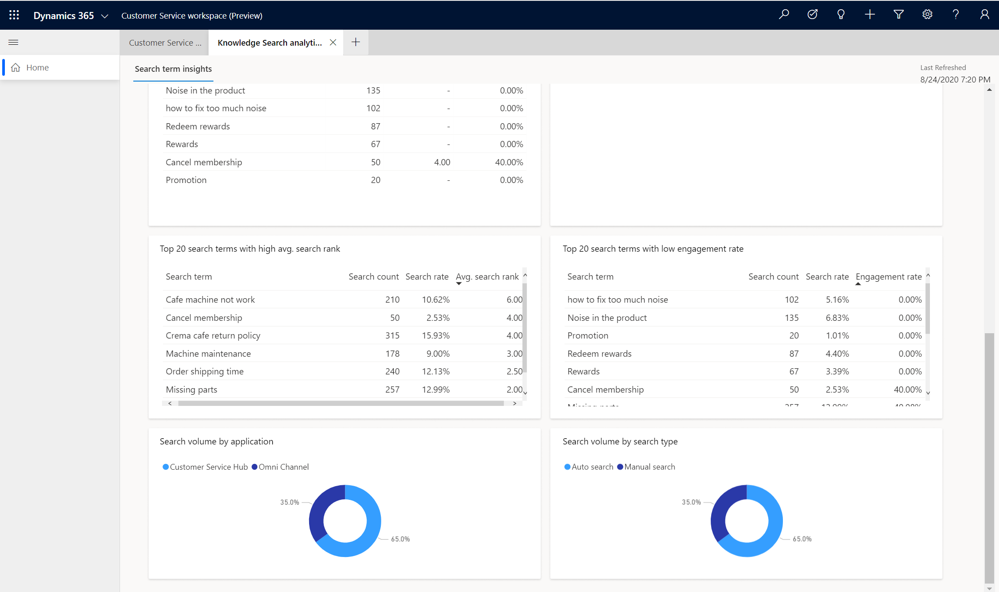

# Knowledge search analytics

The knowledge search analytics dashboard is designed to provide your organization's customer service supervisors and knowledge workers with valuable insights into how your support agents are finding and using knowledge articles.

As a knowledge manager, it's your responsibility to maintain and improve your organization's overall knowledge base article offerings. By identifying searches that have low success or return no results, the knowledge search analytics dashboard can help you identify knowledge gaps, improve search results, and surface the most relevant articles.  

For more information about specific metrics in this dashboard, select the link for the chart in the following list or locate the chart later in this article. 

- KPI Summary charts 
- Search count over duration chart 
- Avg. search rank trend  
- Engagement rate trend 
- Rate of no-result searches trend  
- Top 20 search terms chart 
- Top 20 search terms with no results chart 
- Top 20 search terms with high avg. search rank chart 
- Top 20 searches with low engagement rate chart 
- Search volume by application chart 
- Search volume by search type 

