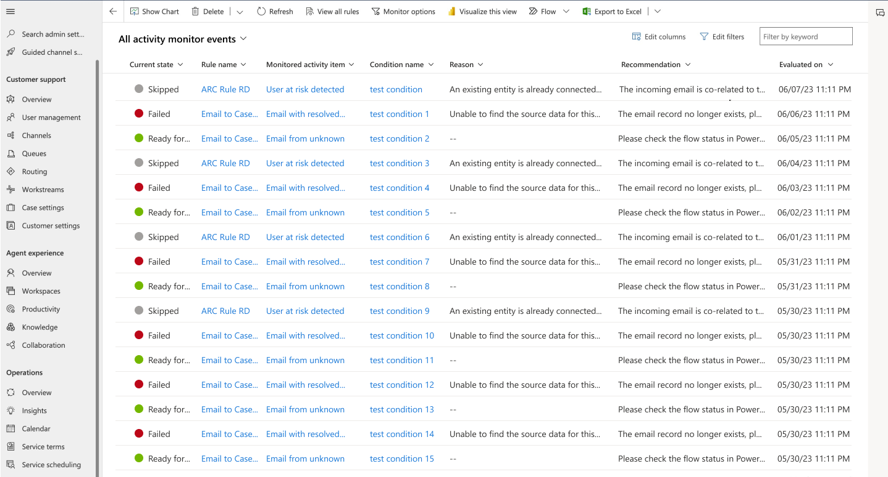

# Manage activity monitor to review and track rules

You can review and track the health of the automatic record creation rules and resolve issues around them. By default, the activity monitor captures all the states. You can customize the events that you want to monitor by deselecting the monitor options in the application.

> [!NOTE]
> - Activity monitor is supported only with online environments, such as cloud applications, and not with on-premises environments.
> - The activity monitor tracks the rules only until they're evaluated in Customer Service before the rule is run in Power Automate.

Perform the following steps to view the activity monitor details for the rules:

In Customer Service admin center, the Customer Service Overview page displays the number of activity monitor events that ran in the past week along with their status. To  view the details specific to either the email activity monitor events or for all of the activities, perform the following steps:
   - Select **Activity monitor events(past 7 days)** on the Customer Service Overview page to view the email specific activity record rule details in **Email activity monitor events for last 7 days**. You can also switch to the **Activity record creation and update rules** view from this page.
   - Select **More** for **Automatic record creation and update rules** in **Case Settings** and then select **Record creation and update rules**.

The **Activity monitor for record creation and update rules** page displays the list of all the rules with their statuses. The following details are available for the rules:
 - **Current state:** Displays the state, such as, Failed, Skipped, or Ready for Power Automate.
 - **Rule name:** Name of the record creation rule.
 - **Monitored activity type:** Activity type, such as email, task, or appointment.
 - **Monitored activity item:** Displays the subject of the activity type.
 - **Condition name:** The name of the condition in which the issue occurred.
 - **Reason:** Displays information on how the rule was handled. For example, if the value in Current state for a rule is Skipped, no action would have been taken because the rule condition, such as **Allow email from unknown senders** was set to No. Therefore, no further action was required for the rule.
 - **Recommendation**: Displays the steps you can follow to resolve the issue. For example, the **Current state** for a rule is skipped with the **Reason** that an active case is already connected to this record. The application displays the following recommendation: the incoming email is related to a parent email linked to an existing case. You can turn off the **use correlation to track email conversations** if you'd like to change the existing behavior.

    > [!NOTE]
    > Hyperlinks aren't displayed in the **Recommendation** field. If you'd like to see the hyperlinks in the recommended resolution, double click the rule or activity to view the activity monitoring summary that is displayed on the **Activity monitor** *<rule_name>* page.
 - **Evaluated on:** Displays the date and time of the issue.
  
> [!NOTE]
>
> - If you navigate to an active rule from the activity monitor page, a message appears stating that the rule is active and therefore is read-only.
> - The legacy rules will also be monitored and listed on the activity monitor view.

If you don't want to monitor any of the following states, you can deselect the state on the **Monitor options** dialog.
 - Ready for Power Automate / workflow
 - Failed
 - Skipped

> 
