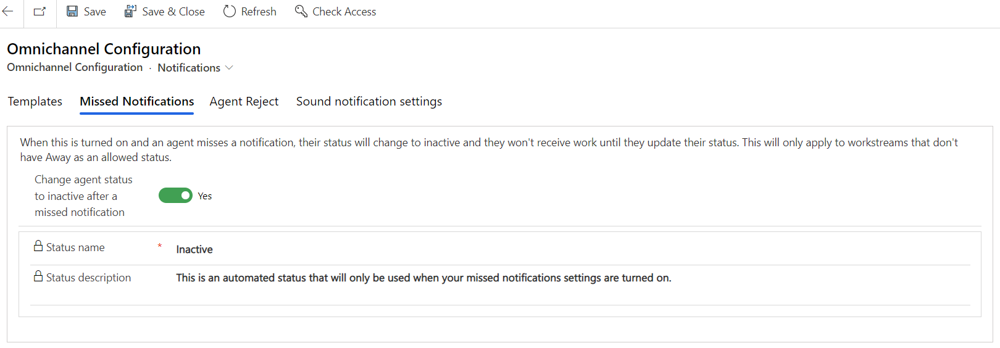

# Enable missed notifications

[!INCLUDE[cc-use-with-omnichannel](../includes/cc-use-with-omnichannel.md)]

With the missed notifications feature, you can now choose to automatically set agent presence to inactive, so that no new tasks will be assigned when agents miss notifications for incoming chat requests. In addition to the status change, a message bar indicating that a notification has been missed will be displayed on the agent dashboard. Agents can reset their status by using the reset presence option that's displayed with the notification or by manually changing their status.

> [!IMPORTANT]
> - Missed notifications won't work if "Away" is included as an allowed presence for work streams. More information: [Understand and create work streams](work-streams-introduction.md)
> - Missed notifications is not supported in Omnichannel for Customer Service on Unified Service Desk.

## Enable automatic update of agent presence when a notification is missed

1. In the Omnichannel Administration app, select **Notifications** under **Agent Experience** in the site map.
2. On the **Omnichannel Configuration** page, select the **Missed Notifications** tab.
3. Set the toggle to **Yes** for **Change agent status to inactive after a missed notification**. The **Status name** and **Status description** settings appear.
4. Select **Save**.

> [!div class=mx-imgBorder] 
> 

### See also

[Manage notification settings and templates](notification-templates.md)  
[View notifications](oc-notifications.md)  

[!INCLUDE[footer-include](../includes/footer-banner.md)]