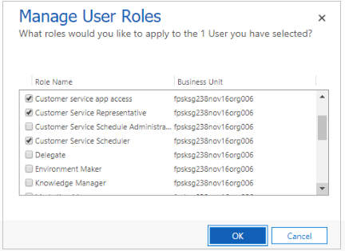

# Manage security roles in service scheduling

Security roles help to identify the privileges a user can exercise in the system. Security roles also define which entities a user can view or configure. For example, a user may have permission to see accounts but cannot see specific fields of an account.

The following standard security roles are leveraged in service scheduling:
  
- **Customer Service Manager (CSM)**. The Customer Service Manager role can setup the service scheduling experience. This role can access and setup all service scheduling entities in the system:

   - Resources
   - Resource Categories
   - Facilites/Equipment
   - Services
   - Service Activities
   - Schedule Board
   - Organizational Units
   - Business Closure

   However, to ensure that all CSM users are able to set up the new scheduling experience and access the new scheduling entities, they should also be assigned the **Customer Service Schedule Administrator** and the **Customer Service App Access** role.

   

   To know more about how to create users and assign role to them, see [Create users and assign security roles](../admin/create-users-assign-online-security-roles.md). 

- **Customer Service Representative (CSR)**. The Customer Service Representative can create and schedule service activities. 

  To ensure that all CSR users are able to schedule services using the new scheduling experience, they should also be assigned the **Customer Service Scheduler** and **Customer Service App Access** role. 

  

[!INCLUDE[proc_more_information](../includes/proc-more-information.md)] [Security roles and privileges](../admin/security-roles-privileges.md)

## Understand roles and their privileges

Each role in the scheduling experience is expected to perform a set of actions. Refer the table below to know more about the privileges of the CSM and CSR role:

|Role  |Privileges  |
|---------|---------|
|Customer Service Manager (CSM)     |     Can create, access, and perform CRUD operations on Services    |
|      |   Can create, access, and perform CRUD operations on Service Activities      |
|     |    Can access Schedule Board     |
|   |   Can create, and access Facilities and Equipment      |
|Customer Service Representative (CSR)     |    Can create, access, and perform CRUD operations on Service Activities      |
|    | Can access Schedule Board         |
|    |   Can create, and access Facilities and Equipment      |

### See also  

[Create or edit a security role to manage access](../admin/create-edit-security-role.md)
