# Preview: Migrate automatic record creation rules and service-level agreements

[!include[cc-early-access](../includes/cc-early-access.md)]

The Dynamics 365 Customer Service Hub app has several features and functionalities that replace the rules in the legacy Customer Service app. The automatic record creation (ARC) rules and service-level agreements (SLAs) are now supported by Power Automate-based flows to make the transition to the new platform easier to manage.

This topic provides an overview of the migration tool that allows legacy rules for ARC and SLAs to be transferred to the Customer Service Hub app for easier access.

The migration tool is designed to migrate the existing legacy rules to Unified Interface, ensuring all the rules, items, and actions are converted accordingly into the Unified Interface format. This also includes the conversion of the workflow to a Power Automate-based flow.

The migration tool provides the following functionality:
- Ability to run the migration tool multiple times and see what your status looks like at any point in time.
- Flexibility to choose which legacy rules need to be migrated. 
- Flexibility to decide when to activate new rules and deactivate the legacy rules so you are not forced to activate all or none.
- Existing legacy rules are not modified or deactivated automatically. 
- Messages on potential issues on why a ruled failed the migration process.
- Legacy rules continue to run on existing cases until the rules are deactivated. 

## Prerequisites

- Customer Service license.
- For migrating automatic record creation rules, your environment must have Customer Service version 9.0.20034.20XX or later to opt in for migration.
- For migrating SLAs, your environment must have Customer Service version 9.0.20053.1030 or later to opt in for migration.
- Administrator permissions.

### Working with rules

Before you run the migration tool, it is important to understand how the modern ARC and SLA rules work in the Customer Service Hub app.

When you perform your migration, you will only receive detailed results on rules that have failed the premigration checkup or creation, or those that were partially migrated (incomplete).  

To learn more about how to create rules in the Customer Service Hub app, see [Automatically create or update records in Customer Service Hub](automatically-create-update-records.md) and [Define service-level agreements](define-service-level-agreements.md).

<!-- editor question: Do you mean Unified Interface instead of UIC? We shouldn't abbreviate Unified Interface. -->

> [!Note]
> When you have successfully migrated a rule, any edits made to that rule on the web client will not be visible in Unified Interface. For the edits to be visible in Unified Interface, you must delete the rule in UIC and migrate it again from the web client.

### Editing rules

If you rerun the migration tool, it will pick up any updates or edits in the web client if the rule has been: 

-  Edited prior to the actual migration in the web client.
-  Edited to resolve errors in the web client that failed during a previous migration attempt.

The following updates or edits to a rule will not be considered if:

-  The rule is edited on the web client after it was successfully migrated to Unified Interface.
-  Any edits were made to migrated rules in the Unified Interface client after running the migration tool.

## Accessing the migration tool

> [!NOTE]
> Only administrators can view and use this option.

You can access the migration tool using the following steps:

1. Go to **Service**.

2. Select **Service Management**.

3. Under **Data Management**, select **ARC & SLA Migration Tool (Preview)**.

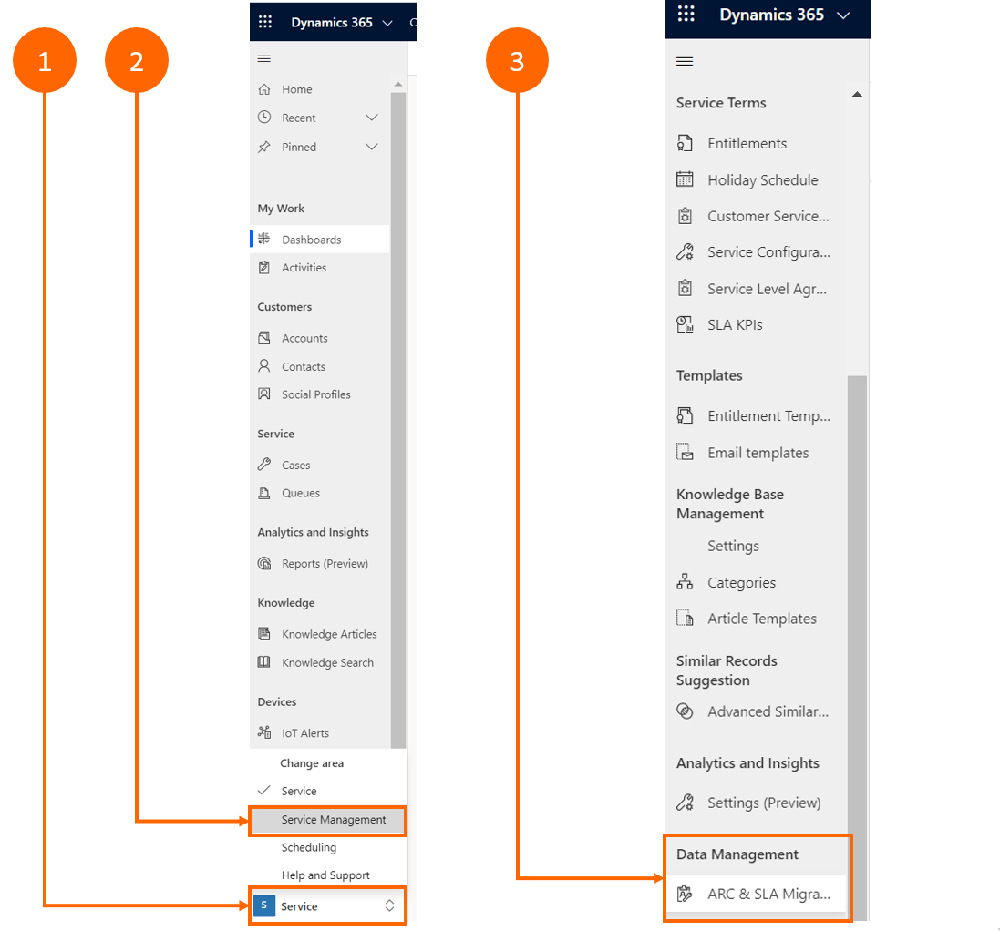

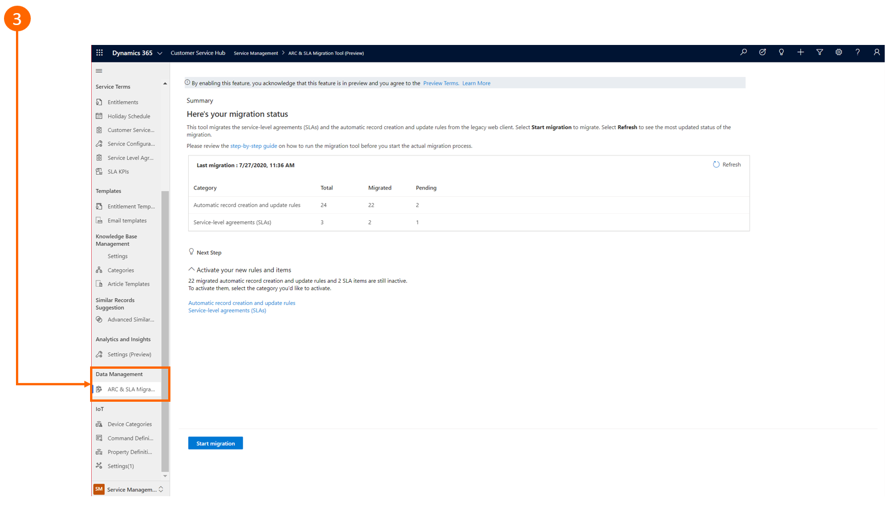

## Migration process

The migration process consists of the following steps:

**Step 1: Category to migrate.** Allows you to pick and choose which rules you wish to migrate.

**Step 2: Premigration checkup.** Provides insights into any potential migration failures you might incur prior to beginning your migration.    

**Step 3: Rules and items to migrate.** Allows you to select which rules you want to migrate. 

**Step 4: Review.** Provides you with the opportunity to go through any rules that have been identified as having errors or issues and fix these prior to migration.

**Step 5: Migration.** Post-migration, allows you to review which rules successfully completed the migration process and which ones failed. 

**Step 6: Finish.** Provides you with a summary and status page of rules which have successfully migrated, those that are pending, and failed migration.

## Use the migration tool 

When you have successfully accessed the migration tool, choose one of the following two options based on your experience working with the tool: 

**First-time migration tool user**: Follow the steps in this option if you are accessing and using the migration tool for the first time.

**Experienced migration tool user**: Follow the steps in this option if you have accessed and used the migration tool in the past.

## Migration tool for first-time users

The migration landing page shown in the next image is what will be displayed for first-time users. It provides the following: 

<!-- editor comment: Maybe add "Category" in bold to step 1 so it is more like the other steps in the list. -->

1.	An overview of the automatic record creation rules and SLAs.
2.	**Total**: Displays the number of legacy rules available overall.
3.	**Migrated**: Displays the number of rules you have migrated.
4.	**Pending**: Displays the number of rules you have pending migration (includes failed rules, partially or incomplete migrated rules, and rules that have not been attempted).
5.	**Migration status**: Displays whether migration has started.
6.	**Refresh**: Allows you to update migration status.
7.	**Start migration**: Allows you to begin the migration process.

    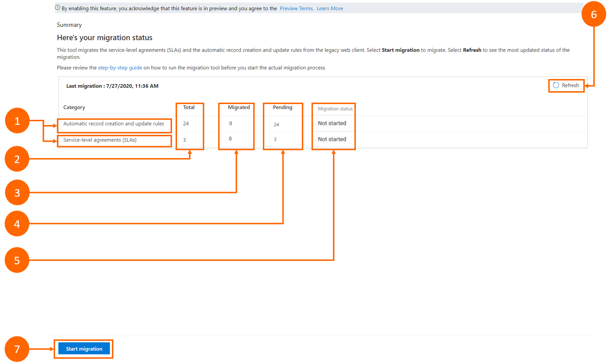

When you select **Start migration**, the migration tool takes you through the migration process, which consists of the following steps:

<!-- editor comment: The following steps already were listed above, starting on line 97. I suggest adding links to that section and getting ride of the following section.  -->

**Step 1:** [Category to migrate](migrate-automatic-record-creation-and-sla-agreements.md#step-1-category-to-migrate)   
**Step 2:** [Premigration checkup](migrate-automatic-record-creation-and-sla-agreements.md#step-2-premigration-checkup)  
**Step 3:** [Rules and items to migrate](migrate-automatic-record-creation-and-sla-agreements.md#step-3-rules-and-items-to-migrate)  
**Step 4:** [Review](migrate-automatic-record-creation-and-sla-agreements.md#step-4-review) 
**Step 5:** [Migration](migrate-automatic-record-creation-and-sla-agreements.md#step-5-migration)  
**Step 6:** [Finish](migrate-automatic-record-creation-and-sla-agreements.md#step-6-finish)

## Step 1: Category to migrate

The **Step 1** screen provides:

1.	A tracker that is displayed on the left, showing you where you are in the migration process at all times.
2.	Category options that allow you to select which rules you want to migrate by selecting a box. You can elect to migrate ARC and SLAs separately, or migrate both at the same time. 
3.	You must select a category for migration before you can proceed.   

    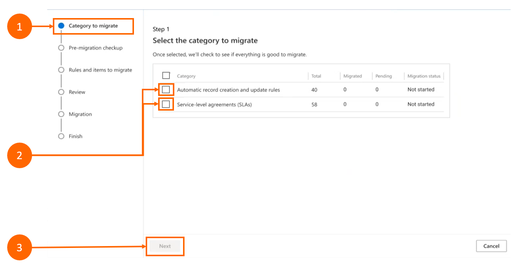

4.	When you select the category you want to migrate, the selection is confirmed by a check mark.

5.	The **Next** button at the bottom will turn blue when you select a category. 

    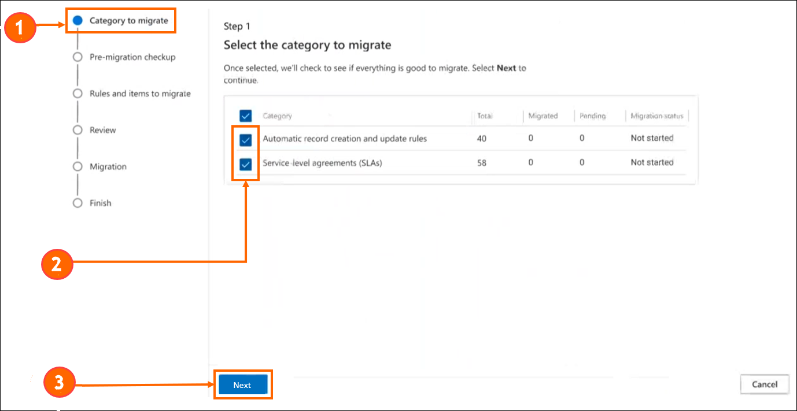

## Step 2: Premigration checkup

The **Step 2** screen provides a premigration check that displays what the actual migration results will look like so you can mitigate potential migration failures before you begin.  

The **Premigration checkup** can be performed on ARC or SLA or both, depending on your selection from the previous screen.

As a first-time user, you won't have any insights until you complete the premigration checkup. When the premigration checkup is complete, the following overview is displayed. It shows:

1.	The number of rules that will successfully complete migration, displayed by category.

2.	The number of rules that might fail if migrated, displayed by category.

3.	The **Next** button, which you select to continue to **Step 3** to view which rules passed and which failed.

    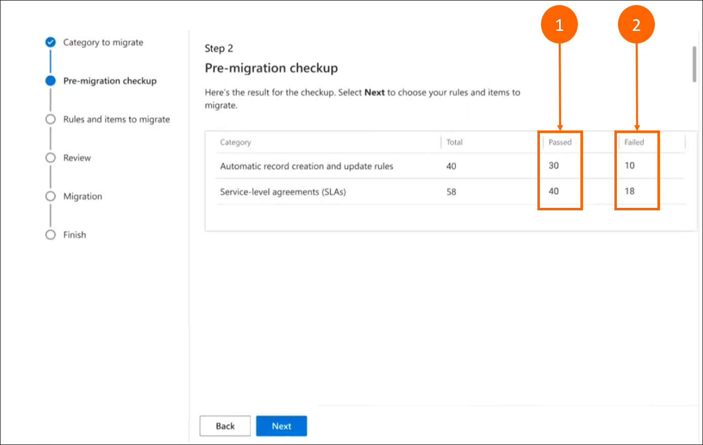

## Step 3: Rules and items to migrate

The **Step 3** screen shows the rules that successfully passed are automatically selected to move forward for migration. However, you can control which rules you want to migrate by selecting or deselecting them.  

Rules that fail can still be migrated; however, the data will not completely migrate. You can fix any errors prior to migration or fix the rule in the Customer Service Hub app when you've completed your migration. If you want to migrate both passed and failed rules, use the **Migrate all rules** option to override any current selection and migrate all rules.

<!-- Editor comment: It's confusing here with two Step 3 headings, even at different levels. I suggest removing "Step 3" from this next heading. -->

### Step 3: Automatic record creation and update rules

Use the following to complete Step 3:   

1.	The tracker displays which set of rules you are working on for migration to ensure clarity.

2.	Rules that pass are automatically selected for migration. You can deselect any rules you don't want to migrate.

3.	Rules that failed are not selected for migration; however, you can still select them but they might not migrate completely. To understand why a rule failed, you can select it and view the details about the failure and use the information to fix the failure prior to or after migration. See [View Details for Rule Failure](#view-details-for-rule-failure) for more details. 

4.	**Migrate all rules** provides you the ability to override the current selection in order to select all rules, regardless of their premigration checkup result.

5.	Allows you to **download all logs** that failed for review and troubleshooting purposes.  

6.	This alert notifies you that while you can migrate rules that failed the premigration checkup, the data on failed rules will not migrate completely and provides the option to **unselect rules** that failed.

7.	When you have selected or deselected all of the rules you want to migrate, select **Next** to continue to Step 4.

    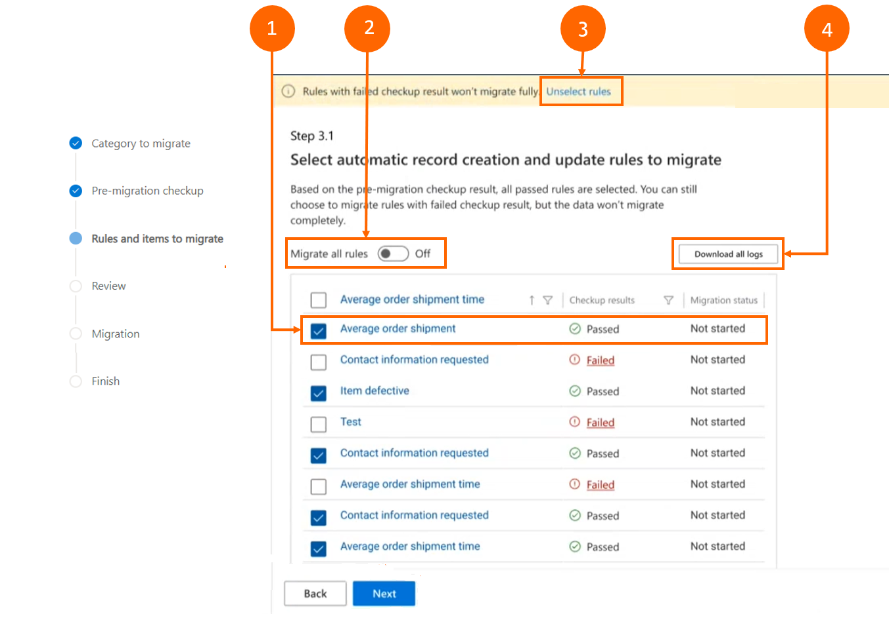

<!-- editor comment: I'm pushing the next three headings down one level so they aren't at the same level as the Step headings. Otherwise, it looks like the steps end at Step 3. -->

### View details for rule failure

When you select a rule that failed the premigration checkup, you have a choice of **Basic** and **Advanced** views to better understand why a rule failed. You can use this information to either troubleshoot and fix the ruled that failed, or choose to migrate the rule and fix it in the Customer Service Hub after migration is complete.

#### Basic view

The **Basic** view provides the following overview for each individual rule that failed, including:

1.	High-level details on rules that fail.

2.	**Pre-migration checkup** shows results along with details of why a rule failed.

    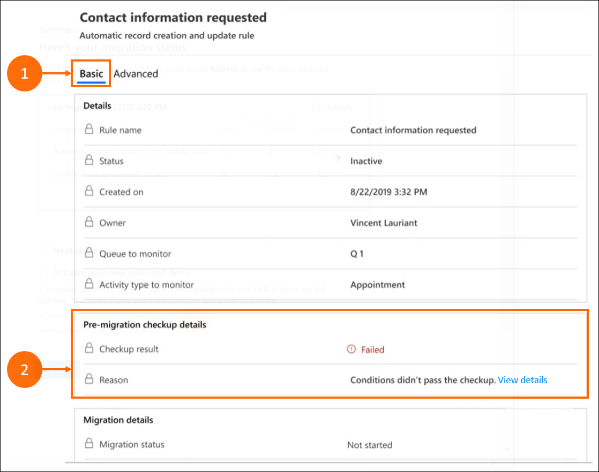

#### Advanced view

The **Advanced** view provides the following overview on rules that failed, including:

1.	Additional details about why the rule might have failed migration, which you can use to troubleshoot and resolve prior to migration.

2.	The **Download log** provides a list of failed rules to review and troubleshoot.  

    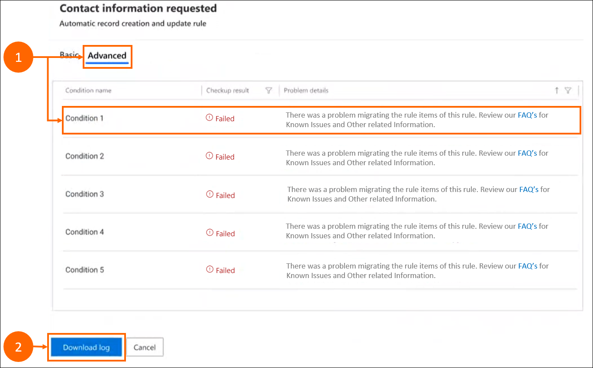

## Step 4: Review

When you have selected the rules you want to migrate for ARC or SLAs, a list displays for your review, which allows you to:  

1.	View a list of all the rules you have selected for migration. 

2.	Select **Back** to return to the previous step to make additional changes.

3.	Select **Start migration** to begin the migration.

    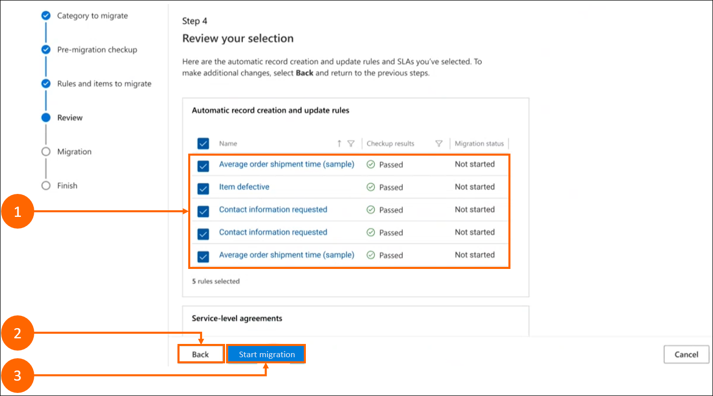

## Step 5: Migration

After you begin your migration, the following screen displays with the details:

1. A message that your migration is in progress.
2. The **Next** button is disabled during the migration process. When the migration is completed you will be taken to the next step automatically.

   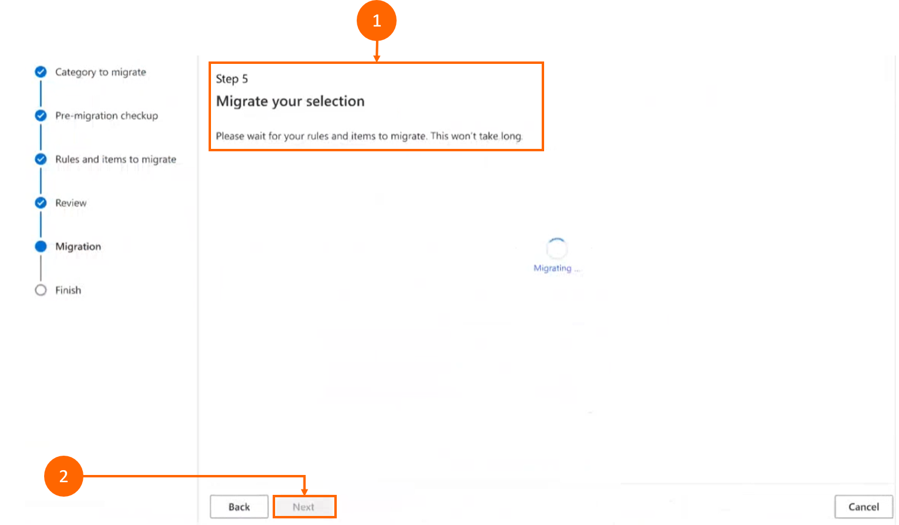

When migration is complete, the following screen displays with the following details:

1.	**Selected**: Displays the total number of rules that were selected for the current migration run.
2.	**Migrated**: Displays the total number of rules that successfully completed migration.
3.	**Incomplete**: Displays the total number of rules that encountered errors and didn't successfully complete migration. See [Incomplete Migration Details](#incomplete-migration-details) for more information.
4.	**Migration Status**: Displays either a green check mark , which represents rules successfully migrated, or a red exclamation mark ,   which represents some or all rules did not successfully complete migration.
5.	**Finish**: Completes the migration process when finished.

    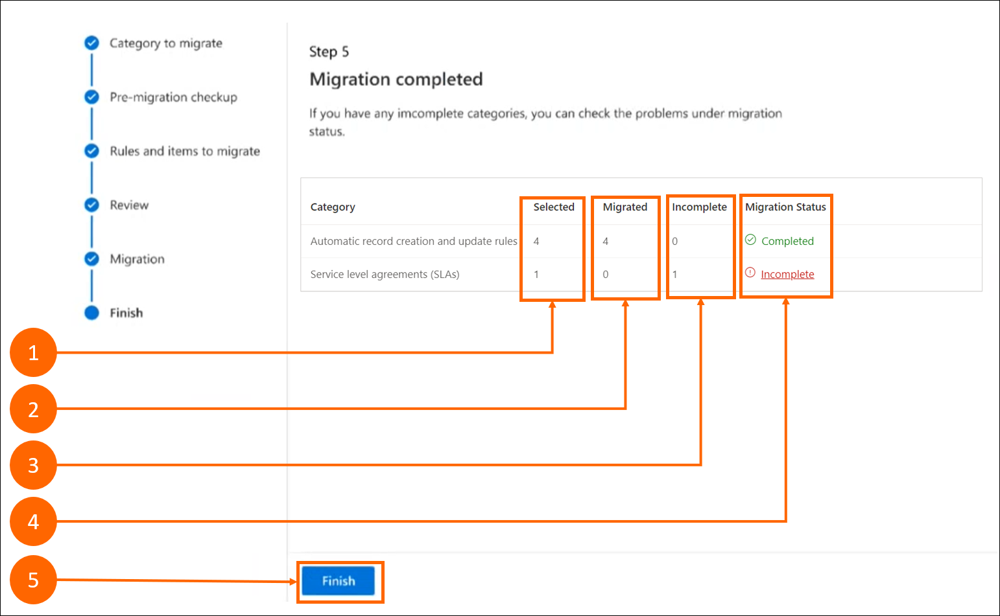

### Incomplete migration details

To view ARC or SLA rules that did not successfully complete migration, you can select **Incomplete** in the **Migration status** section. This displays a list of all rules that did not pass, including:  

1.	**Name**: Displays each individual rule that failed.
2.	**Migration status**: Displays whether a rule successfully migrated or was unsuccessful and is therefore considered incomplete.
3.	**Problem details**: Displays why the rule failed and has a **Download log** option that provides more details.
4.	**Download all logs**: Allows you to download a list of the rules that failed migration that you can use for review and troubleshooting.  

    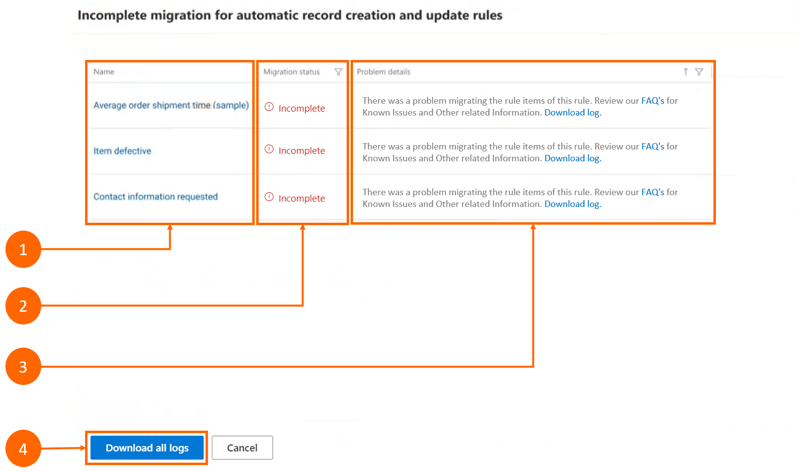

## Step 6: Finish

When you've completed your first run and selected **Finish**, a migration **Summary** page displays with the following information:

1.	**Total**: Displays the number of legacy rules present overall.
2.	**Migrated**: Displays the number of rules you have completely migrated to date.
3.	**Pending**: Displays the number of rules you have pending migration (includes failed rules, partially/incomplete migrated rules, and rules that have not been attempted).
4.	**Refresh**: Allows you to view your update migration status.
5.	**Next Step**: Provides links to all of the ARC and SLA rules where you can review the migrated rules and choose to activate them. See [Review and activate new rules](#review-and-activate-migrated-rules) for more information. 

    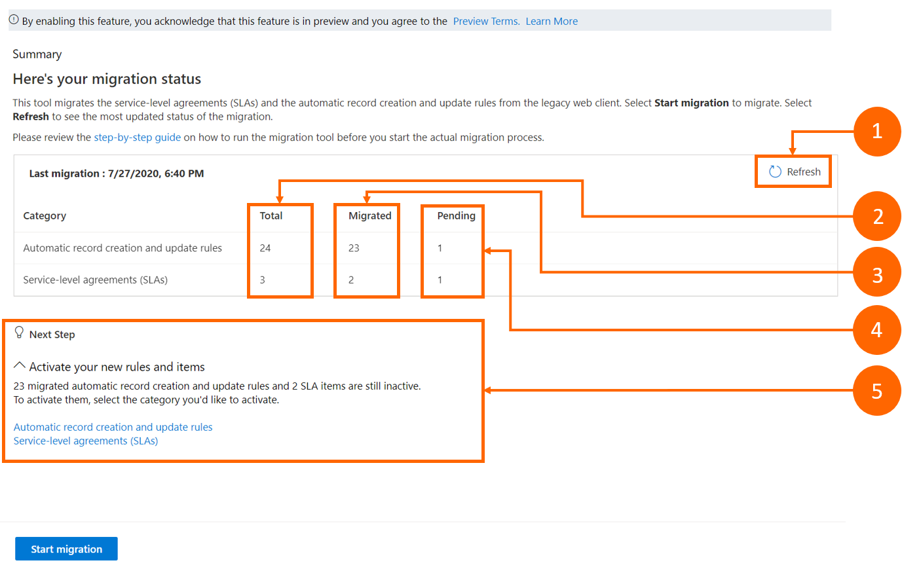

<!-- editor question: Should the following section be part of the "Finish" step, or is it not part of any step? If part of Finish, push the heading level down. -->

## Review and activate migrated rules

When you activate new rules for either ARC or SLA, the following screen displays:

1.	**Rule name**: Displays migrated rules with an underscore (\_) to make it easier to identify the migrated rules. For example: **\_migrated**.

    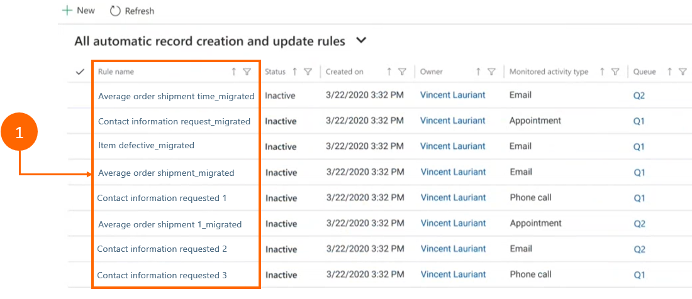

### Migration detail section

<!-- editor comment: It would help to have some text here, maybe explaining what the next two subsections are. Try to avoid consecutive headings with no text in between. -->

#### Working with partially migrated rules

When you select a **Rule name** ending in **\_migrated**, the following displays:

<!-- editor question: Does the user need to select the tab? -->

1.  The **Migration details** tab. 
2.	**Mark as complete**: Contains a toggle feature that identifies whether a rule has completed migration (**Yes**), or has not completed or has only partially completed migration (**No**). 

    The administrator can review the incomplete rule and choose to resolve the issue and move the toggle to **Yes**, which then updates the migration status to **Migrated**. 

    > [!Note]
    > - When an administrator moves the toggle to **Yes**, this confirms that the rule has been successfully migrated and therefore won't be picked up in subsequent migrations.
    > - If the administrator doesn't take any action on an incomplete rule, the rule continues to be picked up in subsequent migrations. Also, the rule will be replaced when it is selected to migrate again. 
3. **Migration status**: Displays the status of the rule as either **Migrated** or **Incomplete**.
4. **Problem Details**: Provides high-level detail on any errors encountered for the rule during migration. 

   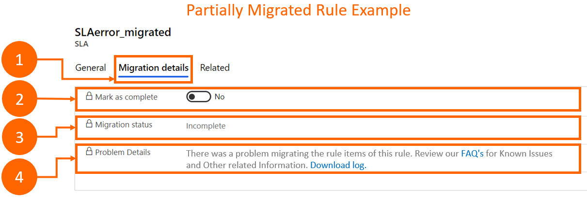

#### Working with successfully migrated rules

1. **Mark as complete**: Toggled to **Yes** by default.
2. **Migration status**: Displays the status of the rule as either **Migrated** or **Incomplete**.

   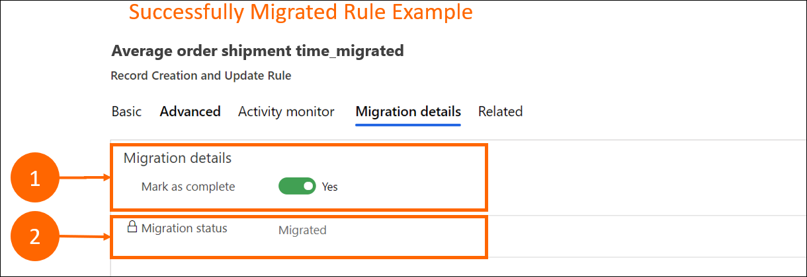

## Migration tool for experienced users

If you have already been through the migration process, your experience will be very similar to that of the first-time user, with a few exceptions.   

1.	**ARC & SLA Migration tool**: Access the migration tool under **Data management**.
2.	**Previous migration data**: The **Summary page** will have updated data based on your previous migration. 
3.	**Start migration**: Begins the migration process. Select to continue. 

    

## Step 1: Category to migrate (Experienced user)

This step allows you to select the rules you want to migrate.

## Step 2: Premigration checkup (Experienced user)

When preparing to rerun the **Premigration checkup** process step, it only reviews the rules that previously did not pass. You can download the details provided to troubleshoot errors and make updates in the Unified Interface or legacy system before you rerun your migration.

1.	**Yellow notification message**: Reminds you that rules that were previously migrated successfully will automatically be skipped in a rerun of the premigration checkup process. This also includes rules that the administrator has confirmed.
2.	**Total**: Shows the number of rules that are available for migration. The premigration checkup process only focuses on running rules that have not been migrated completely, not attempted previously, or failed to create, which is reflected in the total count.

    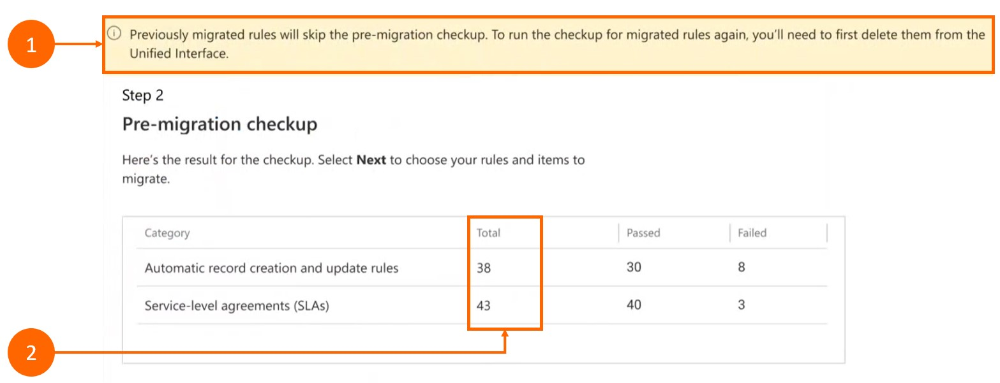

## Step 3: Rules and items to migrate (Experienced user)

This step allows you to select the rules you want to migrate, including:
 
1.	**Migrate all rules**: Allows you to override all previous selections.
2.	**Checkup Results**: Displays whether your rule passed or failed the premigration.
3.	**Failed**: Allows you to review the rules that failed by selecting them.
4.	**Download all logs**: Allows you to view individual problem details.

    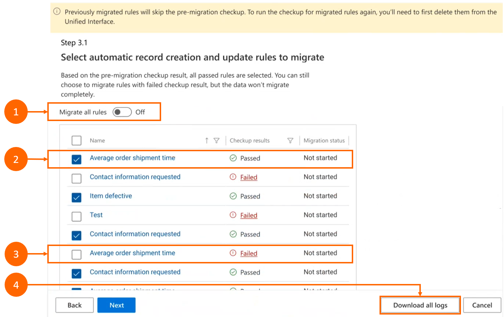

Only rules that were not attempted, did not completely migrate, or failed to migrate will appear in **Step 3**. If you want to attempt migration of a successfully migrated rule again, delete the corresponding rule from Unified Interface and rerun the migration tool for it to appear in the list again. 

## Step 4: Review (Experienced user)

This step gives you the opportunity to review and fix any rules that have errors or issues prior to migration.

## Step 5: Migration (Experienced user)

This step confirms when migration is complete and provides a summary of the number of rules that successfully completed migration, as well as the number of rules that failed.

1.	**Selected**, **Migrated**, and **Incomplete**: Provide the migration results for the current migration run.
2.	**Migration status**: Displays the status of your current migration run and allows you to view the details on the **Incomplete** rules that could not be migrated.

    <!-- editor comment: There's a typo in the image ("imcomplete"). Actually, it might be better to remove that text in the top of the image - it adds clutter to the image. -->

    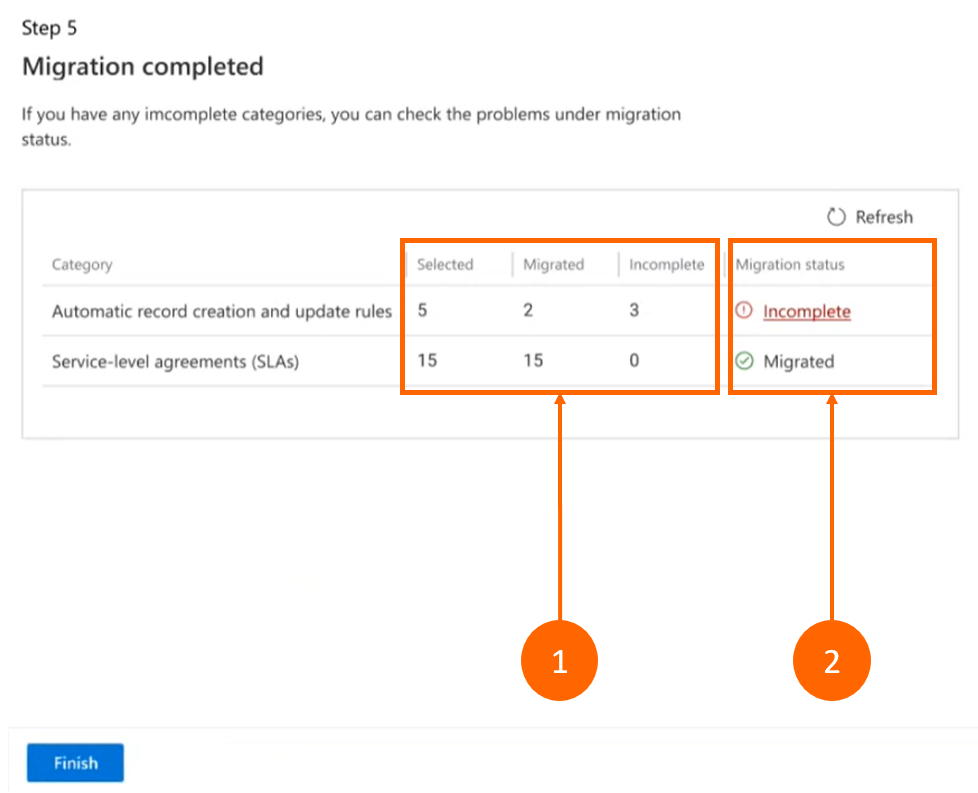

## Step 6: Finish (Experienced user)

When you finish your migration, an updated **Summary** page will be displayed that includes:

1.	**Summary**: Provides the overall summary of all the migration details to date. 
2.	**Start**: Select to rerun the migration process.

    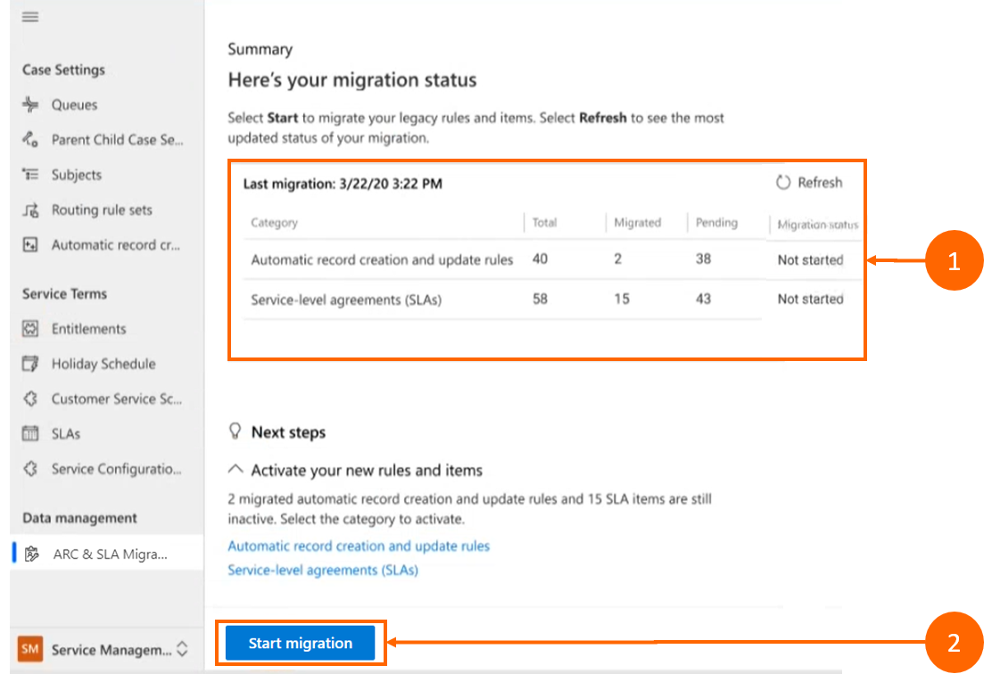

### See also

[Migration tool FAQs](migrate-tool-faqs.md)

[Set up rules to automatically create or update records](set-up-rules-to-automatically-create-or-update-records.md)

[Define service-level agreements](define-service-level-agreements.md)

[Important changes (deprecations) coming](https://docs.microsoft.com/power-platform/important-changes-coming) 

