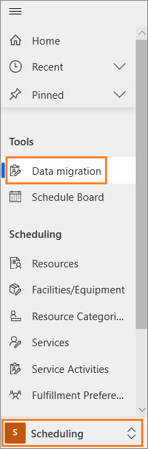
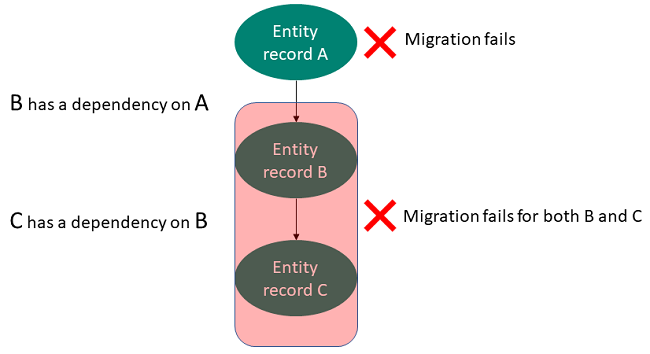

# Migrate data from legacy Service scheduling using migration tool

Follow these steps to migrate entity records from legacy scheduling experience to the new scheduling experience.

1. Sign in to the Customer Service Hub app with Administrator or System Customizer role privileges.

2. Select **Scheduling** from **Change area**.

3. Select **Data migration** under **Tools**. The **Migrate to Service scheduling on Unified Interface** page displays the **Last run status**. If you've never run the tool, then the **Date** and **Status** field will be blank.

    

4. Review the details and select **Next** in the **Migrate to Service scheduling on Unified Interface** page. The **Step 1/3: Configuration data** page appears that displays the name of the entity records and the total number of records that will be migrated.

5. Specify the following in the **Step 2/3: Service Activities** page and select **Migrate**.

    | Field | Description | Value |
    |----------------------------|-------------------------------|---------------------------------------|
    | Migrate Service Activities | Set the toggle to **On** to migrate the service activities. | On |
    | Start date | Select a start date from the date picker. | 6/20/2019.   **Note:** This is an example value. |
    | End date | Select a end date from the date picker. | 9/23/2019.   **Note:** This is an example value. |

    The tool considers all the Service activities that are scheduled to start and be completed within the date range.

    > [!Note]
    > - The migration tool doesn’t consider the records whose status is marked as Ignore. To learn more, see [Understand migration status](#understand-migration-summary-and-troubleshoot).
    >
    > - If you create any records after you start the migration, the new entity records will not be fetched and migrated.

6. Review the information in the confirmation dialog and select **Migrate**. Once you migrate, the action cannot be undone.

7. Review the status of the migration. If the migration is successful, select **Done**, and the migration status page is displayed.
 
    

    > [!Note]
    > After you’ve migrated an entity record, if you update the record in the legacy service scheduling, the difference of update can’t be migrated using the tool. You must manually update the changes in the new service scheduling experience.

## Understand migration summary and troubleshoot

The status column displays two types of migration statuses for the entity records:

- **Done:** When the migration of the entity records is completed successfully, the tool displays the status as Done. 
- **View Errors:** When the migration of the entity records is failed, the tool displays the status as View Errors.

### View errors

If the migration of one or more entity records has failed, the status column displays for which entity records the error has occurred.

   

Select the **View Errors** in the status column to view the details in a new browser tab. The tool navigates to the associated entity view that shows the record name, status (which will be failed all the time), and migration failure reason.

For example, when you select the View Errors option against the **Service Activity**, a new browser tab opens, and the tool displays **Service Activities - Migration Status** page.

To learn more, see [Troubleshoot using migration information](#troubleshoot-to-resolve-migration-errors).

### Troubleshoot to resolve migration errors

One of the reasons for the failure of entity record migration is a dependency among the entity records. That is, a **Service Activity** entity record has a dependency on the **Service** entity record, which in turn has a dependency on the **Resource Group** entity record. If the migration of **Resource Group** fails, then migration of **Service** and **Service Activity** also fails.

   

> [!TIP]
> Resolve the errors in the order in which the entity records are migrated. To learn about the order of migration, see [Considerations for migration](plan-migration.md#considerations-for-migration).

For example, 

Henry Ross, a customer, has scheduled a service activity with Contoso Bike Center. To do this service activity, the **Bike technicians** resource group and **Bike overhaul** service  are required. 

See the matrix for the dependency.

   | Entity name |Record name|
   |------------------|--------------------|
   | Resource Group | Bike technicians |
   | Service | Bike overhaul |
   | Service Activity | Henry Ross (customer) |

The **Service Activity** for Henry Ross has a dependency on the **Service**, Bike overhaul and **Resource Group**, Bike technicians.

Let us take the preceding example to learn how to resolve the error.

1. Select **View Errors** against the **Service Activities** record in the **Data Migration Wizard** tab. 

   The **Service Activities - Migration Status** page opens in a new browser tab.   You can view the migration error message for the **Henry Ross** customer stating service has failed due to the **Dependent ResourceGroup is not migrated**, which has the GUID as `3979D7DB-F5DA-E911-A81F-000D3A6D4947`.

2. Open a new browser window and go to `https://<dynamics org url>api/data/v9.0/services(<Guid>)`. For example, `https://<dynamics org url>api/data/v9.0/services(3979D7DB-F5DA-E911-A81F-000D3A6D4947)`.

   Now, you find the record name. In our case, it is **Bike technicians**, which is a **Resource Categories** entity in the new service scheduling experience.

3. Select **View Errors** against the **Resource Categories** record in the **Data Migration Wizard** tab. 

   The **Resource Categories - Migration Status** page opens in a new browser tab.   You can view the error the caused the Site entity record failure.

4. Resolve the error that caused the migration failure, and then you can go to the migration step, and select **Retry Migration** to start the migration for the failed entity records.

   > [!Note]
   > In case of retry scenario, the migration tool shows the number of records that need to be migrated in that retry scenario of migration.

5. Review the migration status, if there are any errors, investigate in a similar way as explained in this example.

## See also

[Introduction to migration of entity records](introduction-migration-entity-records.md)

[Plan your migration](plan-migration.md)
