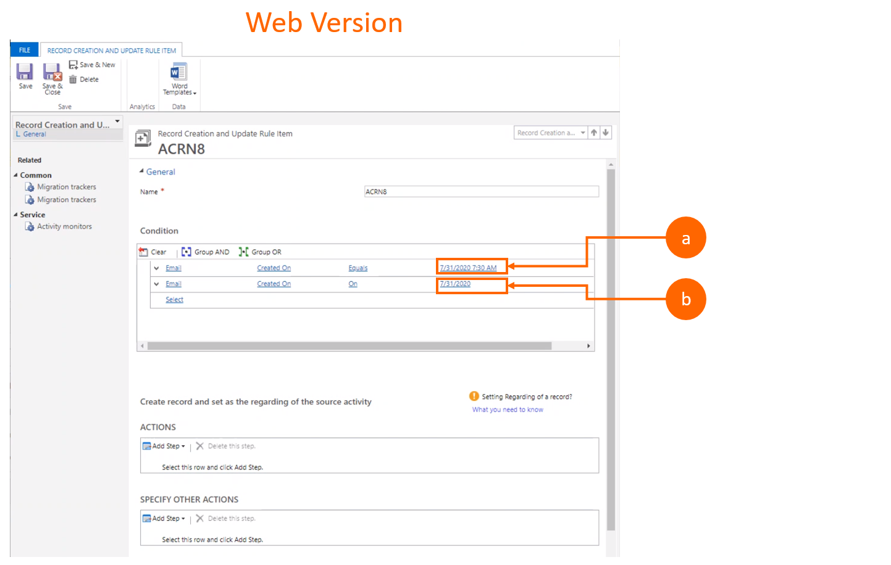
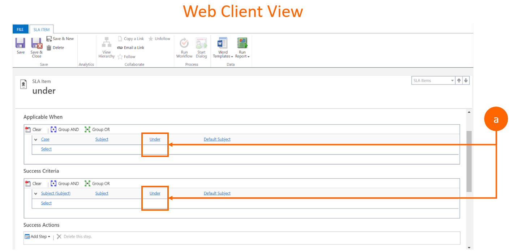
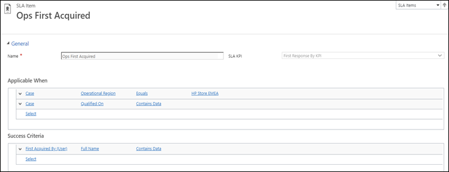
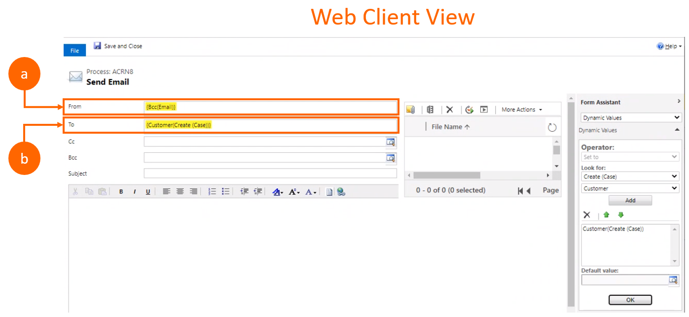

# Migration tool FAQs

## FAQs on migration tool for automatic record creation rules and service level agreements (SLAs)

### Who can access or run the migration tool?

Currently, only administrators can run the migration tool.

### Are migrated rules automatically activated post-migration?

No. You must manually activate the migrated rules when migration is complete.

### Can I activate a rule with an incomplete migration status?

No. A migrated rule can only be activated when **Mark as complete** is toggled to **Yes** (that's when the rule is considered successfully migrated). 

> [!Note] 
> Review the incomplete rule to resolve any issues before you toggle the **Mark as complete** to **Yes**, and then activate the rule.

### Will the legacy rule be deactivated?

- **For ARC, yes.** When you activate a migrated ARC rule in Unified Interface, the corresponding legacy rule will be deactivated.
- **For SLA, no.** When you activate a migrated SLA rule in Unified Interface, the corresponding legacy rule remains active because they can coexist.  

### What does an "incomplete" status mean?

- If located in the **Summary** section, it means the overall migration process couldn't successfully complete the migration of all selected rules.
- If listed next to a rule, it means the rule has either failed or could not be fully migrated (meaning one or more items or conditions failed to migrate).

### Where can I find a list of partially migrated rules that are tracked in the migration tool?

Rules that are partially identified or identified as ‘incompletely migrated’ are tracked under **Pending** in the **Summary** section since they are not considered fully migrated. Only rules that completed migration successfully are counted under **Migrated**.

### Are custom forms or fields supported by the migration tool?

No. Custom entities, fields, attributes, and configurations are not supported by the migration tool. Only out-of-the-box entities, fields, and attributes are supported by the migration tool.

### Do I need a separate license for Power Automate before running migration?

 No. For more information on licensing guidelines, go to [What are Microsoft Power Apps and Power Automate use rights for Dynamics 365 applications?](https://docs.microsoft.com/power-platform/admin/powerapps-flow-licensing-faq#what-are-microsoft-power-apps-and-power-automate-use-rights-for-dynamics-365-applications)

### Some of my rules are incomplete or partially migrated. What should I do?

You can either fix the rule in the web client based on the problem details and rerun your migration, or fix the migrated rule directly in Unified Interface.

### Can I rerun the migration tool for a specific migrated rule?

Yes, you can rerun the migration tool for a specific migrated rule based on the following:
    
- **For incomplete or failed migration rules:** Select the same rule when you rerun the migration tool. It automatically replaces the existing failed or incomplete rule with the newly migrated one.
- **For successfully migrated rules:** Delete the migrated rule in the Unified Interface before rerunning the migration tool.

## Known condition conversion issues

The following are key scenarios where rules or items will not successfully complete migration:

### If my rule items or conditions have related entities inside a nested group clause (and/or), will they be migrated to Unified Interface?

No. We currently only support one level of the related entity hierarchy. For such rule items or conditions to successfully migrate, you need to remove any related entity in group clause before you migrate. If you don't take any action, the rule will fail during the **Premigration checkup** step, and if you then choose to continue with the migration, the rule will have an empty condition for the respective item.
    
**Example: Premigration view**
  
**a.**	Premigration web client view.

    
**Example: Post-migration Unified Interface view** 
  
**2a.** The migrated item title changes to **\_FailedMigration** appended.
    
**2b.** The same standard placeholder **Created On equals 2200-01-01** is added to the condition.

### Why do my rule items or conditions with a DateType field that uses a "not on" operator fail during the premigration checkup and actual migration?

The **Not on** operator for the **Date** data type is not supported in Unified Interface and therefore is not supported as part of migration. To fix this issue, you can change the legacy items or conditions from **{not-on selecteddate}** to **{selecteddate less than and selecteddate greater than}** in the web client before rerunning the migration tool for the respective rule.

**Example: Premigration view**
    
**a.**	Premigration web client view.
        

**Example: Post-migration Unified Interface view**
    
**2a.** The migrated item title changes to **\_FailedMigration** appended. 

**2b.** The condition **Created On equals 2200-01-01** is added to the condition.

### Why does the data in my DateTime field change during migration?

A separate time field doesn't exist in the Unified Interface, so the DateTime field will change from a calendar control to text field. Input should be in a specific format as shown in the text box below:
    
**Example: Premigration view**
    
**a.**	Premigration **Date and time** location.
    
**b.**	Premigration **Date only** location.
    

**Example: Post-migration Unified Interface view** 

**a.**	Post-migration **Date and time** location

**b.**	Post-migration **Date only** location

### Why are some of my operator fields blank in Unified Interface after migration?**

For lookup data types, only the **equal / not equal, null /not null** operators are supported in Unified Interface and are supported in the migration tool. **Under** and **not-under** operators are not supported in Unified Interface, and therefore are not supported in the migration tool. Any conditions that have **under** or **not-under** operators are translated as **related entities** after migration and are shown as blank in Unified Interface after migration, and cannot be edited. 

**Example: Premigration view**
    
**a.**	Premigration web client view.
    
 

**Example: Post-migration Unified Interface view**

**b.**	Post-migration Unified Interface view.
    
 

> [!Note]
>
> The following limitations are applicable when defining a condition in Customer Service Hub:
> - The Date & Time picker control is no longer available in the conditions; however, you can still edit the date and time in the text field.
> - Only one level of the related entity hierarchy is supported, though the application lets you select nested, related entities.
> - The related entity inside a group of the and/or clause is not supported.
> - The "not-on" operator for the Date data type is not supported.
> - For the lookups data type, only the "equal," "not equal," "null," and "not null" operators are supported. The "under" and "not-under" operators are not supported.

## Known issues
 
### Can I migrate a rule again after it’s been activated?

 - **Yes, for automatic record creation rules.** You can migrate an activated rule again, but you must first deactivate and delete it from Unified Interface before you can migrate it again.
 - **No for SLAs.** After a migrated SLA rule is activated, it is linked to another entity (such as a case or is in use). To attempt to migrate an activated rule (which is a successfully migrated rule by default) again, you'd need to delete that specific rule. 

However, there is a limitation with Unified Interface SLA rules, and once a rule is associated with a case or entity (that is, if it has been activated even once), you cannot delete the rule even if it is deactivated. Therefore, the rule cannot be migrated again if it has been previously activated or applied.

### Can I migrate deprecated standard SLA rules?

 No. The migration tool only supports enhanced SLA rules. Standard SLA rules have been deprecated and are no longer supported in Unified Interface and therefore aren't supported in the migration tool. For more information, go to [Standard SLAs in Dynamics 365 Customer Service are deprecated](https://docs.microsoft.com/power-platform/important-changes-coming#standard-slas-in-dynamics-365-customer-service-are-deprecated). 

## Known flow issues

### Migration doesn't support multiple items or conditions having the same "applicable when" within same SLA.

In the web client, multiple items can be defined with the same "applicable when" condition and different success criteria for an SLA. However, the same capability is not supported in Unified Interface. Therefore, during migration, the second or subsequent such SLA item with the same "applicable when" condition will not be created. The following screenshots capture the scenario that is not supported in Unified Interface.

### Activity party-type attribute issues during workflow-to-flow conversion.

Any activity party-type attribute assigned to another activity party-type field (the most commonly impacted fields are: to, from, cc, and bcc, in emails) will not migrate during the workflow-to-flow conversion, as Flow currently doesn't support this scenario. Although the migration of the rule will not fail, the data value for such activity party-type fields that relies on another activity party-type attribute will be empty post-migration. 
        
 **Example: Premigration view**
    
**a.** The **From** field, which is an activity party-type field that is assigned another activity party-type attribute **{Bcc(Email)}** will be empty post-migration.

**b.**	The **To** field will migrate.
    

**Example: Post-migration Unified Interface view**

**b.**	The **To** field post-migration.

### First not null checks in expressions within legacy workflow during workflow-to-flow conversion is not supported.

In legacy workflows, a lookup field can be mapped with multiple expressions where you check and assign the **First Not Null** expression, as shown in the web client example below. Currently, this is not supported as part of workflow-to-flow conversion, as this is a known limitation from the legacy workflow designer. Therefore, the workflow converter assigns the first expression (without performing the null check) and removes the rest of the expressions, irrespective of whether they have **non-null** values. In the sample snapshot that follows, the flow will only have **Regarding(Email)** in the **Customer** field within this step.

**Example: Premigration view**
    
**a. Unified Interface view:** In Flow, the Customer field will only have: **Regarding(Email)** regardless of whether it is null.

**b. Web client view:** In the workflow, the Customer field has: **{Regarding(Email); Contact(Create (Case)); Customer(Create (Case))}** 

> [!Important] 
> 
> If you are still experiencing issues with the migration tool, contact your administrator or Microsoft support.

### See also

[Migrate automatic record creation rules and SLAs](migrate-automatic-record-creation-and-sla-agreements.md)  

[!INCLUDE[footer-include](../includes/footer-banner.md)]