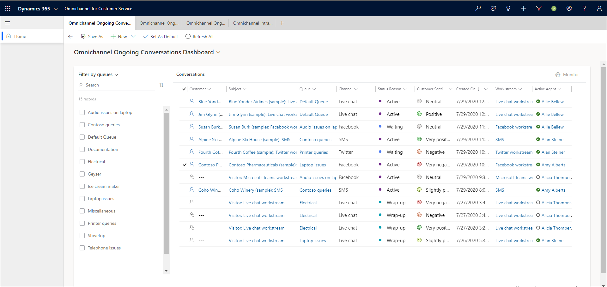
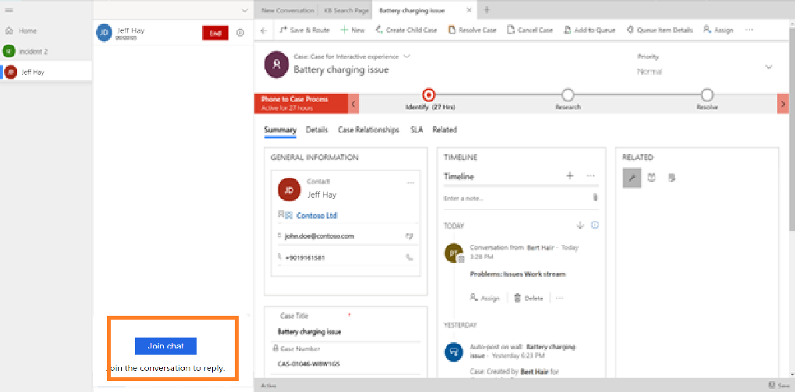
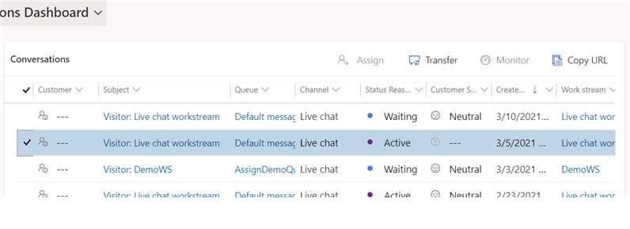

# Monitor, assign, and transfer conversations

[!INCLUDE[cc-use-with-omnichannel](../includes/cc-use-with-omnichannel.md)]

> [!IMPORTANT]
> This feature is intended to help customer service managers or supervisors enhance their team's performance and improve customer satisfaction. This feature is not intended for use in making, and should not be used to make, decisions that affect the employment of an employee or group of employees, including compensation, rewards, seniority, or other rights or entitlements. Customers are solely responsible for using Dynamics 365 Customer Service, this feature, and any associated feature or service in compliance with all applicable laws, including laws relating to accessing individual employee analytics and monitoring, recording, and storing communications with end users. This also includes adequately notifying end users that their communications with agents may be monitored, recorded, or stored and, as required by applicable laws, obtaining consent from end users before using the feature with them. Customers are also encouraged to have a mechanism in place to inform their agents that their communications with end users may be monitored, recorded, or stored.

As a supervisor, you can monitor, assign or transfer conversations that are being handled by agents. 
Monitoring conversations helps you identify the conversations to see how they are trending and if they need your immediate attention. You can also view customer sentiments and agent responses. 
You can also join a conversation in the consult mode, so you can provide your expertise and share your experience with the agent who is interacting with the customer. When you join a conversation, notifications about your presence are sent to the agent and customer who are part of the conversation. 

As a supervisor, if your administrator has enabled the **Assign** feature, you can also manually assign conversations to agents in cases where a conversation is not assigned. Only conversations that are in an **Open** state can be assigned by supervisors.

Also, you can transfer ongoing conversations that are in the active or waiting states from one agent to another.

Use the **Omnichannel Ongoing Conversations** dashboard to access the monitor and assign features. To learn more, see [Omnichannel Ongoing Conversations dashboard](ongoing-conversations-dashboard.md).

The following screenshot is an example of Omnichannel Ongoing Conversations:

> [!div class=mx-imgBorder]
> 

## Monitor and join conversations

 By joining the conversation, you provide necessary details to both the agent and customer based on the selected message mode (public or internal) in the communication panel. You can monitor all conversations that are in the **Active** or **Wrap-up** states. you can monitor or assign workstreams that are configured for all channels except entity records.

> [!NOTE]
> As a supervisor, you can't monitor conversations that are assigned to you.

1. Sign in to **Omnichannel for Customer Service**.

2. From the dashboard view selector, select the **Omnichannel Ongoing Conversations** dashboard.

    The list of conversations currently being handled by your agents is displayed.

3. Select a conversation that you want to monitor and select **Monitor** on the top-right corner.

    > [!div class=mx-imgBorder]
    > 

    The conversation page opens.

4. You can choose to join a conversation as required. Select **Join chat** in the communication panel.

    > [!div class=mx-imgBorder]
    > 

    When you join the conversation, a notification is sent to both agent and customer stating that you have joined as a consultant. Depending on your requirement, you can start a consultation with the agent and customer by using a messaging mode (public or internal). By default, the messaging mode is internal.

    To learn more, see [View communication panel](oc-conversation-control.md).

## Assign conversations

At times, you may need to manually assign a conversation. In such cases, the conversation should be in an open state and not assigned to any agent. You can override the agent's presence and allocated capacity when assigning conversations to them. When you override agent capacity, the number of units by which their capacity is exceeded is displayed.

1. From the dashboard view selector in **Omnichannel for Customer Service**, select the **Omnichannel Ongoing Conversations** dashboard.

    The list of available agents, their capacities, and queues, is displayed.
    > [!div class=mx-imgBorder]
    > 

2. Select a conversation in an **Open** state, and then select **Assign**.
    > [!div class=mx-imgBorder]
    > 

3. On the **Assign conversations** dialog box, select either **Agent** or **Queue**.

  If you select **Agent**, only those agents whose presence matches with one of the allowed presence values in the workstream configuration are displayed.
  If you select **Queue:**, then all other queues except the one to which the conversation is currently assigned, are displayed.

4. After selecting the agent or queue, select **Assign**.
   The conversation is now assigned to the agent or queue you selected.

## Transfer conversations

At times, you may need to transfer an ongoing conversation from an agent to another agent. In such cases, the conversation should be in an **Active** or **Waiting** state.

> [!NOTE]
> You can transfer conversations only on messaging channels such as Live Chat, SMS, or WhatsApp, particularly those that do not happen over voice or video modes. You can transfer conversations to and from agents only, and not bots.

1. From the dashboard view selector in **Omnichannel for Customer Service**, select the **Omnichannel Ongoing Conversations** dashboard.

    The list of available agents, their capacities, and queues is displayed.

2. Select a conversation in an **Active** or **Waiting** state, and select **Transfer** on the top-right corner.
    > [!div class=mx-imgBorder]
    > 

3. On the **Transfer conversations** dialog box, select an agent that you want to transfer the conversation to, from the list of agents that appears.

      Only those agents whose presence matches with one of the allowed presence values in the workstream configuration will be listed.

4. Then, select **Transfer**. The selected conversation is transferred to the agent.

> [!NOTE]
> When you transfer an **Active** or **Waiting** state conversation from one agent to another, the first agent becomes a consultee to the conversation that is now being managed by the second agent.

### See also

[Configure Intraday insights dashboard for Unified Service Desk](configure-intraday-dashboard-supervisor.md)  
[Enable sentiment analysis](enable-sentiment-analysis.md)  

[!INCLUDE[footer-include](../includes/footer-banner.md)]