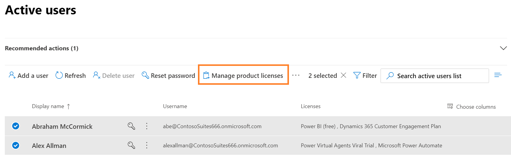

# Move from Dynamics 365 Customer Service Enterprise to Dynamics 365 Customer Service Professional

Customer Service Professional is targeted at businesses that have fewer needs and don't require the full capabilities that are offered by Customer Service Enterprise.

To switch from Customer Service Enterprise to Customer Service Professional, do the following steps:

1. Purchase a Customer Service Professional subscription.

2. Assign Customer Service Professional licenses to the users and remove the Customer Service Enterprise licenses from the users.

3. Review the [Microsoft Dynamics 365 Licensing Guide](https://go.microsoft.com/fwlink/?LinkId=866544).

## Purchase a Customer Service Professional subscription

1. Sign in to the  [Microsoft 365 admin center](https://admin.microsoft.com) with the Dynamics 365 account that has admin permissions.

2. In the navigation pane, expand **Billing** and select **Purchase Services**, and then select the Dynamics 365 Customer Service Professional tile.

3. Select **Buy**, and then follow the steps to purchase new licenses.

## Assign and remove licenses

After you’ve purchased the licenses, assign the licenses to users.

1. In the Microsoft 365 admin center navigation pane, select **Users** > **Active users**.

2. Select multiple users, and then select **Manage product licenses**. 

   > [!div class="mx-imgBorder"]
   > 

3. Select **Replace** to unassign existing licenses and assign new ones.

4. Select the license for your Dynamics 365 Customer Service Professional plan.

5. Select **Save changes**.

6. Review the license status on the **Active users** page, and make other assignments as needed.

> [!IMPORTANT]
> As per contractual agreement, you can't mix Enterprise and Professional users on the same instance. If you plan to keep Professional licenses, make sure that you abide by the contractual requirements. More information: [Microsoft Dynamics 365 Licensing Guide](https://go.microsoft.com/fwlink/?LinkId=866544)

### See also

[Dynamics 365 Licensing Update](https://docs.microsoft.com/dynamics365/licensing/update)  

[!INCLUDE[footer-include](../includes/footer-banner.md)]
