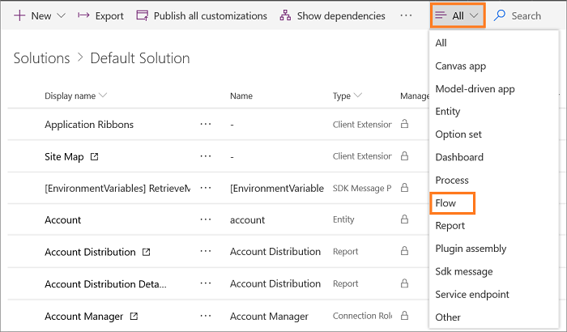

# Create multiple work streams for entity records routing

[!INCLUDE[cc-use-with-omnichannel](../includes/cc-use-with-omnichannel.md)]

## Overview

You can setup multiple work streams for same entity records if you want to distribute the entity records using different work streams based on certain conditions. 

For example, you want high priority cases to be pushed to agents and demand more capacity than low priority cases, which can be picked by agents. You can achieve it by configuring multiple work streams.

This walkthrough demonstrates how to set up two work streams, one each for high priority cases and low priority cases and to distribute the cases appropriately.

### In this section

[Step 1: Create work stream](#step-1-create-work stream)

[Step 2: Update Entity Record Distribution Flow](#step-2-update-entity-records-distribution-flow)

## Step 1: Create work stream

Create entity records work stream to define how the records will be distributed. In this walkthrough, let us create two work streams - **High Priority Cases** and **Low Priority Cases**.

High priority cases work stream is set up to distribute the cases using automatic push, and the capacity required in 60 units.

Low priority cases work stream is set up to distribute the cases for manual pick up, and capacity required is 30 units.

To learn more, see [Create workstream for entity record routing](set-up-entity-workstream.md).

## Step 2: Update entity records distribution flow

If you create or edit an entity record work stream, you must update **Entity records Distribution Flow**. The Omnichannel Administration app automatically creates this flow out-of-the-box for distributing entity records.

**Entity records Distribution Flow** contains the following components.

| Component | Modification recommendation |
|-----------------------------------|-----------------------------------|
| When the record is created | Do not modify. |
| Initialization | Do not modify. |
| Omnichannel Work Distribution | You can see the list of entity records for which work streams were created in the Omnichannel Administration app. |
| \<Entity Record\> | Select to view the components under the Entity record. |
| Work Stream Initialization - \<Entity Record\> | Do not modify. |
| Entity record - \<Entity Record\> | Do not modify. |
| Work Stream Selection for Routing (\<Entity Record\> ) | Update the condition and work stream ID. |
| Invoke Omnichannel | Do not modify. |

> [!Warning]
> We recommend you update only the **Work Stream Selection for Routing** component in **Entity Records Distribution Flow**. If you update any other component step in the flow, the entity routing might fail. 

### Update entity records work distribution flow

#### Navigate to the flow

1. Sign in to the Omnichannel Administration app.

2. Select **Work Streams** under **Work Distribution Management**.

3. Select the work stream for which you want to update the flow.

4. Select **Flow** menu in the command bar, and then select **See your flows**. Power Automate opens in a new browser window.

5. Select **Solutions** in the sitemap, and then select **Default Solution** from the list.

    > [!div class=mx-imgBorder] 
    > 

6. Select the **All** button in the menu and select **Flow** to filter the flows.

    > [!div class=mx-imgBorder] 
    > 

7. Select **Entity Record Distribution Flow** from the list.

    > [!div class=mx-imgBorder] 
    > 

8. Select the **Edit** button from the command bar at the top. The flow appears in a new tab.

#### Authenticate

9. Select the flow component that shows the warning icon. Select an existing connection to resolve the warning. The flow component uses the current user credentials and resolves the warning.

    

#### Update the work stream ID

10. Select the **Omnichannel Work Distribution** section. 

11. Select **\<Entity Record\> Distribution**. For example, **Case Work Distribution**.

12. Select the **Work Stream Selection for Routing** section.

    > [!div class=mx-imgBorder] 
    > 

13. Remove the **Select Default Work Stream - \<Entity Record\>** section by selecting the ellipses, and then by selecting **Delete**.

    For example, **Select Default Work Stream - Case** 

    Remove the default work stream so you can update the work stream with the one you created earlier.

14. Select **Add an action** in the  **Work Stream Selection for routing entity- (\<Entity Record\>)** section.

15. Select **Conditions** under the **Actions** tab.  

16. Select the **Choose a value** box to add a rule. A flyout control appears. Type in the search box to look up the attributes of the Case record that is being routed. For example, **Priority**. The rule appears in the list, and when you select the rule, it is added to the field. 

    > [!div class=mx-imgBorder] 
    > 

17. Select a condition from the list. For example, **is equal to**.

18. Type the rule value in the field. For example, **1**.

    > [!div class=mx-imgBorder] 
    > 

19. Select **Add an action** button under the **If yes** section. The **Choose an action** component appears. Now, type **Set Variable** in the **Search connectors and actions** box and the action appears in the list. Select it and the **Set Variable** action appears.

    > [!div class=mx-imgBorder] 
    > 

20. Select the **LiveWorkStreamId** from the Name drop-down list.

21. Select the **Value** field search box to add a variable. A flyout control appears. Type the name of the work stream that you created in the search box. For example, **High Priority Cases** is one of the case work stream that you created to route high priority cases. The value appears in the list, and when you select the value, it is added to the field. 

    > [!Note]
    > If you update the name of the work stream in Omnichannel Administration app, then you must perform step 21. Otherwise, the cases won't be automatically distributed to the agents.

    > [!div class=mx-imgBorder] 
    > 

22. Select **Add an action** button under the **If no** section. The **Choose an action** component appears. Now, type **Set Variable** in the **Search connectors and actions** box and the action appears in the list. Select it and the **Set Variable** action appears.

23. Select the **LiveWorkStreamId** from the Name drop-down list.

24. Select the **Value** field search box to add a variable. A flyout control appears. Type the name of the work stream you created in the search box. For example, **Low Priority Cases** is one of the case work stream that you created to route low priority cases. The value appears in the list, and when you select the value, it is added to the field.

    > [!Note]
    > - If you update the name of the work stream in Omnichannel Administration app, then you must perform step 24. Otherwise, the cases won't be automatically distributed to the agents.
    >
    > - Adding multiple work streams in the conditions are optional. If your business process requires multiple work stream conditions, you can create it.

    > [!div class=mx-imgBorder] 
    > 

25. Select **Save** to save **Entity Record Distribution Flow**.

    > [!div class=mx-imgBorder] 
    > 

Now, you've defined **Entity Record Distribution Flow** such that any case whose priority is 1 (high) is distributed using high priority work stream, and other cases will be distributed using low priority work stream. Similarly, you can extend the conditions such that the Flow supports your business scenario requirements.

> [!Important]
> Whenever you want to update the entity record work stream ensure that **Entity Records Distribution Flow** is closed. 
> Assume, you've made certain updates to the Flow. Now, while the Flow is still in the open in the browser, you go to Omnichannel Administration app and update the work stream. In this case, after you save the work stream, the Flow will be reset to its earlier state and you will loose the changes you did to the Flow.

## Troubleshoot

- [Entity routing configuration fails](troubleshoot-omnichannel-customer-service.md#entity-routing-configuration-fails)

## See also

[Entity records routing](entity-channel.md)  
[Understand and create workstreams](work-streams-introduction.md)  
[Create workstreams for entity record routing](set-up-entity-workstream.md)  
