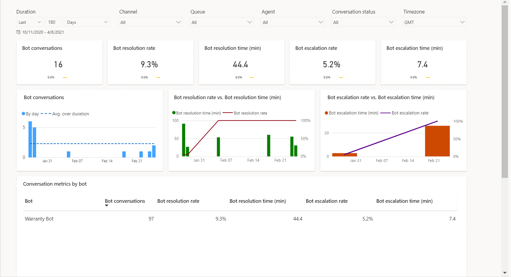
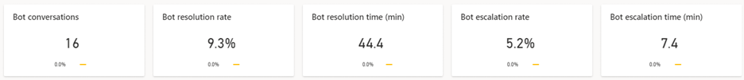
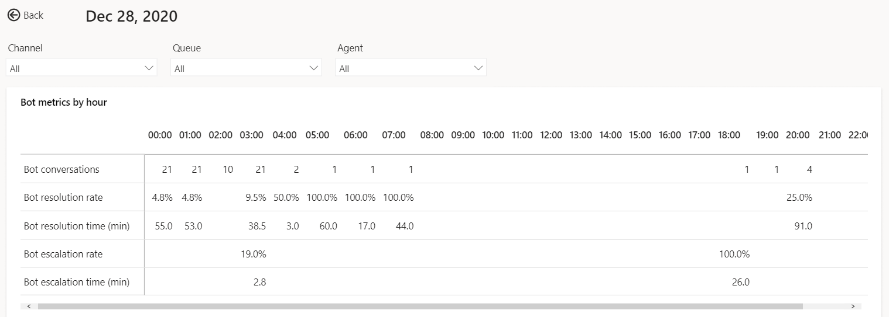

# Bot dashboard

The bot dashboard shows KPIs and charts that you can use to understand how bots are playing a role in a support organization.

> [!div class="mx-imgBorder"]
> 

You can view the Bot dashboard in the Omnichannel for Customer Service app. On the **Home** tab, select the plus (**+**) icon, and then select **Analytics and insights**. On the page that appears, select the **Bot** tab.

## Report details

The reports summarize the key performance indicators for the specified time period and the percent change over the period. You can filter these areas by duration, channel, queue, and agent.

KPIs for the following areas are displayed.

> [!div class="mx-imgBorder"]
> 

| KPI | Description |
| ------- | ------------------ |
| Bot conversations | The number of conversations initiated by the customer and engaged by a bot. |
| Bot resolution rate | The percentage of conversations that were closed by interacting with a bot out of all conversations engaged by a bot. |
| Bot resolution time (min) | The length of time, in minutes, a customer interacted with a bot before the conversation was closed. |
| Bot escalation rate | The percentage of conversations that are escalated by a bot to a human agent. |
| Bot escalation time (min)  | The length of time, in minutes, a customer interacted with a bot before the conversation was escalated to an human agent. |

The table explains the bot KPI chart metrics.

| Title | Description |
| --------------- | ----------------- |
| Bot conversations | The total number of bot conversations occurring per day |
| Bot resolution rate vs. Bot resolution time (min) | The number of customer issues resolved by bot vs. the amount of time in took to resolve them |
| Bot escalation rate vs. Bot escalation time (min) | The number of customer sessions escalated by a bot to human agent vs. the amount of time the bot was engaging before escalation | 

| Title | Description |
| --------------- | --------------- |
| Bot conversations | The number of conversations initiated by the customer and engaged by a bot. |
| Bot resolution rate | The percentage of conversations that were closed by interacting with a bot out of all conversations engaged by a bot. |
| Bot resolution time | The length of time, in minutes, a customer interacted with a bot before the conversation was closed. |
| Bot escalation rate | The percentage of conversations that are escalated by a bot to a human agent.|
| Bot escalation time (min) | The length of time, in minutes, a customer interacted with a bot before the conversation was escalated to an human agent. | 

## Bot Hourly detail drill down view

The Bot hourly details drill down view provides more granular insight into the hour-by-hour breakdown of key conversation metrics within the contact center. The metrics are the same as the day-by-day view ensuring that supervisors can consistently analyze their contact center operation regardless of desired duration granularity. 
To view the drill down, select any single metric value on the desired day, then select **Hourly details**.

> [!div class="mx-imgBorder"]
>  

### See Also

- [Conversation dashboard](oc-conversation-dashboard.md)
- [Dashboard overview](customer-service-analytics-insights-csh.md)
- [Queue dashboard](oc-queue-dashboard.md)
- [Conversation Topics dashboard](oc-conversation-topics-dashboard.md)

