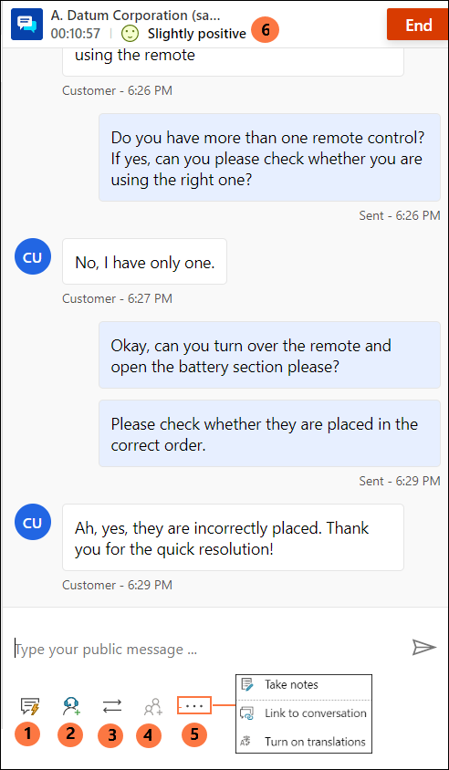
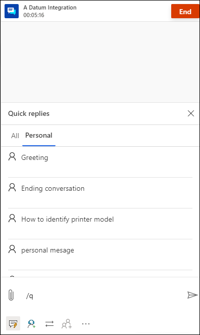
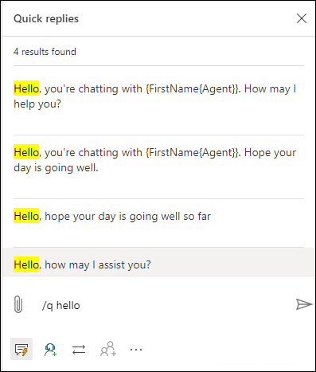
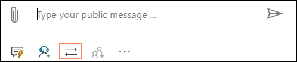
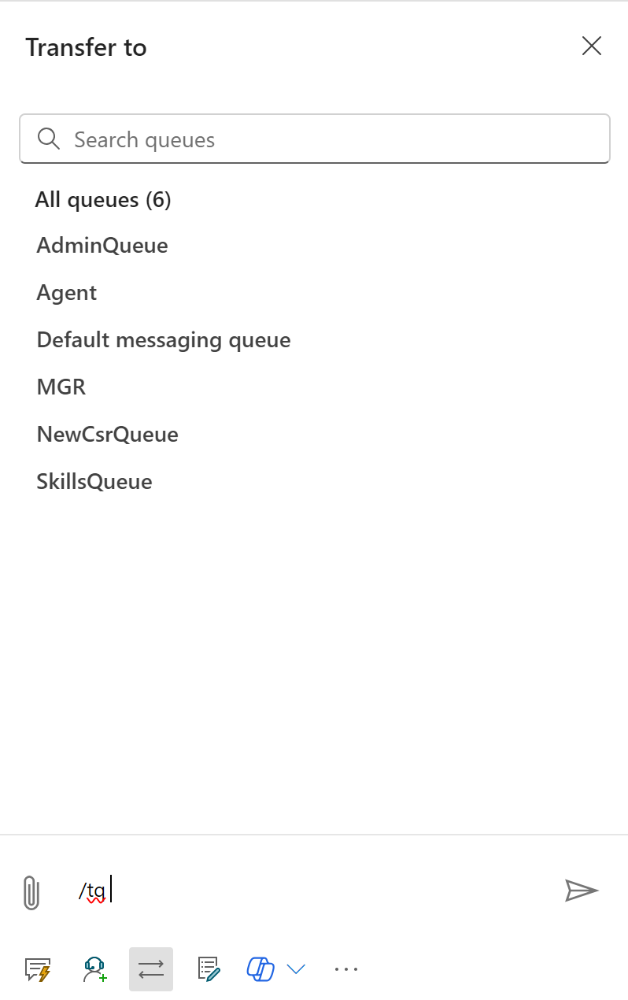
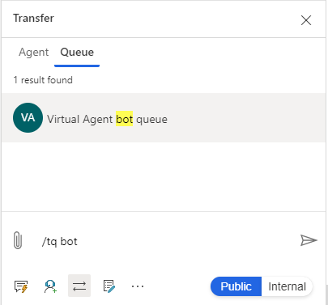
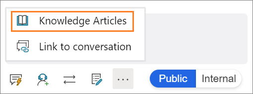

# View communication panel

[!INCLUDE[cc-use-with-omnichannel](../includes/cc-use-with-omnichannel.md)]

The communication panel is where you, as an agent, interact with your customer. When you sign in to the application, the communication panel is in hidden mode by default. You cannot view the communication panel unless you accept an incoming conversation to communicate with the customer.

From a conversation channel, you can do the following tasks:

- Send quick replies.
- Search for and share knowledge articles with the customer with whom you are interacting.
- Transfer the conversation (work item) to another agent or queue.
- Use the consult option if you need help to resolve the work item.
- Switch between internal and public mode to send messages to the internal participants (other agents and/or supervisors).

 > [!div class=mx-imgBorder]
 >   

## Enhance agent productivity using keyboard commands

The communication panel has options that you can use to perform actions, such as see quick replies, consult, and transfer, and launch notes control. You can also use keyboard commands to perform these actions.

In the communication panel, you can see the following options:
 
| Annotation | Option     | Description                                   | command |
|------|------------------|-----------------------------------------------|----------|
|  1   | Public           | Send messages to public | `/p` |
|  2   | Internal         | Send messages to internal users | `/i` |
|  3   | Quick replies    | Send templatized messages created by you as personal quick replies or quick replies created by your administrator | `/q` |
|  4   | Consult          | View list to consult with other users | `/c` |
|  5   | Transfer         | View list to transfer the request | `/t` and `/tq` |
|  6   | Notes            | Take notes specific to conversation | |
|  7   | Knowledge articles | Search for knowledge articles and share | `/kb` |
|  8   | Link to conversation | Link the record to this conversation | |
|  9   | Customer sentiment | View real-time customer satisfaction levels |  |

## Send messages using the Public and Internal modes

The communication panel allows you to send messages in two modes: **Internal** and **Public**.

When you want to send messages only to the internal participants like other agents and/or supervisors and not customers, then use the **Internal** option.

When you want to send messages to all the participants in the conversation including the customer, then use the **Public** option.

 > [!div class=mx-imgBorder]
 > 

You can use the keyboard commands to send internal and public messages:

- **/i** – Type the forward slash (/) key and the letter **i** to send an internal message to other agents and/or a supervisor. 

- **/p** – Type the forward slash (/) key and the letter **p** to send a public message to all the participants in the interaction.

## Send predefined messages in chats

The communication panel allows you to send predefined messages to a customer with whom you're interacting. These predefined  messages are stored as quick replies. Select the **Quick replies** button to retrieve the messages and send them to the customers and or internal participants.

 > [!div class=mx-imgBorder] 
 >   

You can use a keyboard command to see the list of quick replies. Type the forward slash (/) key and the letter q (**/q**). When you type **/q**, the **Quick replies** panel is displayed.

The quick replies can be created either by the administrator or by you. You can create personal quick replies if the administrator has enabled the option. The quick replies you created are available on the **Personal** tab of the **Quick replies** panel, and those created by the administrator are available on the **All** tab. Use the personal quick replies when you're in a conversation with a customer by doing the following:

1. Select the quick responses icon  at the bottom of your conversation window. The **Quick replies** panel displays the available predefined messages on the **All** and **Personal** tabs.
2. Select the **Personal** tab, and type the number sign (**#**) in the compose box to list the tags and search for the personal quick replies that are available for your use.
3. Use the **more** option to view the complete text of the quick reply.

    > 

### Search for messages

After you type **/q** in the communication panel messaging area, you can continue typing any keywords and if the **Quick replies** library has at least one message associated with the word, it is filtered and displayed to you. You can also use the number (#) sign to search for the predefined messages.

 > [!div class=mx-imgBorder]
 >   

### Share reconnection link with customers

If the reconnection link is configured by your administrator, you can share the link with customers during the session that they can use to connect back to the chat when they are disconnected for some reason, such as loss of connectivity or restart of their computer. The reconnection link information is available as a quick response.

> [!IMPORTANT]
> You can share the reconnection link only when you don't end the chat session using the **End** button.

## Consult with agent or supervisor

The communication panel allows you to consult with other agents and/or supervisors using the consult option. You can invite the agent or supervisor by selecting the **Consult** button in the communication panel.

 > [!div class=mx-imgBorder]
 > 

You can use a keyboard command to see the list of agents and/or the supervisor who are available for consultation. Type the forward slash (/) key and the letter c (**/c**).

> [!Note]
> We recommend inviting a maximum of five consulting agents when conversing with the customer.

### Search for consulting participants

After you type **/c** in the communication panel messaging area, you can continue typing the name of the participant and if it is present, the names are filtered and displayed to you.

## Transfer the conversation

In the communication panel, you can transfer the conversation (work item) either to an agent or a queue. If operating hours have been configured for the queues, you can successfully transfer the conversation to only those queues that are operational at the transfer time.

 > [!div class=mx-imgBorder]
 > 

You can transfer the request only to agents who are configured in the same queue. If the request belongs to another queue and you transfer the request, the work distribution system assigns the conversation to the appropriate agent in the queue.

Agents whose presence is set to Busy-DND, Away, or Offline will not appear in the agents list of the transfer pane. Also, agents 

Use the keyboard command to see the list of agents and/or the supervisor who is available for transfer. Type the forward slash (/) key and the letter t (**/t**).

Use the keyboard command to see the list of queues to transfer the conversation request. Press the forward slash (/) key and the letters T and Q (**/tq**).

**/t** (forward slash, letter t) launches the **Agent** and **Queue** tabs. Select either tab and then select the agent or the queue from the list to transfer the conversation. The **/t** command keeps the focus on the Agent tab whereas the **/tq** command keeps the focus on the Queue tab.

When skill-based routing is enabled, then during the transfer, the **Transfer** panel shows users sorted in the order of matching skills. A check for agent skills is not done by the app and the conversation can be transferred to any agent irrespective of the skill match.

When a conversation needs to be transferred from one queue to another, the matching criteria that was used in the conversation will be reused to find an agent in the new queue. For example, if exact match had been used to attach the skills to the conversation, the same criteria will be used to find the agent in the new queue.

### Search agents or queues for the transfer of a conversation request

After you type **/t** or **/tq** in the communication panel messaging area, you can continue typing the name of the participant and if it is present, the agent or queues names are filtered and displayed to you.

## Take notes specific to conversation

Use the notes option to capture information specific to the conversation when you interact with customers. Use the option in the communication panel to launch the notes.

 > [!div class=mx-imgBorder]
 > 

To learn more, see [Take notes specific to conversation](oc-take-notes.md).

## Search for and share knowledge articles

From the communication panel, you can search for relevant knowledge articles based on the context of the session and share it with the customers through the communication panel. Use the command to launch knowledge articles search.

 > [!div class=mx-imgBorder]
 >   

**/kb** (forward slash, letter K, and letter B) is the keyboard command to launch the knowledge articles search control. You can search and share the article with the customer through the communication panel. Use the **Send link** button to share the knowledge article link with the customer.

To learn more, see [Search for and share knowledge articles](oc-search-knowledge-articles.md).

## Link to conversation

When you have a conversation with a customer, you can link the conversation to the record (case or account/contact).

> [!div class=mx-imgBorder]
> 

To learn more, see [Search, link, and unlink a record to the conversation](oc-search-link-unlink-record.md).

## Monitor real-time customer satisfaction

As an agent, you can view the real-time customer satisfaction levels on the communication panel. A sentiment icon is displayed at the top of the communication panel based on the previous six customer messages sent to you.

To learn more, see [Monitor real-time customer sentiment](oc-monitor-real-time-customer-sentiment-sessions.md)

### See also

[Monitor real-time customer sentiment](oc-monitor-real-time-customer-sentiment-sessions.md)  
[Introduction to the agent interface](oc-introduction-agent-interface.md)  
[Manage sessions](oc-manage-sessions.md)  
[Manage applications](oc-manage-applications.md)  
[Manage presence status](oc-manage-presence-status.md)  
[View customer summary and know everything about customers](oc-customer-summary.md)  
[Search for and share knowledge articles](oc-search-knowledge-articles.md)  
[Take notes specific to conversation](oc-take-notes.md)  
[View customer summary for an incoming conversation request](oc-view-customer-summary-incoming-conversation-request.md)  

[!INCLUDE[footer-include](../includes/footer-banner.md)]