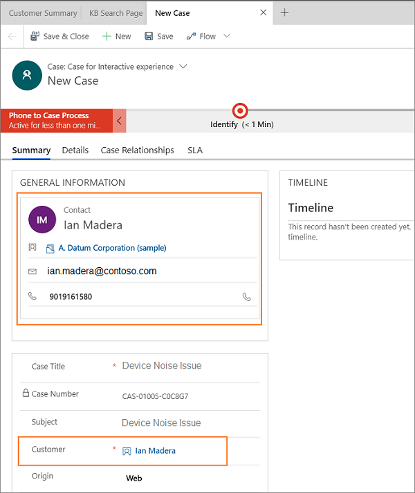
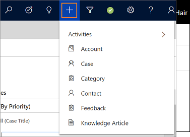
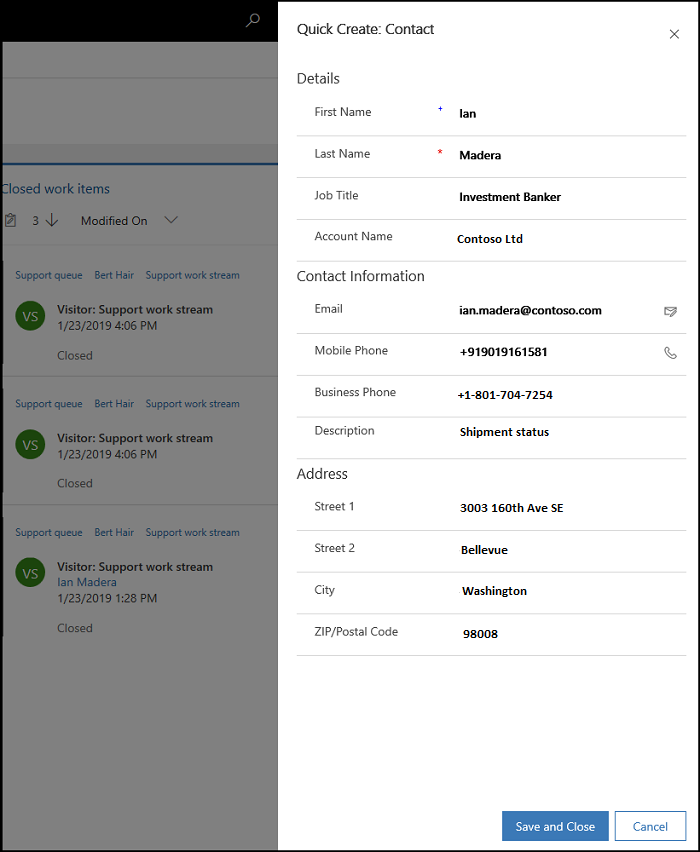
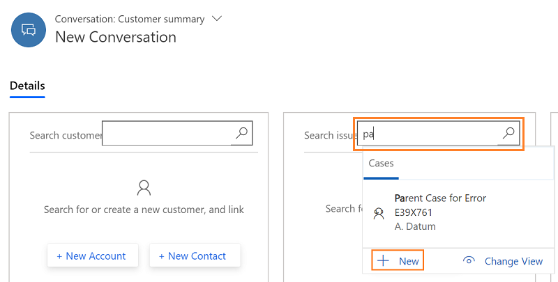

# Create a record

[!INCLUDE[cc-use-with-omnichannel](../includes/cc-use-with-omnichannel.md)]

When no records are linked to the conversation in Omnichannel for Customer Service, you can create a record. You can create a record in one of the following ways:

- Create a record from the Customer Summary page
- Create a record using the quick create option
- Create a record using the New option

## Create a record from the Customer Summary page

In the Customer Summary page and on the customer and case form, you see an option to create a new record. When you select the **New** option, a corresponding form opens in a new tab. You can fill in the details and save the record and the record is auto-linked to the conversation. 

To create a new record:

1. Select one option in the Customer or Case section based on the record you want to create. After you select the option, a form opens in an application tab panel.
    
    | Option | Section | Description |
    |---------------------|------------------------|------------------------------------------------|
    | + New Account | Customer | Select this option to create a new account record |
    | + New Contact | Customer | Select this option to create a new contact record |
    | + New Case | Case | Select this option to create a new case record |

    > [!div class=mx-imgBorder]
    > 

2. Specify the details in the form's fields.

3. Select **Save**.

    > [!div class=mx-imgBorder]
    > 

After you save, the record is automatically linked to the conversation. when you switch to the customer summary page, you can view the auto-linked record.

   > [!div class=mx-imgBorder]
   > 

If you create the account or contact first and then start to create a case record, the case form shows the linked customer's name in the **Customer** field who is already created and linked.

   > [!div class=mx-imgBorder]
   > 

## Create a new record using the quick create option

Use the quick create (**+**) option in the nav bar to create a new record. After creating the record, you must manually search and link the record to the conversation.

To create a new record, follow the steps:

1.  Select the **+** icon to create a new record.

2.  Select a record type from the list.  
 - Case
 - Contact
 - Account

   > [!div class=mx-imgBorder]
   > 

3. In the left pane, you can see a new record page. Specify the details in the form.

4. Select **Save and Close** to save the changes and close the form.

 > [!div class=mx-imgBorder]
 > 

After you save the changes, you can link the record to the conversation. To learn more, see [Search and link a record to the conversation](oc-search-link-unlink-record.md#search-for-records-by-using-the-inline-search-option) 

## Create a new record using the new option

In the Customer Summary page, when you are trying to search a record in customer or case section, after you type few characters to search, you can use the inline **+ New** button to create a record. After you select the button, the quick create pane of the entity appears.

1. Type to search in the search box. The records appear as a list that matches your search criteria.

2. Select **+ New** below the list of records. The Quick create pane appears.

    > [!div class=mx-imgBorder]
    > 

3. Fill in the form and select **Save and Close**. The quick create pane closes and the customer summary page refreshes. The record you created is auto-linked in the customer or case section.

    > [!div class=mx-imgBorder]
    > 

### See also

- [Search, link, and unlink a record](oc-search-link-unlink-record.md)
- [View customer summary and know everything about customers](oc-customer-summary.md)
- [View conversation and session activity types in the model-driven apps](oc-view-activity-types.md)
- [View customer summary for an incoming conversation request](oc-view-customer-summary-incoming-conversation-request.md)

[!INCLUDE[footer-include](../includes/footer-banner.md)]