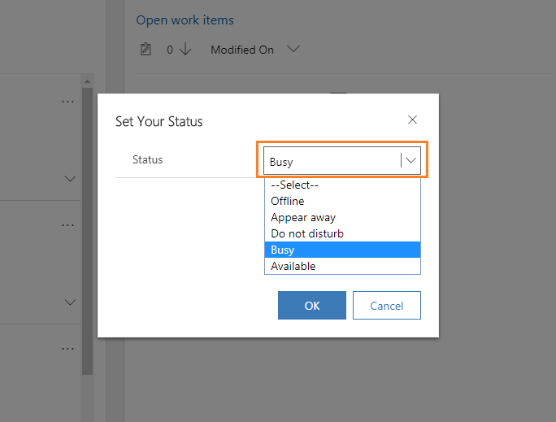

# Manage presence status

[!INCLUDE[cc-use-with-omnichannel](../includes/cc-use-with-omnichannel.md)]

Presence is the indication of your availability or status.

  > [!div class=mx-imgBorder]
  > 

## View your presence status

As an agent, you can view your presence status that is shown in the nav bar. Select the icon to launch the presence dialog. Each presence status is indicated by an icon:

  -  - Offline

  -  - Appear away

  -  - Do not disturb

  -  - Busy

  -  - Available
  
  -  - Inactive
  
If you can't see your presence status, make sure that cookies are not blocked in your browser in any mode.
 
## Update your presence status

Presence status is updated in two ways:
- **Manually** - Change the status manually according to your availability.  To view and set the presence, select the presence icon from the nav bar and then select the status from the list. The list shows five standard presence statuses:

  - Offline
  - Appear away
  - Do not disturb
  - Busy
  - Available
  
   You might also see other additional presence statuses that your administrator configured for you.

  > [!div class=mx-imgBorder]
  > 

- **Automatically** - The status is set automatically based on the work item assignment. That is, when a conversation (work item) is assigned to you, the status is updated based on the capacity as follows:

  - When your capacity is fully utilized, the presence is set to **Do not disturb**.
  - When your capacity is partially utilized, the presence is set to **Busy**.
  - When your capacity is not utilized, the presence is set to **Available**.
  - When you miss a notification and when missed notifications alert is enabled, the presence is set to **Inactive**.
  - When you reject a work notification and when agent reject notifications alert is enabled, the presence is set to **Do not disturb**.

### Troubleshoot display of presence

[Why doesn't my presence load?](troubleshoot-omnichannel-customer-service.md#troubleshoot-presence)

### See also

- [View notifications](oc-notifications.md)
- [Introduction to the agent interface](oc-introduction-agent-interface.md)
- [Manage sessions](oc-manage-sessions.md)
- [Manage applications](oc-manage-applications.md)
- [View communication panel](oc-conversation-control.md)
- [Monitor real-time customer sentiment](oc-monitor-real-time-customer-sentiment-sessions.md)

[!INCLUDE[footer-include](../includes/footer-banner.md)]
