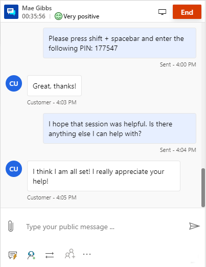
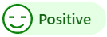
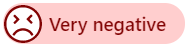

# Monitor real-time customer sentiment

[!INCLUDE[cc-use-with-omnichannel](../includes/cc-use-with-omnichannel.md)]

As an agent, when you interact with your customers, you want to know the sentiments they're experiencing in real time. Analysis of the customer's satisfaction level helps you understand how serious the problem is and develop a course of action to solve it. In Omnichannel for Customer Service, you can see the customer's satisfaction levels instantly while you communicate with the customer.

## View real-time customer sentiment

A customer's real-time sentiment is displayed at the top of the communication panel. The sentiment icon changes dynamically based on the six most recent customer messages sent to you.

When you get an incoming conversation request, you accept the request and communicate with the customer. By default, you see the neutral sentiment icon, which indicates that at this moment the customer's satisfaction level is neutral. As you continue to communicate with the customer, the sentiment icon changes dynamically according to the conversation.

When a conversation is escalated from a bot, the sentiment icon you see is based on the previous messages exchanged between the customer and the bot.

> [!div class=mx-imgBorder]
> 

## Understand real-time customer sentiment

The sentiment analysis is an automatic and unbiased measurement of satisfaction levels of the customer in real time.

The sentiment icons displayed on the communication panel are as follows:

| Sentiment | Icon |
|--------------------------|---------------------------------------------------|
| Very positive |  |
| Positive |  |
| Slightly positive |  |
| Neutral |  |
| Slightly negative |  |
| Negative |  |
| Very negative |  |

> [!Note]
> The real-time sentiment is shown to you only if the supervisor or administrator has enabled sentiment analysis for a queue where you've been added as a member.

If profanity is detected in English, the sentiment is displayed as Negative or Very negative.

> [!div class="nextstepaction"]
> [Next topic: Manage presence status](oc-manage-presence-status.md)

## Multi-language sentiment

Multi-language sentiment displays sentiment scores on some non-English conversations.

> [!Note]
>
> Multi-language sentiment is available only if the administrator enables it for you.

To learn more, see [multi-language sentiment](enable-sentiment-analysis.md).

## Videos

[Real-time sentiment analysis in Omnichannel for Customer Service](https://go.microsoft.com/fwlink/p/?linkid=2114615)  
To view more videos on Omnichannel for Customer Service, see [Videos](videos.md).

### See also

[Introduction to the agent interface](oc-introduction-agent-interface.md)  
[Enable sentiment analysis](enable-sentiment-analysis.md)  
[Manage sessions](oc-manage-sessions.md)  
[Manage applications](oc-manage-applications.md)  
[View the customer summary](oc-customer-summary.md)  
[Search for and share knowledge articles](oc-search-knowledge-articles.md)  
[Take notes specific to a conversation](oc-take-notes.md)  
[View the customer summary for an incoming conversation request](oc-view-customer-summary-incoming-conversation-request.md)  

[!INCLUDE[footer-include](../includes/footer-banner.md)]