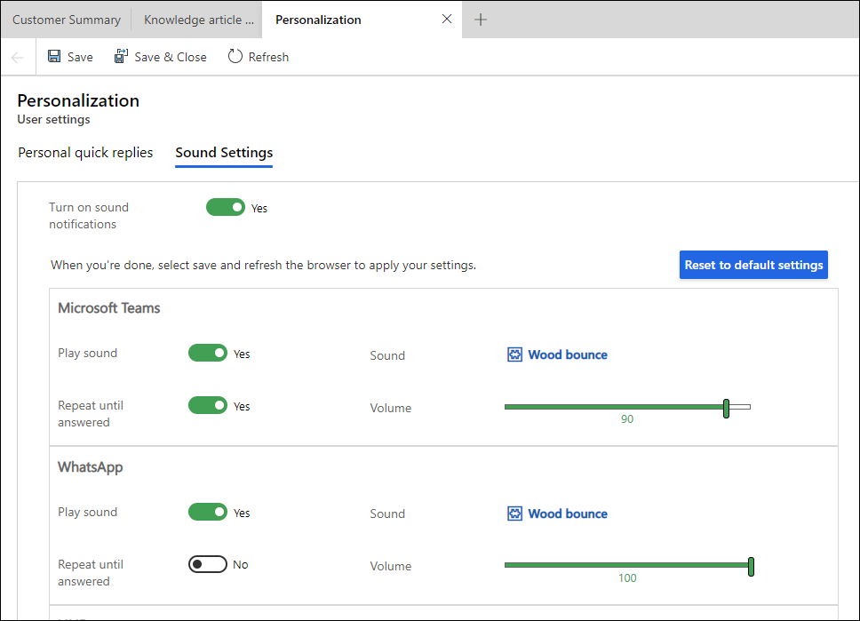

# Personalize sound notification settings

[!INCLUDE[cc-use-with-omnichannel](../includes/cc-use-with-omnichannel.md)]

## Introduction

You can personalize sound notification settings for incoming conversation requests using the personalization menu available on the application tab panel. The option to personalize is available only when sound notifications are enabled by your administrator. The sound notifications are available across all channels and can also be set for messages for ongoing conversations.

## Personalize sound notifications

The personalized settings have precedence over the administrator settings. You can enable notifications at each channel level for all the channels that are provisioned and available for you.

1. On the application tab panel, select the plus icon, and select **Personalization**. The **Personalization User settings** page appears.
2. Select **Sound Settings**.
3. Personalize the following settings for the channels:
   - **Play Sound:** Set the toggle to **Yes**.
   - **Repeat until answered:** Set the toggle to **Yes** if you want the sound to be played till you respond.
   - **Sound:** Accept the default setting or search and select a different audio file. You can use the **New Audio File** option to upload and use an audio file of your choice. You also have the option to preview the audio.
   - **Volume:** Accept the default setting or use the slider to adjust the volume.
      > 
   
   - **Reset to default settings:** When you customize any setting, the button is enabled for you to reset to the out-of-the-box settings.
4. In the **Incoming messages for open sessions** section, customize the options for sound notifications for messages in open sessions, such as live chat or a social channel.
    > 
5. Select **Save**.

> [!IMPORTANT]
> Make sure that the setting for sound is set to allow in your browser settings. In Microsoft Edge, sound is allowed by default. For information on how to configure the sound settings in other browsers, see the browser-specific documentation.

### See also

[View communication panel](oc-conversation-control.md)  
[View notifications](oc-notifications.md)  

[!INCLUDE[footer-include](../includes/footer-banner.md)]