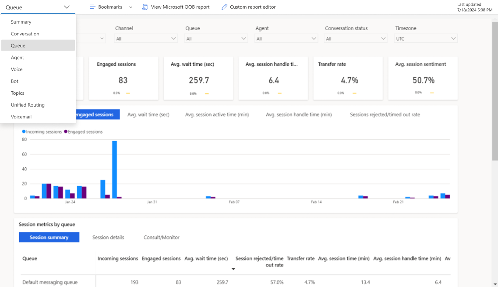
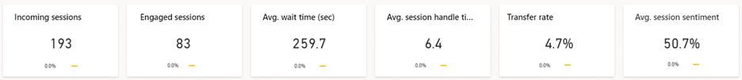
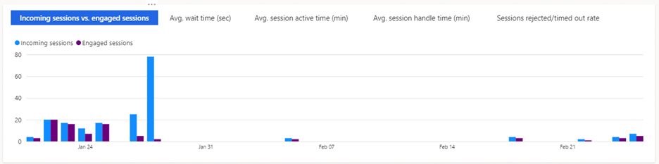
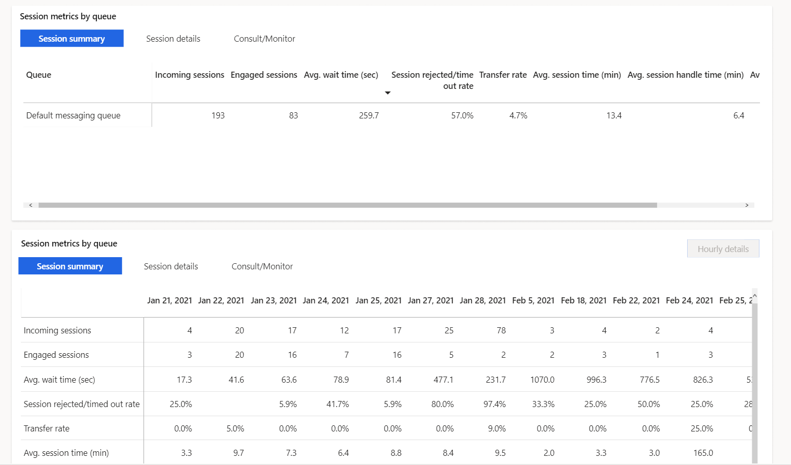
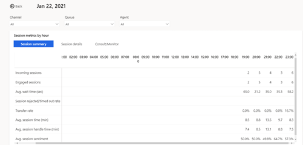

# Queue dashboard

The Queue dashboard gives you a broad overview of the customer service experience in your organization by providing insights into how specific queues are operating.
 
> [!div class="mx-imgBorder"]
> ! [Omnichannel Queue dashboard](media/oc-queue-dashboard.png "Omnichannel Queue dashboard")

> [!div class="mx-imgBorder"]
> 

To view the Queue dashboard, go to Omnichannel historical analytics and select **Queue** in the workspace.

By default, the dashboard shows you KPIs for the past month and for all channels, queues, and agents in your system. The data filtering options allow you to select data for specific time periods, channels, queues, agents, conversation status, and timezone. To filter data by duration, channel, queue, agent, conversation status, or timezone, select a value from the respective drop-down list.

> [!NOTE]
If you switch to a different dashboard, the filter you specify persists and is applied to the data on all dashboards.

## Report details

Key performance indicators for the following are displayed in the Queue dashboard.

> [!div class="mx-imgBorder"]
> 

| KPI | Description |
| ----------------- | ------------------ |
| Incoming sessions | Total number of sessions initiated by customers |
| Engaged sessions | Number of sessions presented to an agent and not accepted by agents. |
| Avg wait time (sec) | The average time customers waited before connecting to an agent. Similar to “speed to answer” but includes time waited on each session within a session. |
| Avg session handle time | Total session active time across engaged sessions |
| Transfer rate | The percentage of conversations that are transferred to another agent/queue. |
| Avg session sentiment | The average predicted customer sentiment for a given session |

Charts are displayed as shown:

> [!div class="mx-imgBorder"]
> 

| Title | Description |
| ---------------- | ------------------ |
| Incoming session vs engaged session | The total number of sessions initiated by customers vs. the number of sessions initiated and accepted by an agent |
| Avg wait time (sec) | The average time customers waited before connecting to an agent. Similar to “speed to answer” but includes time waited on each session within a session |
| Avg session active time (min) | The average total session active time across engaged conversations |
| Avg session handle time (min) | The average total session handle time across engaged conversations |
| Sessions rejected/timed out rate | The number of sessions presented to an agent and not accepted |

> [!div class="mx-imgBorder"]
> 

| Session summary | Description |
| ---------------- | ---------------- |
| Incoming sessions | The number of sessions initiated by a customer |
| Engaged sessions | The number of sessions accepted by an agent  |
| Avg wait time (sec) | The average time customers waited before connecting to agents. Similar to “speed to answer” but includes time waited on each session within a conversation |
| Session rejected/timed out rate | The number of sessions presented to an agent and not accepted |
| Transfer rate | The percentage of conversations that are transferred to another agent/queue |
| Avg session time (min) | Average time from session start to end for engaged sessions |
| Avg session handle time (min) | Average of the total session active time across engaged sessions |
| Avg session sentiment | The average predicted customer sentiment for a given session |

| Session details | Description |
| --------------- | ----------------- |
| Avg session active time (min) | The average total session active time across engaged conversations. |
| Avg session inactive time (min) | The average total session inactive time across engaged sessions  |
| Avg incoming messages | Average total number of incoming messages from a customer per session |
| Avg outgoing messages | Average total number of outgoing messages from a customer per session |
| Incoming messages | Total incoming messages per session from customer |
| Outgoing messages | Total outgoing messages per session from customer |

| Consult/ Monitor | Descriptions | 
| --------------------- | --------------------- |
| Consult sessions | Number of sessions where the agent has participated in consult mode |
| Avg consult time (min) | Average time an agent spent during a session in consult mode |
| Monitor sessions | Number of sessions where the agent has participated in monitor mode |
| Avg monitor time (min) | Average time agent spent on a session in monitoring mode | 

A blue up-and-down indicator next to the value indicates the percent change in a positive direction. A red indicator indicates the percent change in a negative direction.

## Queue Hourly details drill down view

The Queue hourly details drill down view provides more granular insight into the hour-by-hour breakdown of key conversation metrics within the contact center. The Conversation summary and Conversation details metrics are the same as the day-by-day view ensuring that supervisors can consistently analyze their contact center operation regardless of desired duration granularity. 
To view the drill down, select any single metric value on the desired day, then select **Hourly details**. 

> [!div class="mx-imgBorder"]
> 

### See Also

[Conversation dashboard](oc-conversation-dashboard.md)
[Dashboard overview](customer-service-analytics-insights-csh.md)
[Agent dashboard](agent-dashboard.md)
[Bot dashboard](oc-bot-dashboard.md)
[Conversation Topics dashboard](oc-conversation-topics-dashboard.md)

