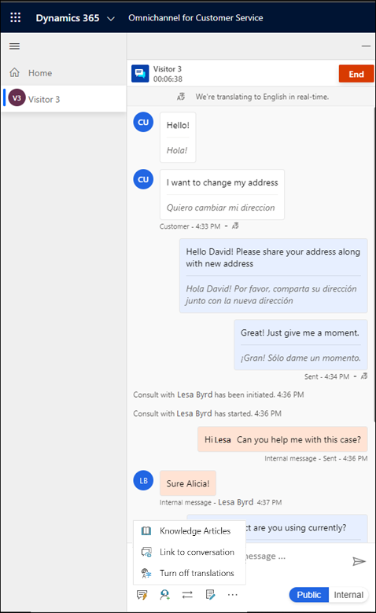

# Real-time translation of conversations for agents and customers

[!INCLUDE[cc-use-with-omnichannel](../includes/cc-use-with-omnichannel.md)]

## Introduction

When language translation is enabled for conversations that are exchanged between the agent and customer or among agents internally, agents can view the conversation in the language that's set as the default for them. The customer receives the agent's messages in the language they used for initiating the chat. This feature removes the necessity of routing conversations only to agents who know the language being used by the customer.

## How language translation of conversations works

When a customer initiates a chat conversation on the portal, irrespective of the language used by the customer, the assigned agent receives the chat text in the language that's set as the default. The language translation happens in real time. For example, if a customer initiates a chat in Spanish, the message text appears to an English-speaking agent in Spanish along with the translated English version. The agent has the option to view and respond to the chat in the customer's language or the agent's default language.

If the agent has to consult a peer or supervisor, it can be done in the language preferred between the agent and peer or agent and supervisor, which can be different from the language used between the agent and customer. The chat transcripts are saved in the languages used in the conversation.

The agent can see the following details pertaining to the feature:

- Information about the language in which the agent receives the chat content is displayed at the top of the chat window.

- The chat content is displayed in the customer's language and translated language.

The agents can turn on or off the translation for each conversation by using the **More commands** button on the chat window.

The following image shows a sample screenshot of the agent experience.

  > [!div class=mx-imgBorder]
  > 

The following image shows a sample screenshot of the customer experience.

  > [!div class=mx-imgBorder]
  > 

### See also

[View a customer summary](oc-customer-summary.md)  
[View communication panel](oc-conversation-control.md)  

[!INCLUDE[footer-include](../includes/footer-banner.md)]