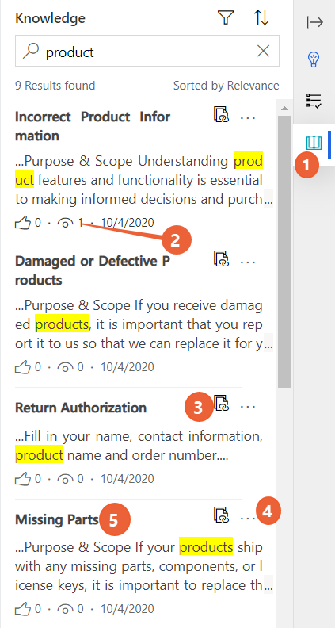

# Search and share knowledge articles

[!INCLUDE[cc-use-with-omnichannel](../includes/cc-use-with-omnichannel.md)]

## Search knowledge articles

Knowledge management plays an important part in the customer service process, and access to accurate and up-to-date information can help you reduce the average handling time to provide quick and accurate answers to your customers.

Omnichannel for Customer Service enables you to use the rich knowledge base so that you can quickly search for relevant information while working on a case and provide accurate answers to customers without having to switch applications.

You can launch knowledge search in the following ways:

- Productivity pane.
- Communication panel.

## Knowledge tab on productivity pane

### Prerequisites

- The productivity pane and knowledge base search must be enabled in app profile manager.
- The anchor tab should be a case or conversation for the knowledge pane to be displayed.

### Use the knowledge pane to search for articles

In Omnichannel for Customer Service, when you are engaged in a conversation with a customer, you can use the **Knowledge** pane to search for knowledge articles and refer to them.

By default, the full text search displays 10 results and relevance search displays 50 results.

  |Label|Description|
  |-----|-----------|
  |1.| Knowledge tab|
  |2.| Number of times the article has been viewed.|
  |3.| Copy URL lets you copy the article link to the clipboard when selected.|
  |4.| Send URL pastes the article link in the conversation window when selected. |
  |5.| Opens the article on a new application tab when selected. |

On the **Knowledge** pane, you can perform the following actions:

- Select the article title to open it in an application tab.
- Use the search box to enter keywords and search for articles.
- Select the filter icon to display the options based on which the articles can be filtered.
- Select sort icon to display the options based on which results can be displayed.
- Select the ellipses to display the following actions that can be performed:
  - Copy the article URL
  - Send URL

    These actions can be performed for only published or expired articles.

### View the knowledge article in the application tab

Select an article title to view it in an application tab.  You can view up to 10 articles in the application tab.

You can perform the following actions for the knowledge article:

- Copy the article URL to copy the external URL of the article so you can share it with your customers in a chat.
- Provide feedback by selecting the thumbs up or thumbs down icon.
  - Make sure that the knowledge article entity is enabled for feedback. To learn more, see [Enable an entity for feedback/ratings](/dynamics365/customer-engagement/customize/enable-entity-feedback).
  - Customer service agents and customer service managers can create, or view feedback based on their role and privileges on feedback entity. Out of the box, customer service agents can create, view, or edit their own feedback only. Customer service managers or knowledge managers can view feedback submitted by all agents.
- When you select thumbs down, the **Comments** box to provide feedback appears. Optionally, provide additional information and reasons for the feedback.

### Filter knowledge articles

With the help of text and visual filters, you can filter the knowledge articles. To see knowledge articles in specific states, use the **Status** filter. You can filter search results to see all draft, published, or approved articles. See articles that are categorized as internal and external. You can also filter the articles based on date and language.

When you select the filter icon, you can see the **Filter by** menu where you can filter the items based on the following categories.

  | Category | Sub-category |
  |-----------------------|-----------------------|
  | Status | <ul> <li> Draft </li> <li> Approved </li> <li> Published </li> </ul> |
  | Visibility | <ul> <li> Internal </li> <li> External </li> <li> All </li> </ul> |
  | Modified Date | <ul> <li> Last 7 days </li> <li> Last 30 days </li> <li> Last 6 months </li> <li> Last year </li> <li> All </li> </ul> |
  | Language | <ul> <li> List of languages </li> </ul> **Note:** The language list is based on the articles that are present in the those languages. For example, there are a total of 50 articles in five different languages such as French, English, Japanese, Spanish, and Danish. The language filter will show only these five languages. |
  |||

### Sort knowledge articles

The knowledge base search control provides sort the knowledge articles interactions. Select the up-arrow icon to view the sorting options and select one of the options from the following: 

- Relevance
- Number of views
- Last modified date (newest first) 
- Last modified date (oldest first)

## Launch the knowledge articles search from the communication panel

When you interact with a customer in the conversation control, you can use the **Knowledge articles** option to launch the **Knowledge articles** tab. Then you can search and share the knowledge articles.

1. Select the Knowledge Articles option in the communication panel. The Knowledge article tab opens in the application tab panel.
2. Search for the knowledge articles and view.
3. Select **Send Link**. The link is displayed in the message area of the communication panel.
4. Select **Send** in the communication panel.

### See also

[Take notes specific to conversation](oc-take-notes.md)  
[View communication panel](oc-conversation-control.md) 
[Monitor real-time customer sentiment](oc-monitor-real-time-customer-sentiment-sessions.md)  
[View conversation and session activity types in the model-driven apps](oc-view-activity-types.md)  
[View customer summary](oc-customer-summary.md)  

[!INCLUDE[footer-include](../includes/footer-banner.md)]