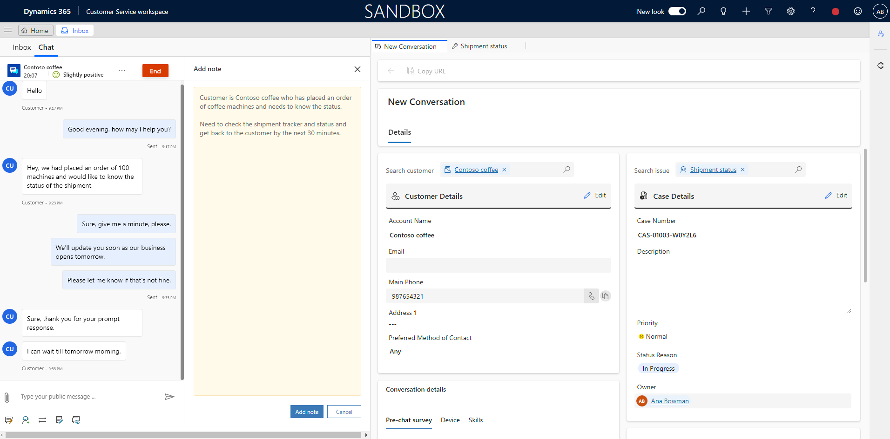

# Take notes specific to conversation

[!INCLUDE[cc-use-with-omnichannel](../includes/cc-use-with-omnichannel.md)]

## Take notes

The communication panel allows you to capture information specific to the conversation when you interact with the customers. Use the notes option in the communication panel or the shortcut key to launch the notes.

> [!div class=mx-imgBorder]
>   

> [!div class=mx-imgBorder]
>   

For an unauthenticated conversation request, you can capture notes only when you link the contact to the conversation. That is, when the contact is either not present in the Omnichannel system or not identified, you cannot take notes unless you link to a conversation. 

When you select the notes option from the communication panel, the application launches the notes panel next to the communication panel. You can capture the points and select **Add**. The notes are linked to the conversation for you to access at a later point. You can view the notes activity in the **Recent activities** timeline. 

> [!div class=mx-imgBorder]
>   

## Take notes for multi-session

When you are working on multiple customer sessions, and while capturing notes, you might switch the session. In this scenario, even though you did not add the notes, the notes are saved, and **Recent activities** timeline is updated. 

Again, when you switch back to the session, launch the notes panel and take the notes. After you add the notes, these notes will be appended to the previously added notes in the timeline.

## See also

- [View conversation and session activity types in the model-driven apps](oc-view-activity-types.md)
- [View Communication panel](oc-conversation-control.md)
- [Monitor real-time customer sentiment](oc-monitor-real-time-customer-sentiment-sessions.md)
- [View customer summary and know everything about customers](oc-customer-summary.md)
- [View customer summary for an incoming conversation request](oc-view-customer-summary-incoming-conversation-request.md)
- [Create a record](oc-create-record.md)
- [Search, link, and unlink a record](oc-search-link-unlink-record.md)

[!INCLUDE[footer-include](../includes/footer-banner.md)]