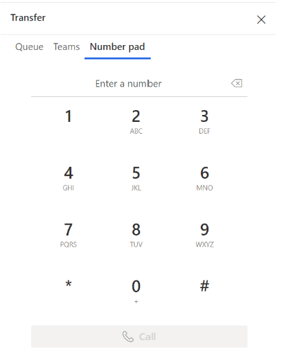
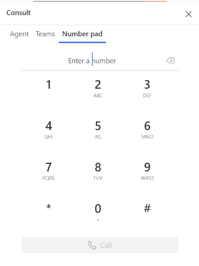

# Transfer calls and consult with users in the voice channel

You can use the Transfer or Consult option to contact another agent and consult with them on questions that you might have when you're on a call with a customer.

## Transfer scenarios

When you receive an incoming call, you can transfer the call to an agent, queue,  a public switched telephone network(PSTN) Teams user, or an external PSTN number. Once you transfer the call, the agent to whom the call is transferred is the primary agent and you will become the secondary agent.

**Transfer the call**

1. Select **Transfer** in the call window. 

  > [!div class="mx-imgBorder"]
  >  
2. The **Transfer** dialog box appears. The options, Queue, Teams, and Number pad are displayed.
  
  > [!div class="mx-imgBorder"]
  > 

3. The following section describes how you can transfer the call, based on your requirement.

    - **Transfer to a queue**: Select **Queue**, search for the queue you want to transfer the call to, and then select **Transfer**. The following actions occur:
         - The customer is automatically put on hold. Hold music plays for the customer.
         - When the secondary agent picks up the call, you will be removed from the call. The secondary agent becomes the primary agent.
         - The primary agent must manually remove the customer off hold. 
         
    > [!div class="mx-imgBorder"]
    > 

    - **Transfer to an external PSTN number**:  Select **Number pad**. On the number pad that appears, enter the plus sign (+) followed by the customer's country code, phone number, and then select Call to make your call. The following actions occur:
        - The customer is automatically put on hold. Hold music plays for the customer.
        - When the secondary agent picks up the call, you will be removed from the call. The secondary agent becomes the primary agent.
        - The primary agent must manually remove the customer off hold. 
    > [!div class="mx-imgBorder"]
    > 
    
    - **Transfer to Teams user via PSTN**: Select **Teams**, and use the search option to search for a Microsoft Teams user. The results are filtered based on the name and the live presence in Microsoft Teams. Select the Teams user you'd like to transfer the call to.
    > [!div class="mx-imgBorder"]
    >  

## Consult

You can consult with another agent, a supervisor, external PSTN number, or Teams PSTN number by bringing them into the call.  When you initiate a consult, you are the primary agent and the new participant has a consult role. If the primary agent ends the call, the call will end for everyone. If the primary agent refreshes their browser, all the participants will be on hold until the primary agent returns to the call.  

During a consult, the primary agent can choose to transfer the call to the new participant.

**Consult with another user**

1. Select **Consult** in the call window. 

  > [!div class="mx-imgBorder"]
  >  
2. The **Consult** dialog box appears. The options Agent, Teams, and Number pad are displayed.
  > [!div class="mx-imgBorder"]
  >   

3. The following section describes how you can consult with other agents or supervisors, based on your requirement.
    - **Consult with an internal agent or supervisor** : Select **Agent**. You can either have a call or chat with an internal agent. 
      Select the conversation channel and then search for the agent you'd like to consult with. The following actions occur:
        - The customer is automatically put on hold. Hold music plays for the customer.
        - The primary agent must manually remove the customer from hold. 
    > [!div class="mx-imgBorder"]
    > 
    - **Consult, then transfer**: The primary agent who initiated the consult can transfer the call to any participant involved in the consult. To transfer a consult conversation to the secondary agent in the conversation, perform the following steps:

       - If the consult is with an external participant (PSTN or Teams through PSTN), select **Transfer** next to the external phone number in the call window.
       - If the consult is with an internal agent or a supervisor, select  **Transfer** on the call controls. See: [Call controls](voice-channel-agent-experience.md#call-controls)

    Once the call is transferred, the primary agent becomes the consulting agent and can leave the call without ending the call. The consulting agent becomes the primary agent. If the primary agent leaves the call, the call will end for the customer. 
    - **Consult with external PSTN number**: Select the **Number Pad**. On the number pad that appears, enter the plus sign (+) followed by the customer's country code, phone number, and then select Call to make your call. 

       - The customer is automatically put on hold. Hold music plays for the customer.
       - The primary agent must manually remove the customer from hold. 
    By default, the consultation is private, the customer is on hold while the primary agent speaks with the new participant. You can also have a public consultation, where the customer is actively involved in the conversation. 
    To make the consultation public, select **Hold** to put the call on hold. When the secondary agent has joined the conversation, remove the customer from hold to continue the consultation.
    > [!div class="mx-imgBorder"]
    > 
    - **Consult with Teams user with PSTN**: Select **Teams** and use the search option to search for and select the Microsoft Teams user you'd like to consult with.  See: [Enable voice consult with Microsoft Teams users](voice-consult-microsoft-teams-user.md)
    > [!div class="mx-imgBorder"]
    > 

    The call recording and transcript of the conversation with the Teams user is saved in the application for reporting and compliance.

### See also

[Overview of the voice channel](voice-channel.md)  
[Enable voice consult with Microsoft Teams users](voice-consult-microsoft-teams-user.md)  
[Make and receive your first call](voice-channel-first-call.md)  
[Call a customer](voice-channel-call-customer.md)  

[!INCLUDE[footer-include](../includes/footer-banner.md)]
