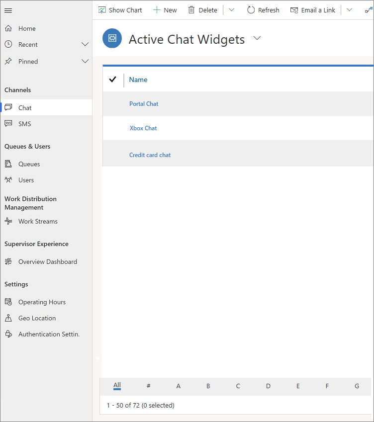

# Omnichannel for Customer Service for administrators

[!INCLUDE[cc-use-with-omnichannel](../includes/cc-use-with-omnichannel.md)]

Omnichannel for Customer Service is a customizable application you can effectively configure to meet the requirements of your business. Use Omnichannel for Customer Service to manage users (agents and supervisors), work streams, conversations, and queues, and effectively route important conversations to agents quickly. You can manage the capacity of agents so they handle conversations effectively and assist your customers better. You can manage the types of conversations agents receive using work stream and queue configurations.

## Access Omnichannel for Customer Service for administrators

1. Provision the Omnichannel for Customer Service app. Follow the steps given in [Provision Omnichannel for Customer Service](omnichannel-provision-license.md) to set up and enable the Omnichannel for Customer Service app in your instance.

2. After the app is enabled, go to the apps page, navigate to the app switcher and then select **Omnichannel Administration**.

    > [!div class=mx-imgBorder] 
    > 

You can view the entities in the **Omnichannel Administration** site map.

  > [!div class=mx-imgBorder] 
  > 

## In this section

- [Understand unified routing and work distribution](unified-routing-work-distribution.md)
- [Scenario walk-through of unified routing and work distribution](unified-routing-work-distribution.md#scenario-walk-through-of-unified-routing-and-work-distribution)
- [Understand and create work streams](work-streams-introduction.md)
- [Create a chat widget](set-up-chat-widget.md)

## How-to topics
- [Assign roles and enable users for Omnichannel for Customer Service](add-users-assign-roles.md)
- [Manage a user in Omnichannel](users-user-profiles.md#manage-a-user-in-omnichannel-for-customer-service) 
- [Configure a chat channel](set-up-chat-widget.md)  
- [Configure an SMS channel](configure-sms-channel.md)  
- [Configure a Facebook channel](configure-facebook-channel.md) 
- [Automatically identify customers using pre-chat responses](record-identification-rule.md) 
- [Create custom presence status](presence-custom-presence.md#create-custom-presence-status) 
- [Create a new Omnichannel queue](queues-omnichannel.md#create-a-queue) 
- [Create a routing rule](routing-rules.md#create-a-routing-rule) 
- [Enable knowledge articles in the Omnichannel for Customer Service](knowledge-management-oc.md)  
- [Add a chat widget](add-chat-widget.md) 
- [Configure a pre-chat survey](configure-pre-chat-survey.md) 
- [Create quick replies](create-quick-replies.md) 
- [Create and manage operating hours](create-operating-hours.md) 
- [Create chat authentication settings](create-chat-auth-settings.md) 
- [Embed chat widget in Power Apps portals](embed-chat-widget-portal.md)

[!INCLUDE[footer-include](../includes/footer-banner.md)]