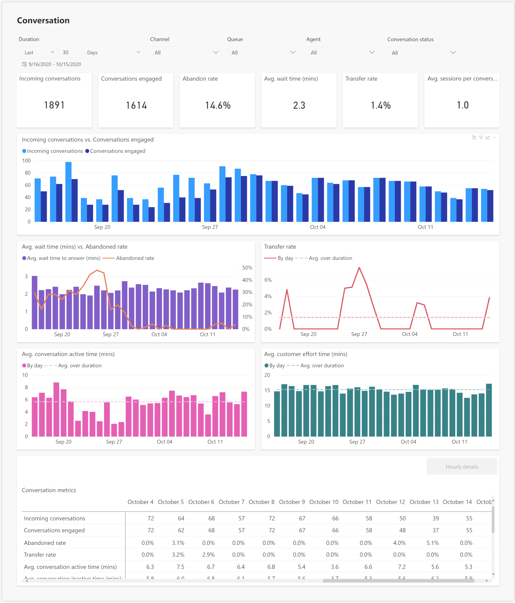
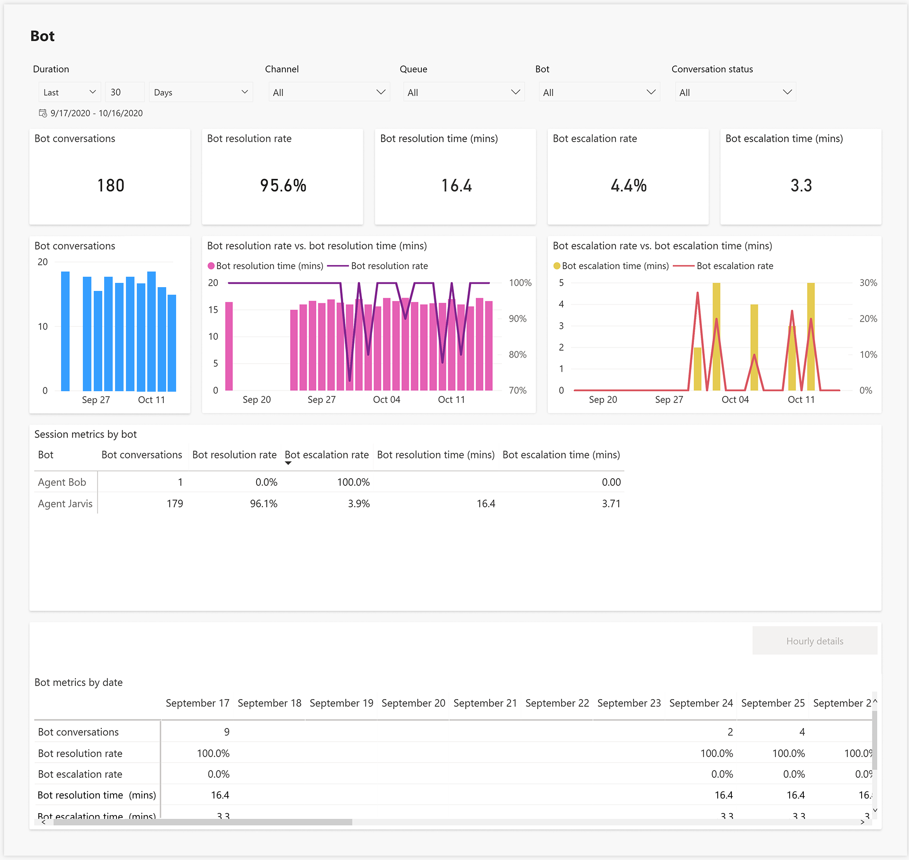

# View and understand Omnichannel Insights dashboards

[!INCLUDE[cc-use-with-omnichannel](../includes/cc-use-with-omnichannel.md)]

## Omnichannel Insights  

The Omnichannel Insights dashboard provides KPIs and trends for supervisors to understand the overall state of the Omnichannel for Customer Service support experience at a glance. It also provides insights on the customer sentiments derived using support-specific machine learning algorithms with an ability to slice through different levels in the organizational hierarchy, which supervisors can rely on to improve the overall customer support experience.  

Typically, the overview dashboard is divided into two sections:

- [Omnichannel Insights dashboard](omnichannel-insights-dashboard.md#omnichannel-insights-dashboard)

- [Omnichannel Sentiment Analysis dashboard](omnichannel-insights-dashboard.md#omnichannelsentiment-analysisdashboard)

## Omnichannel Insights dashboard

The following illustration is an example of the Omnichannel Insights for Dynamics 365 dashboard:

   > [!div class=mx-imgBorder]
   > 

This section consists of the following conversation KPIs:

| KPI                  | Description              |
|----------------------|--------------------------|
|Incoming conversations | The number of conversations initiated by the customer.|
|Conversations engaged | Offered conversations that are engaged by an agent. Customer-to-agent communication can begin at this point.  |
|Average wait time (mins) | The length of time, in minutes, a customer is waiting in a queue. |
|Average wait time | Total length of time (in minutes) / Offered |
|Abandon Rate | The percentage of conversations that are not engaged by agents.|
|Average Handle Time (mins) |Average length of time an agent takes to complete a conversation with a customer. This time considers the time spent by one or more agents to help the customer.|
|Transfer rate |The percentage of conversations that are transferred to another agent/queue.|
|Average Customer Sentiment Pulse (CSP) | The predicted customer sentiment in a given timeframe for a set queue/agent, which indicates the degree of positive sentiment expressed by customers at the end of their interactions.|
|Average customer effort time |Average length of time a customer takes to contact support and complete a conversation with an agent. Only the conversations engaged by an agent are considered for this metric.|

## Omnichannel Insights for Dynamics 365

Omnichannel Insights reports provide comprehensive information on how overall support is performing across channels. The reports provide administrators and supervisors with a rich visualization and ability to filter across channels, queues, agents, and date ranges to better understand performance and troubleshoot problem areas.

The reporting structure consists of the following sections:

- [Conversations and channels](#conversations-and-channels)
- [Queue and agents](#queues-and-agents)
- [Bot insights] (#botinsights)

### Conversations and channels

This section provides historical visibility into the overall support operations across various conversations and channels.
   
   > [!div class=mx-imgBorder]
   > 
   
  
   > [!div class=mx-imgBorder]
   > 

The KPIs for conversations and channels are listed in the following table. For conversations, these are applicable to scenarios in which bots escalate to agents or agents directly handle customer calls. For channels, the KPIs represent support operations by each channel to help supervisors easily understand how each support channel (for example, SMS or chat) is performing, and take appropriate actions to improve the overall support experience for customers.    

   | KPI | Description | Derivation | Measure | 
   |------|----------|------------|---------|
   | Incoming conversations | The number of conversations initiated by the customers that can be presented to agents. | All conversations are considered. | FactConversation[InComingConversationCount] |
   | Conversations engaged | Offered conversations that are engaged by an agent. Customer-to-agent communication can begin at this point. | All conversations are considered. | FactConversation[Engaged] |
   | Abandon rate | The percentage of conversations that are not engaged by agents. | All conversations are considered. | FactConversation[AbandonedRate] |
   | Transfer rate | The percentage of conversations that are transferred to another agent or queue. |Conversations engaged and conversations that are in the closed state are considered.| FactConversation[TransferRate] |
   | Conversation active time | Cumulative session active time for a conversation. | Conversations engaged and conversations that are in the closed state are considered. | FactConversation[ConversationActiveTime] |
   | Conversation inactive time | Cumulative session inactive time for a conversation. | Conversations engaged and conversations that are in the closed state are considered. | FactConversation[ConversationInactiveTime]|
   | Conversation wrap time | Cumulative time from the conversation wrap-up start time until the conversation close time. | Conversations engaged and conversations that are in the closed state are considered. | FactConversationFirstAgentParticipant[ConversationWrapupTime] |
   | Conversation handle time | Cumulative session active time for a conversation. | Conversations engaged and conversations that are in the closed state are considered. | FactConversation[ConversationActiveTime] |
   | Average Conversation active time | Total conversation active time divided by the number of conversations handled. | Conversations engaged and conversations that are in the closed state are considered. | FactConversation[AvgActiveTime(mins)] |
   | Average Conversation inactive time | Total conversation inactive time divided by the number of conversations handled. | Conversations engaged and conversations that are in the closed state are considered. | FactConversation[AverageConversationInactiveTime] |
   | Average Conversation wrap time | Total conversation wrap time divided by the number of conversations handled. | Conversations engaged and conversations that are in the closed state are considered. | FactConversation[AverageConversationWrapupTime)] |
   | Average Conversation handle time | Total Conversation active time divided by the number of conversations handled. | Conversations engaged and conversations that are in the closed state are considered. | FactConversation[AvgConversationTime] |
   | Average Conversation time | Average time from the conversation start to conversation end. | Conversations engaged and conversations that are in the closed state are considered. | FactConversation[AvgConversationTime] |
   | Average Customer Effort time  | Average time from the conversation start to the conversation wrap-up start time. | Conversations engaged and conversations that are in the closed state are considered. | FactConversation[AvgCustomerEffort] |
   | Speed to answer | The average time customers have waited in the queue before connecting to an agent. | Conversations engaged and conversations that are in the closed state are considered. | FactConversation[AvgSpeedtoAnswer] |
   | SLA - Speed to answer | Number of SLAs met divided by the number of conversations handled. For example, if the Speed to answer is less than 180 seconds, then this is considered met. Otherwise, it is not met. | Conversations engaged and conversations that are in the closed state are considered. | FactMessage[SLASpeedtoAnswer] |
   | Customer wait time  | The average time customers have waited before connecting to agents. This is similar to “Speed to answer” but includes the time waited on each session within a conversation. | Conversations engaged are considered. | FactConversationParticipant[AvgWaittime(mins)] |
   | Total consult time | The time spent on the consult from when the agent joined to when they left in session participant. | Only consult sessions are considered as a denominator. |  |
   | Average consult time | Total consult time divided by the total consult sessions. | Only consult sessions are considered as a denominator. | FactSessionParticipant[AvgConsultTime] |
   | Total monitor time | The time spent on the monitor from when the agent joined to when they left in session participant. | Only monitor sessions are considered as a denominator. | |
   | Average monitor time | The total monitor time divided by the total of monitor sessions. | Only monitor sessions are considered as a denominator. | FactSessionParticipant[AvgMonitorTime] |
   | Average Customer sentiment pulse (CSP) | The predicted customer sentiment in a given timeframe for a set queue/agent, which indicates the degree of positive sentiment expressed by customers at the end of their interactions. | Conversations engaged are considered. | Average of FactConversationSentiment[msdyn_sentimentpulse] |

### Queues and agents

This section provides historical visibility into how each queue is performing and how each agent is performing across different channels and queues so supervisors can take appropriate steps to improve the overall support experience for the customer. 

   > [!div class=mx-imgBorder]
   > 

   > [!div class=mx-imgBorder]
   > 
   
The KPIs for queues and agents are listed in the following table. Metrics in this section are computed at the session granularity. Each customer contact is defined as a conversation. Each conversation is defined as a session and can be handled by one or more agents.

| KPI | Description | Derivation | Measure | 
|------|----------|------------|---------|
| Consult sessions | The number of sessions accepted by a user in mode = consult. | Only consult sessions are considered as a denominator |  |
| Total consult time | The time spent on the consult from when the agent joined to when they left in session participant. | Only consult sessions are considered as a denominator. |  |
| Average consult time | The total consult time divided by the total consult sessions. | Only consult sessions are considered as a denominator. | FactSessionParticipant[AvgConsultTime] |
| Monitor sessions | The number of sessions accepted by a user in mode = monitor. | Only monitor sessions are considered as a denominator. |  |
| Total monitor time | The time spent on the monitor from when the agent joined to when they left in session participant. | Only monitor sessions are considered as a denominator. | |
| Average monitor time | The total monitor time divided by the total of monitor sessions. | Only monitor sessions are considered as a denominator. | FactSessionParticipant[AvgMonitorTime] |
| Sessions engaged | # Sessions presented to an agent and accepted by an agent | Conversations engaged are considered and all conversation states are considered. | FactSession[EngagedByAgentSessionCount] |
| Session rejection rate | The number of sessions presented to an agent and are not accepted by an agent. | Conversations engaged are considered and all conversation state are considered. | FactSession[SessionRejectionRate] |
| Transfer rate | The number of sessions transferred by an agent. | Conversations engaged are considered and all conversation states are considered. | FactSession[QueueTransferRate] |
| Consult sessions | The number of sessions where the agent has participated in consult mode. | Conversations engaged are considered and all conversation states are considered. | FactSessionParticipant[ConsultSessionCount] |
| Monitor sessions | The number of sessions where the agent has participated in monitor mode. | Conversations engaged are considered and all conversation states are considered. | FactSessionParticipant[MonitorSessionCount] |
| Average Session active time | The total session active time divided by the number of sessions engaged (primary). | Conversations engaged are considered and all conversation states are considered. | FactSession[AvgActivetime]  |
| Average Session inactive time | the total session inactive time divided by the number of sessions engaged (primary). | Conversations engaged are considered and all conversation states are considered. | FactConversationFirstAgentParticipant[AverageSessionInactiveTime] |
| Average Session handle time | The total session active time divided by the number of sessions engaged (primary). | Conversations engaged are considered and all conversation states are considered. | FactSession[AvgSessionHandleTime] |
| Average Session time | The average time from the session start to session end for sessions engaged divided by the sessions engaged (primary). | Conversations engaged are considered and all conversation states are considered. | FactConversationFirstAgentParticipant[AvgSessionTime] |
| Average consult time | The average time the agent spent on a session in consulting mode. | The sum of consult time divided by consult sessions. | FactSessionParticipant[AvgConsultTime] |
| Average monitor time | The session level average time the agent spent on a session in monitoring mode. | The sum of monitor time divided by monitor sessions. | FactSessionParticipant[AvgMonitorTime] |
| Session active time | The time an agent actively spent on a session. | Conversations engaged are considered and all conversation states are considered. |  |
| Session inactive time. | The time an agent is not actively working on a session. | Conversations engaged are considered and all conversation states are considered. |  |
| Session handle time | the time an agent actively spent on a session. | Conversations engaged are considered and all conversation states are considered. |  |
| Agent total login time | The total time the agent is signed in. Note: This metric is not sliced in any dimension other than from Date and Agent. | This is based on the agent signin and signout timestamp, and is not sliced by any other metrics other than from Date and Agent. | FactAgentStatusHistory[AgentTotalLoginTime(hrs)] |
| Agent Total Login Time (hrs) | The time an agent is signed in to the Omnichannel application. | This is based on the agent signin and signout timestamp, and is not sliced by any other metrics other than from Date and Agent. | FactAgentStatusHistory[AgentTotalLoginTime(hrs)] |
| Agent Available Duration (hrs) | The time an agent is in the available state in the Omnichannel application. | This is based on the agent signin and signout timestamp, and is not sliced by any other metrics other than from Date and Agent. | FactAgentStatusHistory[AgentAvailableDuration(hrs)] |
| Agent Busy Duration (hrs) | Time an agent in the busy state in Omnichannel application. | This is based on the agent signin and signout timestamp, and is not sliced by any other metrics other than from Date and Agent. | FactAgentStatusHistory[AgentBusyDuration(hrs))] |
| Agent Busy DND Duration (hrs) | The time an agent is in the Busy DND state in the Omnichannel application. | This is based on the agent signin and signout timestamp, and is not sliced by any other metrics other than from Date and Agent. | FactAgentStatusHistory[AgentBusyDNDDuration(hrs)] |
| Agent Away Duration (hrs) | The time an agent is in the Away state in the Omnichannel application | This is based on the agent signin and signout timestamp, and is not sliced by any other metrics other than from Date and Agent.  | FactAgentStatusHistory[AgentAwayDuration(hrs))] |
| Agent Offline Duration (hrs) | The time an agent signed out of the Omnichannel application. | This is based on the agent signin and signout timestamp, and is not sliced by any other metrics other than from Date and Agent. | FactAgentStatusHistory[AgentOfflineDuration(hrs) )] |

  
### Bot insights

This section provides historical visibility into how bots are performing to help resolve customer support issues. 

   > [!div class=mx-imgBorder]
   >   

The KPIs for bots are listed in the following table: 

| KPI | Description | Derivation | Measure | 
|------|----------|------------|---------|
| Bot Conversations | The number of conversations initiated by the customer and handled by a bot. | All conversations are considered. | FactSession[QueueSessions] |
| Bot Resolution Rate  | The percentage of conversations that were closed by interacting with bot out of all conversations handled by a bot. | All conversations are considered. | FactSession[BOTResolutionRate] |
| Bot Resolution time (min) | The length of time, in minutes, a customer interacted with a bot before the conversation was closed. | All conversations are considered. | FactSession[AvgResolutionTime] |
| Bot Escalation rate  | The percentage of conversations that are escalated by a bot to a human agent. | All conversations are considered. | FactSession[BotEscalationRate] |
| Bot Escalation time (min)  | The length of time, in minutes, a customer interacted with a bot before the conversation was escalated to an human agent. | All conversations are considered. | FactSession[BotEscalationTime] |

## Omnichannel Sentiment Analysis dashboard

This illustration of the Omnichannel Sentiment Analysis dashboard provides an **overview** of important KPIs and trends relative to the sentiment analysis of conversation offered.  

   > [!div class=mx-imgBorder]
   >   

## Omnichannel Insights – Sentiment Analysis report

This illustration of the Omnichannel Sentiment Analysis report provides a **detailed view** of more comprehensive information. 

   > [!div class=mx-imgBorder]
   > 

   Explanation of Sentiment Analysis KPIs
    
   |KPI             |Description                |
   |-----------------|---------------------------|
   |Average Sentiment Pulse              |The predicted customer sentiment in a given timeframe for a set queue/agent that indicates the degree of positive sentiment expressed by customers at the end of their interactions. For channel and queue, it provides the overall customer sentiment of the conversation. For agent, it provides the customer sentiment specific to the sessions handled by the agent in the conversation.  |
   |% Positive Sentiment                 |Count of positive sentiment zone conversations divided by total sessions.  |
   |% Neutral Sentiment                  |Count of neutral sentiment zone conversations divided by total sessions.  |
   |% Negative Sentiment                 |Count of negative sentiment zone conversations divided by total sessions.  |
   |Conversations with Sentiment prediction  |Count of conversations to predict the customer sentiment metrics.|

## Preview: Omnichannel Insights – Sentiment drivers reporting

[!include[cc-beta-prerelease-disclaimer](../includes/cc-beta-prerelease-disclaimer.md)]

Topics are generated when chat transcripts from Omnichannel for Customer Service are analyzed and grouped together, and similarities are discovered among the conversations. These are then correlated with sentiment, so that supervisors can better understand how their customers feel about each topic on which they've interacted with agents.

   > [!div class=mx-imgBorder]
   > 

   > [!NOTE]
   >
   > - The filters at the top of the report (duration, channel, agent, queue) don't have an impact on the topic-related tiles.
   > - This component of the report will display data only when sentiment drivers reporting is enabled and a minimum of 10 chat conversations per organization take place.

   |Tile             |Description                |
   |-----------------|---------------------------|
   |Grid             | Displays the discovered topics from the most recent 24-hour period in which chat transcripts were processed. |
   |Keyword          | Displays the keywords that are related to a topic.  |
   |Ribbon chart     | Displays the topics that have been discovered over the course of the most recent full week in which chat transcripts were processed. |

   |KPI             |Description                |
   |-----------------|---------------------------|
   |Impact           | Denotes the extent to which conversations related to a topic are driving overall sentiment up or down. This is determined by factoring out the sentiment of chats for the topic in question and comparing the resulting average to the overall sentiment across all chats. The difference indicates negative or positive impact on sentiment.  |
   |Volume  |Denotes the total number of chat transcripts that are assigned to a topic. |
   |Avg. Sentiment    | Denotes the average sentiment of chat transcripts that correspond to a topic.

## Sentiment zones

**Positive sentiment**

Positive sentiment is expressed by the customer writing messages that they're happy, pleased, or positive as a result of the support interaction. Positive sentiment requires the positive words to convey positive feeling beyond just simple pleasantries or politeness.

For example, when a customer writes "thank you," that's just being polite—it doesn't necessarily mean they're pleased or happy. However, if a customer writes "I can't thank you enough" or "thank you very much," that portrays clear positive feeling. Other examples of simple pleasantries or politeness that shouldn't be mischaracterized as positive are "Please help" and "Yes."

**Negative sentiment**

Negative sentiment is expressed by the customer when they're disappointed with the support interaction. These can be cases where the customer is describing a problem and is frustrated or unhappy because of how it's currently affecting them. For something to be scored with negative sentiment, the words need to clearly convey that the user is unhappy, disappointed, or frustrated.

**Neutral sentiment**

Neutral sentiment is represented when a customer's sentiment was neither positive nor negative. A customer's problem statement isn't to be scored as negative; rather, it should be scored neutral unless it contains words that denote emotion. This is true regardless of how severe the user's problem is. Messages with non-specific pleasantries or politeness are scored as neutral and not as positive.

### View and filter reports

You can filter the information presented in the reports by selecting **Duration**, **Channel**, **Queue,** and **Agent**.

   > [!div class=mx-imgBorder]
   > 

### See also

[Introduction to Omnichannel Insights dashboard](intro-dynamics-365-omnichannel-insights-dashboard.md)

[Configure Omnichannel Insights dashboard](configure-historical-sentiment-dashboard-supervisor.md)

[Analyze real-time customer sentiment](enable-sentiment-analysis.md)

[!INCLUDE[footer-include](../includes/footer-banner.md)]