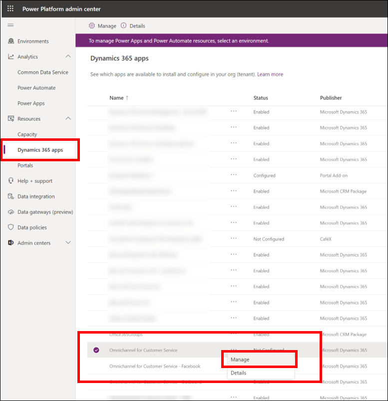
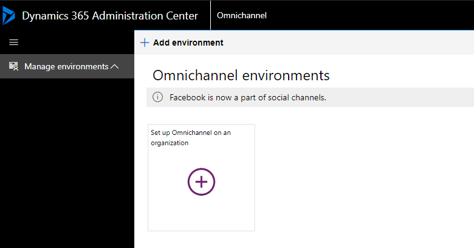
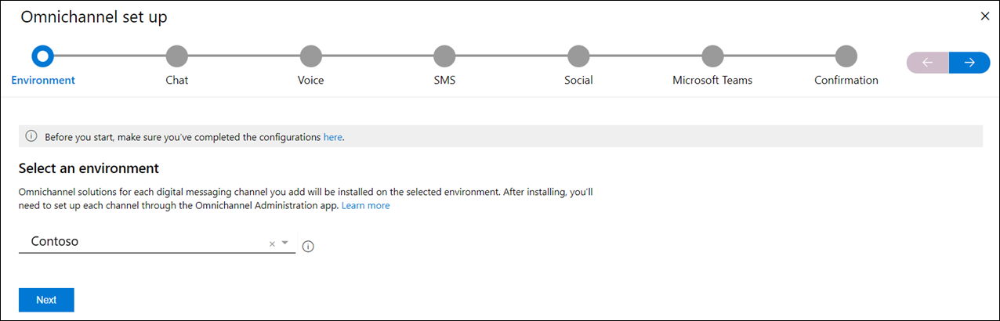
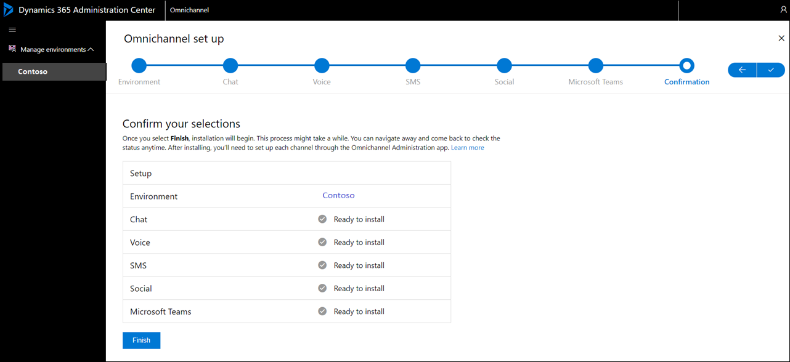
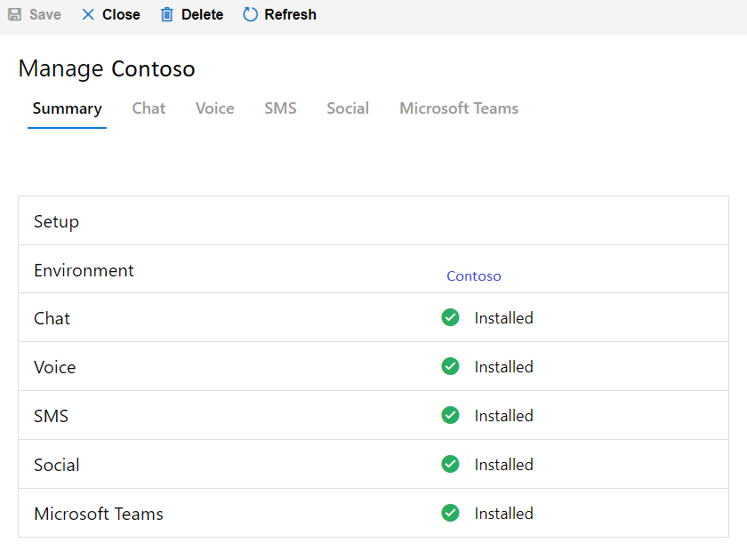
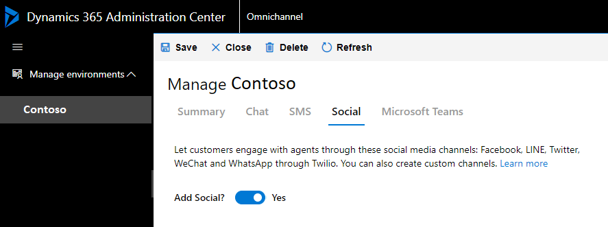
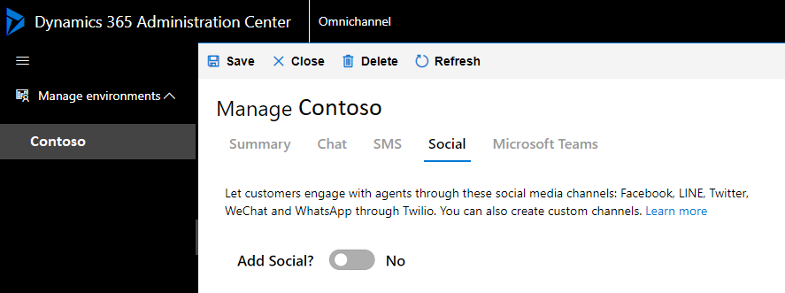

# Provision Omnichannel for Customer Service

[!INCLUDE[cc-use-with-omnichannel](../includes/cc-use-with-omnichannel.md)]

Omnichannel for Customer Service provides a modern, customizable, high-productivity app that lets agents help customers across different channels via a unified interface. It lets organizations choose the channel that suits their business needs. It also ensures that a high level of responsive, quality service is received across channels.

To find out if Omnichannel for Customer Service is available in your region, see [International availability](international-availability.md).

Looking for an upgrade? See [Upgrade Omnichannel for Customer Service](upgrade-omnichannel.md) for more information.

## Prerequisites

To provision the Omnichannel for Customer Service application, make sure the following prerequisites are met:

- An active subscription of Chat for Dynamics 365 Customer Service or Dynamics 365 Digital Messaging. For more information on pricing, select [here](https://dynamics.microsoft.com/customer-service/overview/#pricing). You can also get a free 30-day trial if you have the required prerequisites, see [Try channels for Dynamics 365 Customer Service](try-channels.md) for more information.
- Ensure that the prerequisites mentioned in the system requirements are set up. More information, see [Prerequisites](system-requirements-omnichannel.md#prerequisites).
- The **Global Tenant Admin** and **Dynamics 365 System Admin** permissions for your organization.

## Provide data access consent

Use the following steps to allow Omnichannel for Customer Service to read and write data on behalf of users:

1. Go to [Data access consent URL](https://go.microsoft.com/fwlink/p/?linkid=2070932). For Government Community Cloud (GCC), use the [GCC data access consent URL](https://go.microsoft.com/fwlink/p/?linkid=2128838).
2. Sign in using **Global Tenant Admin** credentials.
3. Select the check box **Consent on behalf of your organization**.
4. Select **Accept** to grant data access consent.

    > [!div class=mx-imgBorder]
    > 

> For more information about app permissions, see [Azure app Power BI API permissions](https://docs.microsoft.com/power-bi/developer/embedded/power-bi-permissions).

## Set up Omnichannel for Customer Service

1. In **Power Platform Admin Center**, on the **Environments** page, select the environment in which Omnichannel for Customer Service needs to be set up.
2. In the left pane, expand **Resources**, and select **Dynamics 365 Apps**.
3. On the **Dynamics 365 apps** page, select **More commands** beside **Omnichannel for Customer Service**, and then select **Manage**.

    > [!div class=mx-imgBorder]
    > 

4. Select **OK** on the **Manage Omnichannel for Customer Service** message. The **Dynamics 365 Administration Center | Omnichannel** page is displayed on a new tab.

5. On the **Manage Omnichannel Instances** page, select **Add Org** to add an organization. Omnichannel is set up on the organization environment that you add here.

    > [!div class=mx-imgBorder]
    > 

    > [!IMPORTANT]
    > As an admin, you can configure Omnichannel in multiple environments. You can view the status of all organization environments where the Omnichannel app has been configured in the **Manage environments** view.

6. Select the environment in the drop-down list.

    > [!div class=mx-imgBorder]
    > 

7. Select the **Chat** tab and set the toggle to **Yes** to enable the Chat channel for your organization.

    > [!div class=mx-imgBorder]
    > 

8. Select the **SMS** tab and set the toggle to **Yes** to enable SMS. Select the check box to confirm that you agree to the SMS terms.

    > [!div class=mx-imgBorder]
    > 

    > [!IMPORTANT]
    > You must select the check box for **SMS Terms** to enable SMS and proceed with the setup.

9.  Select the **Social** tab and set the toggle to **Yes** to enable social channels.

    > [!div class=mx-imgBorder]
    > 

10. Select the **Microsoft Teams** tab and set the toggle to **Yes** to enable Microsoft Teams. 

    > [!div class=mx-imgBorder]
    > 

11. On the **Confirmation** page, verify your selections, and select **Finish** to provision Omnichannel for Customer Service in your organization.

    > [!div class=mx-imgBorder]
    > 

    The setup can take several minutes. You may close the window and check after some time, or refresh to check if it's complete. After the setup is complete, the selected channels are enabled in your environment.

    > [!div class=mx-imgBorder]
    > 

> [!IMPORTANT]
> If the provisioning of Omnichannel for Customer Service fails and you retry it, you might see an app profile named **Omnichannel Upgraded OOB Default app profile** on the **App profiles** page in Power Apps. You can safely delete this app profile that is created.

## Update Omnichannel for Customer Service application

After Omnichannel for Customer Service application is successfully provisioned, you can update the environment by enabling or disabling the required channels.

1. In **Power Platform Admin Center**, on the **Environments** page, select the environment in which Omnichannel for Customer Service needs to be set up.
2. In the left pane, expand **Resources**, and select **Dynamics 365 Apps**.
3. On the **Dynamics 365 apps** page, select **More commands** beside **Omnichannel for Customer Service**, and then select **Manage**.
4. Select **OK** on the **Manage Omnichannel for Customer Service** message. The **Dynamics 365 Administration Center | Omnichannel** page is displayed on a new tab.

    > [!div class=mx-imgBorder]
    > 

5. Select the channel to be enabled. For example, in this procedure, we will enable the Social channels.

6. On the **Social** tab, set the toggle to **Yes** to enable social channels in your environment.

    > [!div class=mx-imgBorder]
    > 

7. Select **Save**. After the update is complete, the status is displayed on the **Summary** tab.

    > [!div class=mx-imgBorder]
    > 

8. To disable a previously enabled channel, set the toggle to **No**. For example, in this procedure, we will disable the Social channel.

   - On the **Social** tab, set the toggle to **No** to disable social channels in your environment. A confirmation message is displayed to remove the channel. Select **Remove**.

        > [!div class=mx-imgBorder]
        > 
    > [!NOTE]
    > If you disable all channels, Omnichannel for Customer Service will be removed from your organization.

### Troubleshoot provisioning

[Instance is not available to select on the provisioning application](troubleshoot-omnichannel-customer-service.md#provision)

### See also

[Upgrade Omnichannel for Customer Service](upgrade-omnichannel.md)  
[Understand and create work streams](work-streams-introduction.md)  
[Manage users](users-user-profiles.md)  
