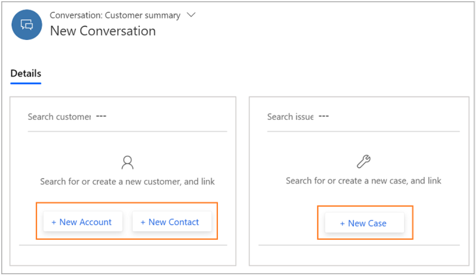

# What's new in Omnichannel for Customer Service

[!INCLUDE[cc-use-with-omnichannel](../includes/cc-use-with-omnichannel.md)]

## What's new in October 2020 update

For information about the features that released in October 2020, see:

[2020 release wave 2 plan - Omnichannel for Customer Service](https://docs.microsoft.com/dynamics365-release-plan/2020wave2/service/dynamics365-customer-service/omnichannel-customer-service)

## What's new in August 2020 update

For information about the features that released in August 2020, see:

[2020 release wave 2 plan - Omnichannel for Customer Service](https://docs.microsoft.com/dynamics365-release-plan/2020wave2/service/dynamics365-customer-service/omnichannel-customer-service)

## What's new in April 2020 update

For information about the features that released in April 2020, see:

[2020 release wave 1 plan - Omnichannel for Customer Service](https://docs.microsoft.com/dynamics365-release-plan/2020wave1/dynamics365-customer-service/omnichannel-customer-service)

## What's new in October 2019 update

For information about new features releasing in October 2019, see:

[2019 release wave 2 plan - Omnichannel for Customer Service](https://docs.microsoft.com/dynamics365-release-plan/2019wave2/dynamics365-customer-service/omnichannel)

## What's new in August 2019 update

This section contains information about new features and enhancements in Omnichannel for Customer Service August 2019 update.

- **Unified routing for entity records:** With unified routing, entity records can be routed to omnichannel-enabled queues along with work items that originate from other channels such as Chat and SMS based on the agents' capacity and availability.

    This allows organizations to tightly define the work profile that their agents are supposed to handle, and organizations can automate the work flow assignment across channels and assign the work items based on agents capacity and availability.

    More information: [Entity records routing](entity-channel.md) and [Cases entity work streams](set-up-entity-workstream.md)

    > [!Note]
    > Only case entity record is supported in this release. To learn about the support for other entity records routing, see [Unified routing for entity records](https://docs.microsoft.com/dynamics365-release-plan/2019wave2/dynamics365-customer-service/unified-routing-queues).

- **Automatic closure of a conversation:** Omnichannel for Customer Service has a default time set for the conversations to close automatically. That is, if a conversation in a certain state remains in the same state more than the default time, then the conversation is automatically moved to the closed state.

    Advantages of automatically closing a conversation:

    - Conversations don’t stay in a state for long duration.
    - Capacity of the agent is unblocked.
    - Conversations achieve a closure and agents can focus on important conversations thus enhancing productivity.

    More information: [Automatic closure of conversation (Agents using Omnichannel for Customer Service app)](oc-conversation-state.md#automatic-closure-of-a-conversation) and [Automatic closure of conversation (Agents using Omnichannel for Customer Service on Unified Service Desk)](../unified-service-desk/oc-usd/conversation-state.md#automatic-closure-of-a-conversation)

### Administrator experience

- **Configure file attachment capability**: You can enable or disable the capability for your agents and customers to attach files during a conversation. When enabled, your customers and agents can send files and share more information about their issues. 

    More information: [Configure file attachment capability](configure-file-attachment.md)

### Developer experience

- **Automatic closure of a conversation:** Omnichannel for Customer Service has a default time set for the conversations to close automatically. You can use the Web API to update the default time after which a conversation automatically closes.

    More information: [Automatic closure of a conversation](auto-close-conversation.md)

##  What's new in July 2019 General Availability

This section contains information about new features and enhancements in Omnichannel for Customer Service July 2019 update.

### Agent experience

- **Create and auto-link a record to the conversation:** You can create a new create a new record in the Customer Summary page on the customer and case form. When you select the **+ New** option, a corresponding form opens in a new tab. You can fill in the details and save the record and the record is auto-linked to the conversation.

    > [!div class=mx-imgBorder]
    > 

    More information: [Create a new record from the Customer Summary page](oc-create-record.md#create-a-record-from-the-customer-summary-page)

- **View timeline based on the Case, Contact, or Account record:** The Timeline section on the Customer Summary page displays case- and customer-related activities in the form of a timeline. The **Linked records** field is used to switch the timeline based on the Case, Contact, or Account record linked to the conversation.

    > [!div class='mx-imgBorder']
    > 

    More information: [Timeline](oc-customer-summary.md#timeline)

- **Monitor real-time customer satisfaction in customer sessions:** As an agent, when you interact with your customers, you want to know their satisfaction levels in real time. Analysis of the customer's satisfaction helps you understand the problem level and take a course of action to solve the problem. In Omnichannel for Customer Service, you can see the customer's satisfaction levels instantly while you communicate with the customer.

    > [!div class=mx-imgBorder]
    > 

    More information: [Monitor real-time customer sentiment](oc-monitor-real-time-customer-sentiment-sessions.md)

##  What's new in April 2019 update

This section contains information about new features and enhancements in Omnichannel for Customer Service April 2019 update.

### Administrator experience

- **Upgrade Omnichannel for Customer Service**: Upgrade to the latest version of Omnichannel for Customer Service to unlock the benefits of new features. You can now upgrade to the latest release of Omnichannel for Customer Service from the **Manage Instances** page in **Dynamics 365 Admin Center**. More information: [Upgrade Omnichannel for Customer Service](upgrade-omnichannel.md)

- **Integrate a bot**: Integration of a bot built using Microsoft Bot Framework, with Omnichannel for Customer Service helps to provide automated responses in a conversational manner to a customer. If required, the bot can also escalate the customer query to a customer service agent and provide the information collected from the customer to the agent. Using a bot will ease the load on your customer service agents by handling basic queries so they can work on more complex issues. More information: [Integrate a bot](configure-bot.md)

- **Configure an SMS channel**: Configure an SMS channel to connect to your customers by using text messages. Your customers can now send their queries as text messages and connect with an appropriate customer service agent. This provides your customers the flexibility to connect with their mobile devices even if there is no internet connection for connecting to a chat channel. To enable SMS channel in your organization, you must register and create your account with TeleSign. SMS channel uses public APIs of TeleSign to send and receive text messages. More information: [Configure an SMS channel](configure-sms-channel.md) 

- **Omnichannel for Customer Service packages**

    - **Unified Service Desk - Omnichannel for Customer Service - Add-on**: Use this sample package if you have an existing deployment of Unified Service Desk and want to start using Omnichannel for Customer Service with it. This package installs Unified Service Desk solutions with minimal configuration data for Omnichannel for Customer Service to work with an existing Unified Service Desk in the specified organization.

    - **Unified Service Desk - Omnichannel for Customer Service**: Use this sample package if you want to start using a new Unified Service Desk environment with Omnichannel. This package installs Unified service desk solutions and Omnichannel supported solutions (Web resources) that are required to work with Unified Service Desk in the specified Customer Service organization. This package provides basic configuration data.

More information: [Deploy Unified Service Desk - Omnichannel for Customer Service package](../unified-service-desk/oc-usd/omnichannel-customer-service-package.md)

### Agent experience

- **Omnichannel for Customer Service Agent interface**: The Omnichannel for Customer Service app for Dynamics is a cloud-based service that enables organizations to instantly connect and engage with their customers via channels like Live Chat and SMS. The app provides context rich multi-tasking experience across different customer interactions. Some of the key value propositions are as follows: 

    - **Unified experience:** The app provides unified and consistent single-view experience for the agents to view conversation details, Customer information, and access Line-of-Business applications from within the Omnichannel for Customer Service app.

    - **Multi-session and application management:** The app enables agents to handle multiple sessions and contextual applications related to the sessions with ease, which in-turn leads to faster case resolution and customer satisfaction.

    - **Deployment and upgrade:** The app is available as a web application (thin client), which makes the maintenance easy and the upgrades are seamless.

    - **Extensibility:** The app is built on the Unified Interface framework, which makes easy for the developers and system customizers to customize and extend the app.

   > [!div class=mx-imgBorder]
   > 

    The key features of agent interface are:

    - **Switch between multiple sessions**: As an agent, you might engage with several customers simultaneously but managing all the customer sessions is a challenge, especially switching between the sessions while understanding the context of the engagement. With Omnichannel for Customer Service, the session panel helps you to switch between multiple customer sessions simultaneously while preserving customer context and resolve issues faster and achieve higher productivity.

    More information: [Manage sessions](oc-manage-sessions.md)

    - **Enhance productivity using the application tab**: With a simplified experience, the application tab allows you to manage the applications like KB search, advanced search, access sitemap, within the context of the customer session. This helps the agents to switch between the customer sessions with relevant customer information and context leading to higher productivity.
    
    More information: [Manage applications](oc-manage-applications.md)

More information: [Agents using Omnichannel for Customer Service app](omnichannel-customer-service-app-agent.md)

- **Communication panel enhancements**

    - **Search for consulting participants**: In the communication panel, you can use the keyboard command to launch the consult fly-out. Once the fly-out is displayed, continue to type the agent name in the communication panel to quickly find and initiate consult.

    More information: [View communication panel](oc-conversation-control.md#search-for-consulting-participants)

    - **Search agents or queues for the transfer of a conversation request**: In the communication panel, you can use the keyboard command to launch the transfer fly-out. Once the fly-out is displayed, continue to type the agent or queue name in the communication panel to quickly find and initiate the transfer of the conversation request.

    More information: [View communication panel](oc-conversation-control.md#search-agents-or-queues-for-the-transfer-of-a-conversation-request)

### Supervisor Experience 

The Omnichannel for Customer Service app for Dynamics is a cloud-based service that enables organizations to instantly connect and engage with their customers. Customer service managers or supervisors are responsible for managing the agents who work to resolve customer queries every day through various service channels, including Chat. Some of the key value propositions are as follows:

-  **Intraday insights dashboards**: This dashboard helps supervisors to keep track of the work that their agents do and can use this dashboard to perform tasks such as to monitor key performance indicators (KPIs), monitor quality and workload of an agent, monitor unassigned workload, and manage agent and customer escalations. To learn more, see [Introduction to Intraday insights dashboard](intro-intraday-insights-dashboard.md).

-  **Omnichannel Insights dashboards**: This dashboard provides metrics to seen through trends over a period of time helps supervisors to understand how each agent and queue is performing over time, so that they can take corrective measures and provide appropriate guidance to agents and fine-tune the customer support experience provided. To learn more, see [Introduction to Omnichannel Insights](intro-dynamics-365-omnichannel-insights-dashboard.md)

-  **Monitor conversations**: Monitoring the conversations helps supervisors in identifying the conversations that need attention to provide their expertise or suggestions to close. Supervisors can select a conversation from the dashboard and choose to monitor and join a conversation when required.  To learn more, see [Monitor conversations](monitor-conversations.md).

### System customizer experience

- **Configure Omnichannel experience with the Add-On package**: When you deploy the Omnichannel for Customer Service – Preview – Add-on package, you can configure the basic components for agents to use Omnichannel for Customer Service. Learn how to configure the following components:

    - [Omnichannel agent dashboard](../unified-service-desk/oc-customizer/configure-agent-dashboard.md)
    - [Communication panel](../unified-service-desk/oc-customizer/configure-communication-panel.md)
    - [Customer summary](../unified-service-desk/oc-customizer/configure-customer-summary.md)
    - [Notifications](../unified-service-desk/oc-customizer/configure-notification-screen-pop-agents.md)
    - [Session name information](../unified-service-desk/oc-customizer/configure-session-name-information.md)
    - [Scriptlets to define the case and channel titles](../unified-service-desk/oc-customizer/configure-Scriptlets-define-case-channel-titles.md)

### Developer experience

- **Enable a bot to escalate and end conversation**: Omnichannel for Customer Service provides developers the capability to integrate bots that can start a conversation with a customer and if required, programmatically escalate the conversation to a human agent. More information: [Enable a bot to escalate and end conversation](bot-escalate-end-conversation.md).

- **Extend Omnichannel for Customer Service app for agents:** The Omnichannel for Customer Service app is built on the Unified Interface framework, which enables the developers to customize and extend the third-party applications. These applications are shown in the application tab menu.

##  What's new in March 2019 update

This topic contains information about updates in Omnichannel for Customer Service available in this version.

### Administrator experience

- **Data masking**: You can block sensitive data such as credit card information, social security numbers (SSN), or even profanity in a conversation by using data masking. You can create a masking rule and define a regular expression in it to identify the sensitive information and replace it with the masking character. More information: [Create and manage data masking rules](data-masking-settings.md)

- **Visitor location detection**: You can configure your chat widget to detect a visitor's location based on their latitude and longitude. If you have enabled location detection, a visitor receives a prompt in their web browser when they start to chat. If a visitor allows the location to be shared, the location is detected. Agents can then use this information to provide a personalized support experience. More information: [Set up visitor location detection](geo-location-provider.md)

- **Agent display name configuration**: To protect an agent's privacy, you can configure your chat widget to display either full name, first name, last name, or nickname of an agent to the customers. If you would like to hide your agent's identity and anonymize, choose to display the nickname. More information: [Configure agent display name](agent-display-name.md)

- **Simplified configuration experience for administrators**: With this release, administrators can now configure varied customer experiences separately for chat and entity channels. More information: [Configure a chat channel](set-up-chat-widget.md)

    Configure context variables and routing rules in work streams to ensure that conversations are distributed to appropriate agents. More information: [Understand and create work streams](work-streams-introduction.md)

### Agent experience

- **Unlink a record (case, contact, and account) from a conversation**: You can unlink a record (case, contact, and account) from a conversation while you are interacting with the customer. You can unlink inline on the **Customer profile** and **Issue snapshot** form and link any other required record. More information: [Unlink a record from the conversation](../unified-service-desk/oc-usd/link-unlink-record.md#unlink-a-record-from-the-conversation) and [Unlink a record from the conversation](oc-search-link-unlink-record.md)

### Developer experience

- **Live chat SDK**: Use the Live Chat JavaScript APIs to programmatically control the visibility of the live chat widget, pass additional user context, and enable user identification when hosting the widget on custom websites or portals. More information: [Live chat SDK JavaScript API reference](developer/omnichannel-reference.md).

### See also

[Upgrade Omnichannel for Customer Service](upgrade-omnichannel.md)

[!INCLUDE[footer-include](../includes/footer-banner.md)]