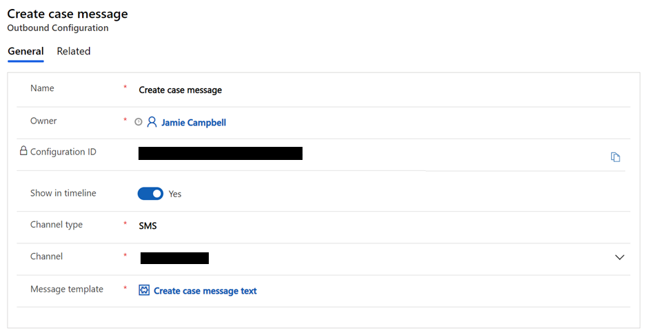

# Configure outbound messaging

[!INCLUDE[cc-data-platform-banner](../includes/cc-data-platform-banner.md)]

[!INCLUDE[cc-use-with-omnichannel](../includes/cc-use-with-omnichannel.md)]

Outbound messaging enables organizations to send messages to their customers through supported channels, based on system-triggered or user-defined events. You can configure message templates for only SMS, Twitter, and WhatsApp channels.

As an administrator, you can do the following: 

- Create message templates that can be adopted for outbound messages.
- Configure outbound messages to be sent for events that are triggered for an entity, such as creation of a case.
- Configure outbound messages to be sent manually based on non-system events, such as a shipping delay due to weather.

## Prerequisites

The following prerequisites must be met.

- The channel that you want to use must be provisioned in your environment. More information: [Provision Omnichannel for Customer Service](omnichannel-provision-license.md)
- To send outbound messages through SMS, you must configure the SMS channel by using an account with an SMS provider, either Twilio or TeleSign. 
- To send outbound messages through WhatsApp, you must [configure the WhatsApp channel](configure-whatsapp-channel.md) by using a Twilio account.
- To send outbound messages through Twitter, you must [configure a Twitter Direct Message channel](configure-twitter-channel.md). 
- You must have a Power Automate account.

After meeting the prerequisites, you can send outbound messages from your organization by following these steps:

- Set up message templates
- Set up outbound configuration
- Set up a Power Automate flow

## Step 1: Set up message templates

You need to set up templates to send outbound messages. To create a template, consider the scenarios that require your organization to send outbound messages.

1. Sign in to the Omnichannel Administration app.

2. Create a template for your outbound message.

    - [Create a template for SMS and Twitter](create-message-templates.md). 
    - [Create a template for WhatsApp](configure-whatsapp-channel.md#modify-settings-for-a-specific-whatsapp-phone-number).

## Step 2: Set up outbound configuration

1. Go to **Settings**, and select **Outbound**.

2. Complete the following fields:

    | Field               | Description| Sample value                       |
    |---------------------|------------|--------------------------|
    | Name                | Name of the case| **Case create message**                  |
    | Show in timeline    | The **Show in timeline** field displays the outbound message in the customer's timeline and activities. Set the toggle to **Yes** for event-based messages that apply to the support journey of a specific set of customers. For bulk messages that will be sent to a high volume of customers, we recommend that you leave this setting at **No**, to conserve resources in your Omnichannel for Customer Service environment and storage.  | **Yes**                                  |
    | Channel type        | Name of the channel for which the configuration is being set up. | **SMS**         |
    | Channel             | Channel number | ***The preconfigured channel number***   |
    | Message template    | Name of the template | ***Your previously created template***   |

    The **Configuration ID** will be generated when you select **Save**. You'll use it later to identify this outbound configuration when you set up the flow in Power Automate.

        You can choose a message template for the outbound message. The default message language and additional localized message versions are part of the message template configuration, and will apply to outbound messages.

    > [!div class=mx-imgBorder]
    > 

## Step 3: Set up a Power Automate flow

Power Automate provides a low-code platform for workflow and process automation. Outbound messaging in in Omnichannel for Customer Service relies on flow-based business logic. For more information, refer to [Power Automate documentation](https://docs.microsoft.com/power-automate/). You can download and import the following sample flows to get started:

- [Case Creation flow](https://aka.ms/CaseCreation) (.zip file): This template sends an automatic outbound message when a case is created.

- [Case Resolved flow](https://aka.ms/CaseResolved) (.zip file): This instant-type template sends an outbound message manually to all customers who have a case in the resolved state.

**To set up a Power Automate flow**

1. In the Omnichannel Administration app, select **Message template view** > **Flow** at the top of the screen, and then select **Create a flow**.

    or

    Go to https://us.flow.microsoft.com/, sign in to your account, and select **My flows**.

2. In Power Automate, set up a flow that aligns with your outbound messaging scenario:

    - **Automated:** Send an automatic message triggered by a system event, for example, case creation.

    - **Instant:** Send a message manually about a non-system event, for example, a shipping delay or a sale on products.

    - **Scheduled:** Send a message at a point in time, at one or more times, or after an amount of time that you specify.

    For more information about the current limits and configuration details for flows, see [Limits and configuration in Power Automate](https://docs.microsoft.com/power-automate/limits-and-config).

 3. Add the action, *incident_msdyn_ocoutboundmessages*. This action enables outbound activity tracking and reporting in Omnichannel for Customer Service.

    
4. Initialize a ContactList array variable, which will be used as contact information.

        
5. Get the required customer contact records that contain phone numbers and other contact details, which can be used as slugs in outbound messaging.
    
    
6. Fill in the values for the ContactList in the **Append to array variable** template.

    
   | Field | Requirement | Description |
   | --------- | --------- | ------------------- |
   | **tocontactid** | Required | The customer's phone number that the outbound service uses to send messages. For Twitter, it is the customer’s Twitter handle. |
   | **channelid** | Required | The customer's preferred social channel: SMS, WhatsApp, or Twitter. |
   | **optin** | Required | The customer's preference to be contacted by phone.This field can be set to **true** or **false**. |
   | **locale** | Chosen by default | To enable dynamic message languages, the default variable must be replaced by a locale column reference, such as the customer's preferred language. If the locale value is missing, the fallback locale in the omnichannel message template will be applied. |
   | **contextitems** | NA | Contains values to be processed with individual messages as they're sent. |
   | **entityrelationshipname** | Not required | This field refers to the **ActivityRelationship** that was previously defined. Although this field isn't required, it's essential for being able to track outbound activities in the timeline. So, if **show in timeline** in the outbound configuration is set to **Yes**, this field will have to be added to the flow for it to work. |
   | **CustomerName** | Required | The name of the customer. This value isn't case-sensitive and can throw an error if the customer name values are different. |
   | **CaseName** | Required | The name of the case. |

7. In the **Perform an unbound action** window, you'll need the outbound message configuration ID that you generated. When you add the ID to the *msdyn_ocoutboundconfigurationid* field, the field references the correct outbound configuration for a flow run.

8. Add the output from the compose action.

When the customer responds back to the outbound messages, the customer's message will be treated like any other incoming conversation that exists today in Omnichannel for Customer Service. The conversation will be routed and assigned to an agent, and the agent will be able to respond back to the customer.

> [!NOTE]
> Outbound messaging imposes limits of 100 contacts per request and 30,000 requests per org per hour. Where higher loads are expected, we recommend that you implement batch processing logic in flows to limit contacts per request to 100.

### Video

[Outbound messaging in Omnichannel for Customer Service](https://go.microsoft.com/fwlink/?linkid=2147614)

To view more videos about Omnichannel for Customer Service, go to [Videos](videos.md).

### See also

[Create message templates](create-message-templates.md) 
[Channels in Omnichannel for Customer Service](channels.md)   
[Configure an SMS channel for TeleSign](configure-sms-channel.md) 
[Configure an SMS channel for Twilio](configure-sms-channel-twilio.md) 
[SMS FAQ](faqs.md#sms)

[!INCLUDE[footer-include](../includes/footer-banner.md)]
