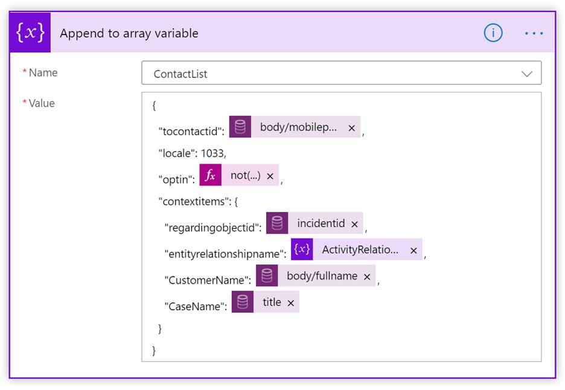

# Configure outbound messaging

[!INCLUDE[cc-data-platform-banner](../includes/cc-data-platform-banner.md)]

[!INCLUDE[cc-use-with-omnichannel](../includes/cc-use-with-omnichannel.md)]

## Overview

Outbound messaging enables organizations to send messages to their customers based on system-triggered or user-defined events through supported channels. 

With outbound messaging, organizations can do the following:

- Create message templates that can be adopted for outbound messages.
- Configure outbound messages based on certain events on any entity and send the messages when those events are triggered.
- Configure outbound messages to send manually based on non-system events.

Organizations can send messages to customers automatically based on a system event, such as case creation. Organizations also can send notices to customers based on non-system events such as a shipping delays due to weather. 

## Prerequisites

Before you configure outbound messaging, make sure that the following prerequisites are met:

- You must have the channel provisioned in your environment. For information, see [Provision Omnichannel for Customer Service](omnichannel-provision-license.md).
- To send outbound messages through SMS, you must configure the SMS channel using an account with an SMS provider, either Twilio or TeleSign. 
- To send outbound messages through WhatsApp, you must [configure the WhatsApp channel](configure-whatsapp-channel.md) using a Twilio account.
- To send outbound messages through Twitter, you must [configure a Twitter Direct Message channel](configure-twitter-channel.md). 
- You must have a Power Automate account.

After completing the prerequisites, you can send outbound messages from your organization by following these steps:

  - [Step 1: Set up message templates](#step-1-set-up-message-templates)
  - [Step 2: Set up outbound configuration](#step-2-set-up-outbound-configuration)
  - [Step 3: Set up a Power Automate flow](#step-3-set-up-a-power-automate-flow)

## Step 1: Set up message templates

1. Consider the scenarios that require your organization to send outbound messages.

2. Log in to the Omnichannel Administration app. 

3. Create a template for your outbound message.
    
    - [Create a template (SMS, Twitter)](create-message-templates.md) 
    - [Create a template (WhatsApp)](configure-whatsapp-channel.md#modify-settings-for-a-specific-whatsapp-phone-number)

## Step 2: Set up outbound configuration

1. Under **Settings**, click **Outbound**.

2. Complete the following fields:

    | Field               | Sample value                         |
    |---------------------|--------------------------------------|
    | Name                | Case create message                  |
    | Show in timeline    | Yes                                  |
    | Channel type        | SMS, Twitter, or WhatsApp                           |
    | Channel             | (the preconfigured channel number)   |
    | Message template    | (your previously created template)   |

    The **Configuration ID** will be generated when you click **Save**. You will use this later to identify this outbound configuration when you set up the flow in Power Automate.

     **Show in timeline** displays the outbound message in the customer timeline and activities. Set to **Yes** for event-based messages that apply to the support journey of a specific set of customers. For bulk messages that will be sent to a high volume of customers, it is recommended to leave this setting at **No** in order to conserve resources in your Omnichannel environment and storage. 
    
    Choose a **Message template** for the outbound message. Default message language and additional localized message versions are part of message template configuration. Defaults configured there will apply to outbound messages with no requested language configured.
    
    > [!div class=mx-imgBorder]
    > 
    
## Step 3: Set up a Power Automate flow

Power Automate provides a low code platform for workflow and process automation. Omnichannel outbound messaging relies on flow based business logic. For more information, refer to [Power Automate documentation](https://docs.microsoft.com/power-automate/). You can download and import the following sample flows to get started:

- [Case Creation flow](https://aka.ms/CaseCreation) (ZIP file)

- [Case Resolved flow](https://aka.ms/CaseResolved) (ZIP file)

To set up a Power Automate flow, complete the following steps.

1. Go to https://us.flow.microsoft.com/, sign in to your account, and click **My flows**.

    OR
    
    In the Omnichannel Administration app, **Message template view**, click the **Flow** button at the top of the screen, and click **Create a flow**.

2. In Power Automate, set up a flow that aligns with your outbound messaging scenario.

    - **Automated:** Send an automatic message triggered by a system event, for example, case creation.

    - **Instant:** Send a message manually about a non-system event, for example, a shipping delay or a sale on products.
    
    - **Scheduled:** Send a message at a point in time, one or more times, and/or after an amount of time that you specify.
    
    For more information about the current limits and configuration details for flows, refer to [Limits and configuration in Power Automate](https://docs.microsoft.com/power-automate/limits-and-config).

3. When you create a flow, you must add the action, incident_msdyn_ocoutboundmessages. This action enables outbound activity tracking and reporting in Omnichannel for Customer Service.

    > [!div class=mx-imgBorder]
    > 

4. Then, you must refer to it in the append variable step. In the example below, "entityrelationshipname" refers to the ActivityRelationship defined above.

    > [!div class=mx-imgBorder]
    > 
   
    - You must define any slugs used in your outbound message here. You can define any Microsoft Dataverse entity to be used as a slug. Once defined they can be added to the message. Slugs not defined here will not resolve. Sample message based on above flow config: “Dear {CustomerName}, we have opened case {CaseName} for you to track your inquiry. Thank you!”
    - The message language is determined by the numerical locale id as set as “locale”: 1033, English-United States, in the example. To enable dynamic message languages, this variable must be replaced by a locale entity reference, such as preferred customer language, in contact information.
   
5. You must also refer to the outbound message configuration ID from Omnichannel Administration app. This will reference the correct outbound configuration for a flow run.
    
    > [!div class=mx-imgBorder]
    > 

When the customer responds back to the outbound messages, the customer messages will be treated like any other incoming conversation that exists today in Omnichannel for Customer Service. The conversation will be routed and assigned to an agent, and the agent will be able to respond back to the customer.

> [!NOTE]
> Outbound messaging imposes limits of 100 contacts per request and 30,000 requests per org per hour. We recommend that you implement batch processing logic in flows to limit contacts per request to 100 where higher loads are expected. This is mostly applicable to instant and scheduled type flows.

### Video

[Outbound messaging in Omnichannel for Customer Service](https://go.microsoft.com/fwlink/?linkid=2147614)

To view more videos on Omnichannel for Customer Service, see [Videos](videos.md).

### See also

[Create message templates](create-message-templates.md) 
[Channels in Omnichannel for Customer Service](channels.md)   
[Configure an SMS channel for TeleSign](configure-sms-channel.md) 
[Configure an SMS channel for Twilio](configure-sms-channel-twilio.md) 
[SMS FAQ](faqs.md#sms)

[!INCLUDE[footer-include](../includes/footer-banner.md)]