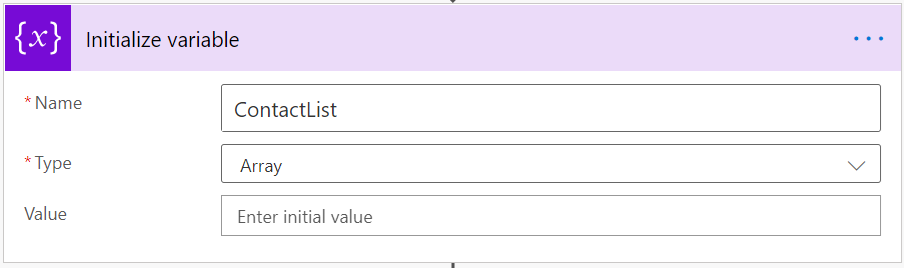
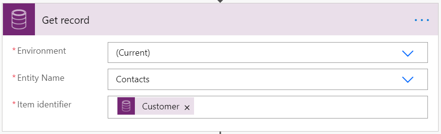
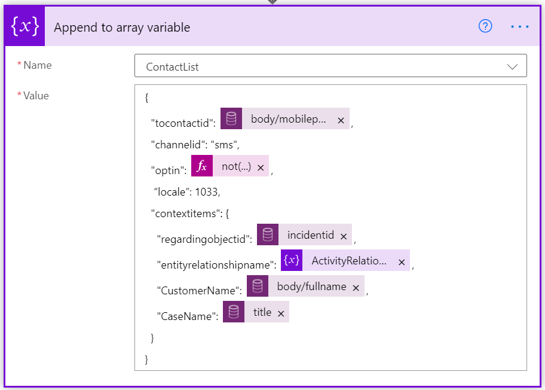

# Configure outbound messaging

[!INCLUDE[cc-data-platform-banner](../includes/cc-data-platform-banner.md)]

[!INCLUDE[cc-use-with-omnichannel](../includes/cc-use-with-omnichannel.md)]

## Overview

Outbound messaging enables organizations to send messages to their customers based on system-triggered or user-defined events through supported channels. 

With outbound messaging, organizations can do the following: 

- Create message templates that can be adopted for outbound messages.
- Configure outbound messages based on certain events on any entity and send the messages when those events are triggered.
- Configure outbound messages to be sent manually based on non-system events.

Organizations can send messages to customers automatically based on a system event, such as case creation. Organizations also can send notices to customers based on non-system events such as a shipping delays due to weather. 

## Prerequisites

Before you configure outbound messaging, make sure that the following prerequisites are met:

- You must have the channel provisioned in your environment. For information, see [Provision Omnichannel for Customer Service](omnichannel-provision-license.md).
- To send outbound messages through SMS, you must configure the SMS channel using an account with an SMS provider, either Twilio or TeleSign. 
- To send outbound messages through WhatsApp, you must [configure the WhatsApp channel](configure-whatsapp-channel.md) using a Twilio account.
- To send outbound messages through Twitter, you must [configure a Twitter Direct Message channel](configure-twitter-channel.md). 
- You must have a Power Automate account.

After completing the prerequisites, you can send outbound messages from your organization by following these steps:

  - [Step 1: Set up message templates](#step-1-set-up-message-templates)
  - [Step 2: Set up outbound configuration](#step-2-set-up-outbound-configuration)
  - [Step 3: Set up a Power Automate flow](#step-3-set-up-a-power-automate-flow)

## Step 1: Set up message templates

You need to set up templates to send outbound messages. To create a template consider the scenarios that require your organization to send outbound messages.

1. Log in to the Omnichannel Administration app. 

2. Create a template for your outbound message.
    
    - [Create a template (SMS, Twitter)](create-message-templates.md) 
    - [Create a template (WhatsApp)](configure-whatsapp-channel.md#modify-settings-for-a-specific-whatsapp-phone-number)

## Step 2: Set up outbound configuration

Perform the following steps to set up outbound configuration for your organization.

1. Go to **Settings**, and select **Outbound**.

2. Complete the following fields:

    | Field               | Requirement| Sample value                         |
    |---------------------|------------|--------------------------|
    | Name                | Required | Case create message                  |
    | Show in timeline    | Required | Yes                                  |
    | Channel type        | Required | SMS, Twitter, or WhatsApp                           |
    | Channel             | Required | (the preconfigured channel number)   |
    | Message template    | Required | (your previously created template)   |

    The **Configuration ID** will be generated when you select **Save**. You will use this later to identify this outbound configuration when you set up the flow in Power Automate.

    The **Show in timeline** field displays the outbound message in the customer's timeline and activities. Set the toggle to **Yes** for event-based messages that apply to the support journey of a specific set of customers. For bulk messages that will be sent to a high volume of customers, it is recommended to leave this setting at **No**, in order to conserve resources in your Omnichannel environment and storage. 
    
    You can choose a **Message template** for the outbound message. Default message language and additional localized message versions are part of the message template configuration and will apply to outbound messages.
    
    > [!div class=mx-imgBorder]
    > 
    
## Step 3: Set up a Power Automate flow

Power Automate provides a low code platform for workflow and process automation. Omnichannel outbound messaging relies on flow based business logic. For more information, refer to [Power Automate documentation](https://docs.microsoft.com/power-automate/). You can download and import the following sample flows to get started:

- [Case Creation flow](https://aka.ms/CaseCreation) (ZIP file) : This template sends an automatic outbound message when a case is created.

- [Case Resolved flow](https://aka.ms/CaseResolved) (ZIP file) : This instant type template sends an outbound message manually to all customers with a case in resolved state.

To set up a Power Automate flow, you need to perform the following steps.

1. Go to https://us.flow.microsoft.com/, sign in to your account, and select **My flows**.

    OR
    
    In the Omnichannel Administration app, select **Message template view** > **Flow** at the top of the screen. Select **Create a flow**.

2. In Power Automate, set up a flow that aligns with your outbound messaging scenario.

    - **Automated:** Send an automatic message triggered by a system event, for example, case creation.

    - **Instant:** Send a message manually about a non-system event, for example, a shipping delay or a sale on products.
    
    - **Scheduled:** Send a message at a point in time, one or more times, and/or after an amount of time that you specify.
    
    For more information about the current limits and configuration details for flows, refer to [Limits and configuration in Power Automate](https://docs.microsoft.com/power-automate/limits-and-config).

 > [!div class ="mx-imgBorder"]
 >

3. Add the action, *incident_msdyn_ocoutboundmessages*. This action enables outbound activity tracking and reporting in Omnichannel for Customer Service.

    > [!div class="mx-imgBorder"]
    > 

4. Initialize a ContactList array variable which will be used as contact information.

    > [!div class="mx-imgBorder"]
    > 
    
5. Get the required customer contact records that contain phone numbers and other contact details, that can be used as slugs in outbound messaging.
    
    > [!div class="mx-imgBorder"]
    > 

6. Fill in the values for the ContactList in the **Append to array variable** template.

    > [!div class="mx-imgBorder"]
    > 

| Field | Requirement | Description |
| --------- | --------- | ------------------- |
| **tocontactid** | Required | This value is the customer's phone number that is used by the outbound service to send messages. For Twitter, this would be the customer’s twitter handle. |
| **Channelid** | Required | This field needs to have the customer's preferred social channel, that is, SMS, WhatsApp or Twitter. |
| **optin** | Required | This field can have values set to **true** or **false** that shows if the customer prefers to be contacted by phone or not. |
| **locale** | Chosen by default | To enable dynamic message languages, the default variable must be replaced by a locale column reference, such as preferred customer language. If the locale value is missing, the fallback locale in the omnichannel message template will be applied. |
| **contextitems** | NA | Contains values to be processed with individual messages as they are sent. |
| **entityrelationshipname** | Not required | This field refers to the **ActivityRelationship** that has been previously defined. While this is essentially not required, this is important if you want to be able to track outbound activities in the timeline. So, if **show in timeline** in the outbound configuration is set to **Yes**, this will have to be added to the flow for it to work. |
| **Customer Name** | Required | Name of the customer. This value is not case sensitive and can throw an error if values are different. |
| **Case title** | Required | The name of the case. |

7. In the **Perform an unbound action** window, you must refer to the outbound message configuration ID that you generated. The ID needs to be added to the *msdyn_ocoutboundconfigurationid* field. This will reference the correct outbound configuration for a flow run.

8. Add the output from the compose action.

When the customer responds back to the outbound messages, the customer messages will be treated like any other incoming conversation that exists today in Omnichannel for Customer Service. The conversation will be routed and assigned to an agent, and the agent will be able to respond back to the customer.

> [!NOTE]
> Outbound messaging imposes limits of 100 contacts per request and 30,000 requests per org per hour. We recommend that you implement batch processing logic in flows to limit contacts per request to 100 where higher loads are expected. This is mostly applicable to instant and scheduled type flows.

### Video

[Outbound messaging in Omnichannel for Customer Service](https://go.microsoft.com/fwlink/?linkid=2147614)

To view more videos on Omnichannel for Customer Service, see [Videos](videos.md).

### See also

[Create message templates](create-message-templates.md) 
[Channels in Omnichannel for Customer Service](channels.md)   
[Configure an SMS channel for TeleSign](configure-sms-channel.md) 
[Configure an SMS channel for Twilio](configure-sms-channel-twilio.md) 
[SMS FAQ](faqs.md#sms)

[!INCLUDE[footer-include](../includes/footer-banner.md)]