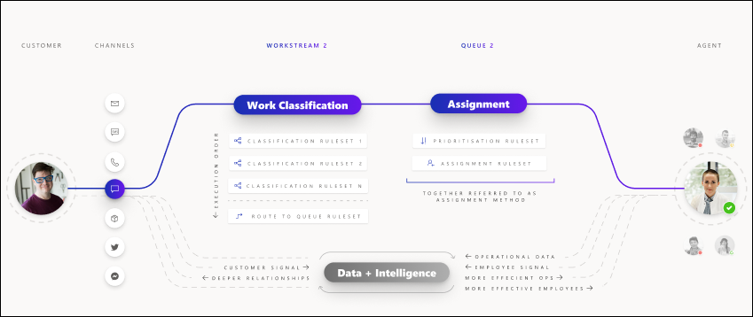

# Overview of unified routing

Unified routing is an intelligent, scalable, and enterprise-grade routing and assignment capability that can direct the incoming work item to the best-suited queue and agent by adhering to work item requirements and matching them with the agent’s capabilities.

The unified routing infrastructure can be used to route service requests on all channels. This creates a unified view of workforce utilization across multiple channels, and thus helps to optimize distribution of work across the workforce. It works in a truly omnichannel way by ensuring that work items on all the channels are routed in a consistent and similar manner. It takes the agent engagement on different channels into account before any new work is assigned to them.

Unified routing has two main stages: classification and assignment. 

In the classification stage, rules and machine learning (ML) models can be used to add information on the work item, which can be further used to find the best-suited agent.

During the assignment stage, the service requests are prioritized and then assigned to the agents based on the nature of the work, related entities, agent skills, and the current state of the agent workforce in terms of availability and workload.

For instance, an organization receiving an incoming chat will add information on the work item—such as skills required, urgency level, category of customer, and importance level—in the classification stage, based on certain conditions that are met as part of the configured rules. In the assignment stage, an organization might want to first prioritize the incoming chats based on highest urgency level and importance, and then assign them to the agents by matching the skills required, current workload status, and availability.

## How unified routing helps achieve business efficiency

Unified routing optimizes businesses in the following ways:

- Routing to the best queue by using attributes in a related entity, saving an admin from creating a custom work flow.

- Using skills-based routing to automatically assign incoming work, matching to the best agent and decreasing resolution time.

- Adding more context to the incoming work item using conditions on work item attributes and relates entity attributes, and then further using that information to route to a particular queue and also while assigning to the right agent.

- Using machine-learning models to predict skills and assigning incoming work items to the best agent using skills to avoid writing manual declarative skill-identification rules.

- Prioritizing work items within a queue using work item attributes, added context, or related entity attributes so as to ensure the business is able to use the agent's time on the most important work items first as per the business need.

- Assigning work items within a queue by matching agent attributes against work item requirements dynamically, thereby assigning agents as per the business requirement.
