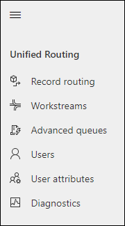

# Provision unified routing for Customer Service

## Introduction

Perform the steps mentioned in this topic to provision unified routing in Customer Service. By default, unified routing is not enabled.

## Provision unified routing

To provision unified routing in Customer Service, do the following:

1. In Customer Service Hub, go to **Service Management**.
2. In the site map, under **Service Terms**, select **Service Configuration Settings**.
3. On the **Service Configuration Settings** page, in the **Unified routing** section, depending on the solutions that are deployed and configured, one of the following messages will be displayed.

  - When only Customer Service is available and consent to access data is not provided by the tenant admin, a message with a link to the consent page is displayed:
    
    "Unified routing requires application permissions. A tenant administrator must provide consent before it can be turned on. Provide consent."

      1. Select **Provide consent**. The following consent form is displayed on a new tab.

       > [!div class=mx-imgBorder]
       > 

       For information on consent, see [Consent to access data to provision Omnichannel for Customer Service](data-access-consent.md)

      2. Select **Consent on behalf of your organization**, and select **Accept**.
      3. After access is granted, you can close the page to return to the **Service Configuration Settings** page.
      4. Set the toggle to **Yes** for **Turn on unified routing**. A message that unified routing is being provisioned appears.

    - When Omnichannel for Customer Service is not deployed, the following message will appear:
      
      "Some required services need to be installed before unified routing can be turned on. Please contact Microsoft Support."
    
    - When Omnichannel for Customer Service doesn't have the required solutions, the following message will appear:
      
      "Before unified routing can be turned on, Omnichannel needs to be updated. Please contact Microsoft Support."

After unified routing is provisioned, for Customer Service users, **Unified Routing** appears in the site map.

> 

> [!NOTE]
> **Unified Routing** also appears in the site map if you install or upgrade Omnichannel for Customer Service.

### See also

[Provide consent to access data](data-access-consent.md)  
[Set up record routing](set-up-record-routing.md)  
[Provision Omnichannel for Customer Service](omnichannel-provision-license.md)  