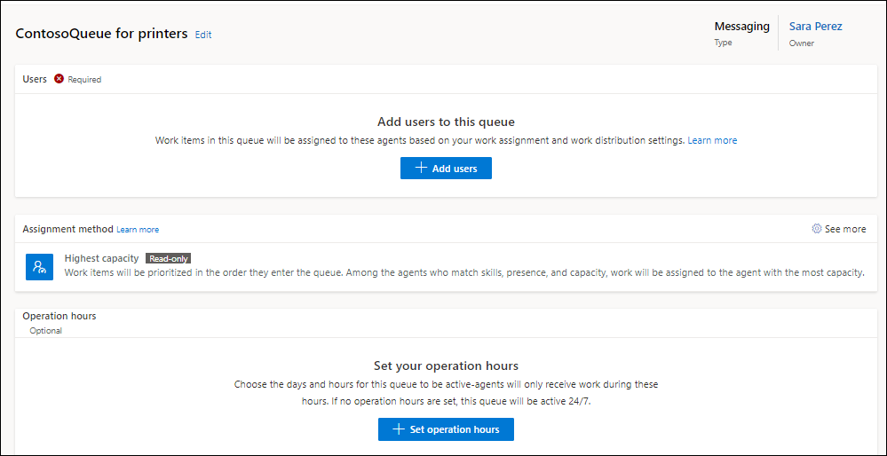

# Work with queues in Omnichannel for Customer Service

[!INCLUDE[cc-use-with-omnichannel](../includes/cc-use-with-omnichannel.md)]

## Introduction

In Omnichannel for Customer Service, queues are used for collecting and distributing workload among agents. Workload includes conversations, such as chat or SMS. Agents are added as members to the queues and the workload is distributed among these agents.

## How conversations are routed to queues

Queues in Omnichannel for Customer Service are proxies for skills or domains. You can create separate queues for each line of business, such as billing, investment, and products. When a customer query is raised for any of the areas, it is routed to the corresponding designated queue. You also can set up a customer support availability matrix by using a combination of queues, operating hour schedules, and routing rules.

In an enterprise scenario, you can have various supervisors handling different issues, and therefore, different types of queues are required to handle the various scenarios. Accordingly, routing rules are set up based on the complexity of issues that need to be handled.

To simplify the routing experience for administrators and supervisors, queues are categorized based on the channel types as follows:

- **Messaging**: To route all messaging conversations pertaining to the live chat, SMS, and social channels.
- **Entity records**: To route cases pertaining to entity records.

The queue types help ensure issues will be routed correctly and help avoid cross-queue assignments. When you configure workstreams and routing rule items, the queues that will be available for selection will be based on the channel type for the workstream. For example, for routing rules for a live chat workstream, only messaging type queues will be shown for selection. Similarly, in a conversation transfer scenario, you can transfer a chat conversation only to a messaging queue and a case to an entity queue.

You can assign priority to queues. A lower value indicates higher priority and a higher value indicates lower priority. All conversations in a queue take the priority that is defined for the queue; higher priority conversations are allocated first. For example, if two chat conversations are waiting in two queues that have priority defined as 1 and 2 respectively, the chat conversation with priority value 1 will be allocated to an agent first.

## Create a queue for the messaging channel in Omnichannel admin center

In this section, we cover information on how to create a queue for the messaging channel and set operating hour record for the queue.

1. In the left pane, select **Queues**, and then do the following:

    1. On the **Queues** page, select **New**.
    2. In the **Create a queue** dialog box, enter the following:
       - **Name**: A name for the queue.
       - **Type**: Select **Messaging**.
       - **Group number**: A number to organize the queue. 
    3. Select **Create**. The queue that you created is displayed.
     
       > [!div class=mx-imgBorder]
       > 

2. Select **Add users**, and in the flyout menu, select the users who should be part of the queue, then select **Add**. The users are added to the queue.
3. In **Assignment method**, do one of the following:
   - **Highest capacity**: Selected by default; assigns work item to the agent with the highest capacity, among those who have the skills identified during the classification stage, and have the presence as specified in the allowed presence option of the workstream.
   - **Round robin**: Assigns work item to the agent in the list order who matches the criteria for skills and presence.
   - Create a custom assignment method. For more information about the custom assignment method, see [Create custom assignment method](assignment-methods.md).
4. To set operation hours, in the **Operation hours** area, select **Set operation hours**. You must configure the operating hour record before you can set it for the queue.
5. On the **Set operation hours** dialog box that appears, select an operating hour record in the **Name** list.
6. Select **Save and close**. The operating hour record that you selected is configured for the queue.

### Manage queues in Omnichannel admin center

You can manage the queues on the **Queues** page.

- Select a queue to edit the users, assignment methods, or operating hours record.

- Select a queue on the **Queues** page, select **Copy** on the command menu, and then select **Copy** in the *<queue_name>* dialog box. The queue is copied and inherits the settings of the queue you copied from, including its name, prefixed with **Copy of**.

## Create a queue in Omnichannel Administration

Out of the box, the following default queues are available in Omnichannel for Customer Service:

- **Default entity queue**: The queue that is available for routing entity records.
- **Default messaging queue**: The queue that is available for routing all messaging conversations pertaining to the live chat, SMS, and social channels.

The default queues can't be edited or deleted. All Omnichannel for Customer Service users are members of the default queues. Therefore, the membership of these default queues also can't be changed.

> [!NOTE]
> When no custom queues or routing rules are defined, all conversations are directed to one of the out-of-the-box default queues based on the work item type.

Perform the following steps to create a queue in Omnichannel for Customer Service:

1. In the Omnichannel Administration site map, go to **Queues & Users** > **Queues**. The **Omnichannel queues** view is displayed.
2. On the command bar, select **New**.
3. On the **Summary** tab, in the **General Information** section, provide the following information:

    - **Name**: Enter a name for the queue.
    - **Priority**: Assign a priority to define how quickly a conversation should be picked from the queue.
    - **Queue type**: Select either **Messaging** or **Entity**. You can't edit the queue type after you save the queue.
    - **Owner**: Search and select an owner for the queue if you do not want to use the default owner.
    - **Operating Hours**: Search and select an operating hour schedule that you want to specify for the queue.

4. Select **Save**. The **Users (Agents)** section is displayed.

   > [!div class=mx-imgBorder]
   > 

5. In the **Users (Agents)** section, select **Add Existing User** to add existing agents to the queue.
6. On the **Lookup Records** flyout menu, select the agents to add, and then select **Add**.

    > [!TIP]
    > To select users from other views, you can change the view by selecting **Change View**.

### See also

[Create workstreams](create-workstreams.md)  
[Understand unified routing and work distribution](unified-routing-work-distribution.md)  
[Create and manage operating hours](create-operating-hours.md)  

[!INCLUDE[footer-include](../includes/footer-banner.md)]
