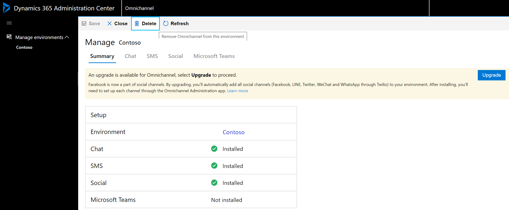
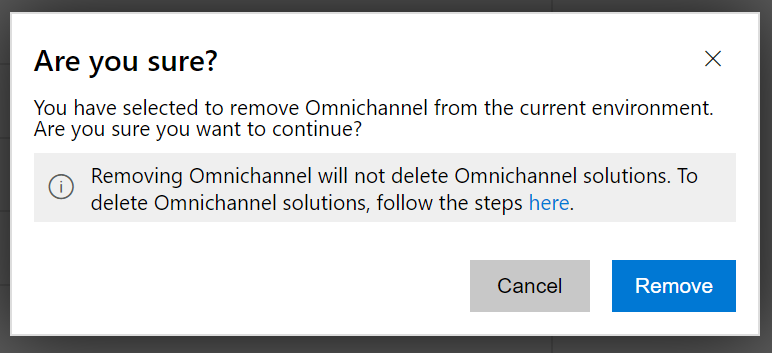

# Remove Omnichannel for Customer Service

[!INCLUDE[cc-use-with-omnichannel](../includes/cc-use-with-omnichannel.md)]

You can remove Omnichannel for Customer Service and disable all channels for a Dynamics 365 Customer Service organization.

> [!NOTE]
> Omnichannel for Customer Service will be automatically removed if you do any of the following:
>
> - Delete the Dynamics 365 CRM instance from the Dynamics 365 admin center.
> - Reset the Dynamics 365 CRM instance from the Dynamics 365 admin center.
> - Modify or change the Dynamics 365 CRM instance to a different organization ID.
>
> Removing Omnichannel for Customer Service will not delete Omnichannel solutions. To delete Omnichannel solutions, see [Delete Omnichannel solutions](delete-solution.md).  

To remove the Omnichannel for Customer Service from the organization,

1. In **Power Platform Admin Center**, on the **Environments** page, select the environment in which Omnichannel for Customer Service needs to be removed.

    > [!div class=mx-imgBorder]
    > 

2. In the left pane, expand **Resources**, and select **Dynamics 365 Apps**.
3. On the **Dynamics 365 apps** page, select **More commands** beside **Omnichannel for Customer Service**, and then select **Manage**.
4. On the **Manage *<environment_name>*** page, select **Delete**.

    

5. In the confirmation dialog box, select **Remove** to proceed.

    > [!div class=mx-imgBorder]
    > 

> [!IMPORTANT]
> Removing Omnichannel for Customer Service will disable all channels in the selected organization.

After Omnichannel is removed, you can enable it again from the **Manage environments** view.

### See also

[Provision Omnichannel for Customer Service](omnichannel-provision-license.md)  
[Upgrade Omnichannel for Customer Service](upgrade-omnichannel.md)  
[Delete Omnichannel solutions](delete-solution.md)  

[!INCLUDE[footer-include](../includes/footer-banner.md)]