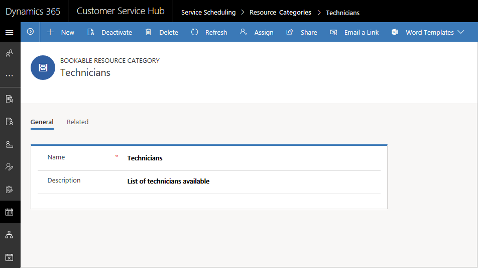

# Create and manage resource categories 

With bookable resource categories, you can group your bookable resources by type. For example, you can create categories like technician, supervisor, subcontractor, vehicle, or equipment.

[!INCLUDE[proc_more_information](../includes/proc-more-information.md)]: [Multi-resource scheduling with requirement groups](https://docs.microsoft.com/dynamics365/customer-engagement/common-scheduler/multi-resource-scheduling-requirement-groups)

## Create a new resource category

Make sure that you have the required security role or equivalent permissions. 

[!INCLUDE[proc_more_information](../includes/proc-more-information.md)] [Manage security roles in service scheduling](manage-security-roles.md)

1. In the Customer Service Hub sitemap, go to **Scheduling**.
2. From the list of entity records, select **Scheduling > Resource Category**.
   - The **Active Resource Categories** view is displayed. You can switch between various system views using the drop-down menu.
   - Select any existing resource category to see additional options in the command bar

3. On the command bar, select **New** to create a new bookable resource category. 
4. In the **General** section:
 
   - Enter a **Name** and a **Description** for the resource category

5. Select **Save**. A new resource category is created and is activated by default. 

6. In the **Related** section, you can view and manage various resource category associations.

   

Similarly, you can create a new requirement resource category for requirements.

## Add resources to a resource category

To assign resources to a resource category:

1. In the **Related** section, go to **Resource Category Associations**.

2. Select **Add New Bookable Resource Category Association**. A resource category is populated. 

3. Add a resource to this resource category by selecting a resource in the **Resource** box. You can either lookup for an existing resource or create a new one.

### See also 
[Service Scheduling overview](basics-service-service-scheduling.md)

[!INCLUDE[footer-include](../includes/footer-banner.md)]