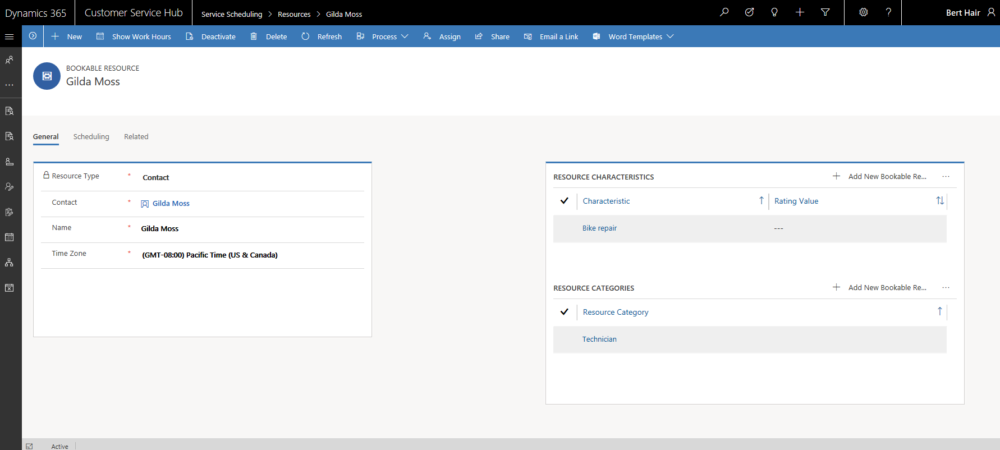
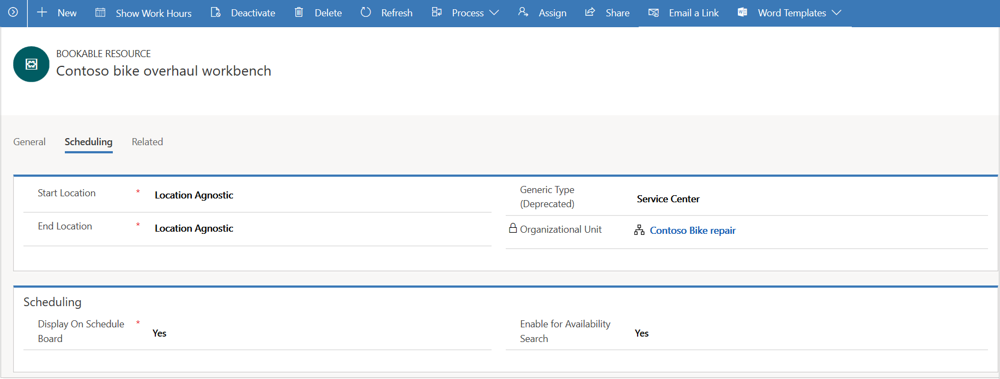
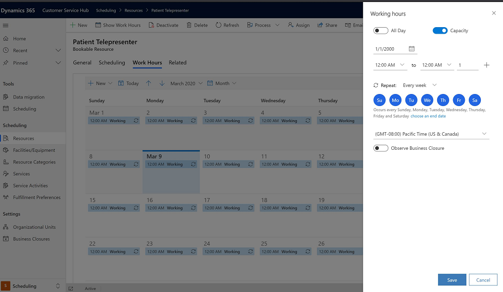

# Create and set up bookable resources

A resource in Service Scheduling is anything that needs to be scheduled. You can set up Generic, Contact, User, Equipment, Account, Crew, Facility, or Pool as bookable resource.

## Create a new bookable resource

Make sure that you have the required security role or equivalent permissions. 

[!INCLUDE[proc_more_information](../includes/proc-more-information.md)] [Manage security roles in service scheduling](manage-security-roles.md)

1. In the Customer Service Hub sitemap, go to **Scheduling**.
2. From the list of entity records, select **Scheduling > Resources**.
   - The **Active Bookable Resources** view is displayed. You can switch between various system views using the drop-down menu.
   - Select any existing bookable resource to see additional options in the command bar.

3. On the command bar, select **New** to create a new bookable resource. 
4. In the **General** section:
   - Select a **Resource Type**. You can choose from the following options:

      - Generic
      - Contact
      - User
      - Equipment
      - Account
      - Crew
      - Facility
      - Pool
      
   - The field name is automatically populated. Look up for the record. You can also create a new record using the **Quick Create** dialog box. 

   - Select a **Time Zone**.

     > [!NOTE]
     > If the Resource Type is Facility or Equipment, the time zone is  automatically populated as per the facility’s or equipment’s time zone and it is not editable.

   - Select **Save**. A new resource is created and activated by default.

     **Resource Characteristics** and **Resource Categories**  sections are displayed.
    - In the **Resource Characteristics** section, select the ellipses  (**...**) and then select **Add New Bookable Resource Characteristics** to add characteristics.
   
      - Use the tooltips to help fill in your information and then select **Save**
      - Look up and assign **Rating Value**. You can also create a new rating value.
      - Assign the characteristic to a **Resource**

    - In the **Resource Categories** section, select the ellipses  (**...**) and then select **Add New Bookable Resource Category** to add a category.

     

5. In the **Scheduling** section:

    - Select the **Start Location** and the **End Location** to specify which location the resource will be at, when starting and ending work.
    - Select an **Organizational Unit** for the resource. 

      > [!NOTE]
      > If the Resource Type is Facility or Equipment, the organizational unit is automatically populated as per the facility’s or equipment’s organizational unit and it is not editable.

    - Select whether the resource should be displayed on the schedule board in the **Display On Schedule Board** box.
    - Select whether you want to enable the resource for availability search in the **Enable for Availability Search** box.

    

7. Once you are ready, select **Save**.

## Set work hours for the resources

You can set work hours for the bookable resources where you can define when the resources will be available to be booked for services. 

1. In the Customer Service Hub sitemap, go to **Scheduling**.
2. From the list of entity records, select **Scheduling > Resources**. 
  
4.  Open the resource record you want to set work hours for.  
  
6.  Select **Show Work Hours**.  
  
7.  From the **Set up** drop-down list, choose the schedule display as required.
  
    > [!NOTE]
    >  Monthly schedules are the default display; you can choose weekly and daily schedules.  
  
8.  Double-click a date on the calendar that is the first day for which you want to set work hours.  
  
9. In the **Edit Schedule** dialog box, select one of the following and then select **OK**.  
  
    - **This date only**  
  
         This option changes only the selected day.  
  
         Skip to step 12.  
  
    - **From \<this date> onward**  
  
         This option changes only the schedule going forward.  
  
    - **Entire recurring weekly schedule from start to end**  
  
         This option changes this entire schedule from the start to end date.  
  
         Selecting this option might change past days, which could affect reports regarding hours worked in the past.  
  
10. In the **Weekly Schedule** dialog box, in the **Set the recurring weekly schedule** section, select one of the following:  
  
    - **Are the same each day**  
  
         The new schedule is the same for every day of the week. After you select this option, select the days of the week that the resource is available.  
  
    - **Vary by day**  
  
         The new schedule is different for one or more days of the week. After you select this option, select the days of the week that the resource is available.  
  
    - **None. User is not working**  
  
         The new schedule includes time that the resource is not working.  
  
     In the **Weekly Schedule** dialog box, you can also do any of the following:  
  
    -   If the schedule is for more than one day, select the days of the week this schedule is effective.  
  
    -   If the resource does not work during business closures, select the **Observe** option.  
  
    -   Under **Date Range**, in the **Starting on** box, you can change the date the schedule starts.  
  
         You cannot change the date the schedule ends. To end a schedule, you must define a new schedule on that date.  
  
11. Choose the work hours link for the schedule you want to modify.  
  
     If work hours have not been set previously, the link is displayed as "Set Work Hours."  
  
12. In the **Set Work Hours and Service Restrictions** dialog box, complete the following fields, and then select **OK**:  
  
    - **Date**  
  
         Select a date from which the work hours for services are to be considered.  
  
    - **Start**  
  
         Select the time the work day starts.  
  
    - **End**  
  
         Select the time the work day ends.  
  
         To add a break in the work hours, such as a lunch break, select **Add Break**, and then select the start and end time of the break. 
  
14. To close the **Weekly Schedule** dialog box, select **Save and Close**.

     

> [!NOTE]
> To define a time when a service won’t be available, on the **Service Restrictions** tab, select **New**. In the **Edit a Service Restriction** dialog box, select the service, and select the start and end time between which the service will be unavailable, and then select **OK**.  

### See also

[Service Scheduling overview](basics-service-service-scheduling.md)

[!INCLUDE[footer-include](../includes/footer-banner.md)]