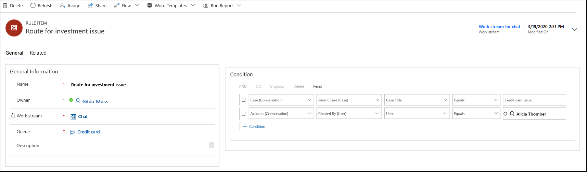

# Create and manage routing rules in Omnichannel Administration

[!INCLUDE[cc-use-with-omnichannel](../includes/cc-use-with-omnichannel.md)]

Routing rules define how conversations are routed to different queues. Each routing rule has a condition and a destination queue. If the rule condition is evaluated as **True**, then the conversation is routed to the destination queue.

 > [!Important]
 > Routing rules for entity records are defined at the entity record channel level. To learn more, see [Entity records routing](entity-channel.md).

A single work stream can have multiple routing rules that are evaluated in the order of definition. For example, if a work stream called **Chat** contains 5 routing rules, an incoming chat conversation will be evaluated against all the 5 routing rules in the defined order. While you can define as many rules as your business requires, the application processes only the first 100 rules.

> [!div class=mx-imgBorder] 
> 

Routing rules are evaluated from top to bottom. If a rule condition is evaluated as **True**, the chat gets routed to the destination queue and skips further evaluation. If a rule condition is evaluated as **False**, further rules are evaluated. 

Routing rule conditions could be based on channel context, pre-chat context, and contact, account, or case context. For example, you can define a routing rule so that chats from high priority customers who have specific queries about investments can be routed to a specific queue.

> [!IMPORTANT]
> If all the rule conditions are evaluated as False for a conversation, it goes to the **Default** queue. For more information, see [Queues in Omnichannel for Customer Service](queues-omnichannel.md).

## Create a routing rule

To create a routing rule, select a work stream by navigating to **Work Distribution Management** > **Work Streams**, and define a new rule in the **Routing Rule Items** tab.

1. Select **Add**. The **New Rule Item** page appears.  
   1. In the **General information** section of the **General** tab, provide the following information:  
      1. **Name**. Name of the rule item  
      2. **Work Stream** is auto populated  
      3. **Queue**. Look up a queue or select **New** to add a new queue. For more information, see [Create a queue in Omnichannel for Customer Service](queues-omnichannel.md)  
   2. **Description**. A brief description of the rule item.
   3. In the **Condition** section, provide the conditions for the rule. Based on the conditions defined, the conversations are routed to the correct queues. You can define the conditions based on the following:
    - Entity
    - Attribute or related entity
    - Attribute
    - Operator
    - Value

    For an entity, you can define rules based on related level 1 attributes.

    > [!div class=mx-imgBorder]
    > 
2. Select **Save**.

      > [!div class=mx-imgBorder]
      > 

### See also

[Understand and create work streams](create-workstreams.md)

[Understand unified routing and work distribution](unified-routing-work-distribution.md)

[!INCLUDE[footer-include](../includes/footer-banner.md)]