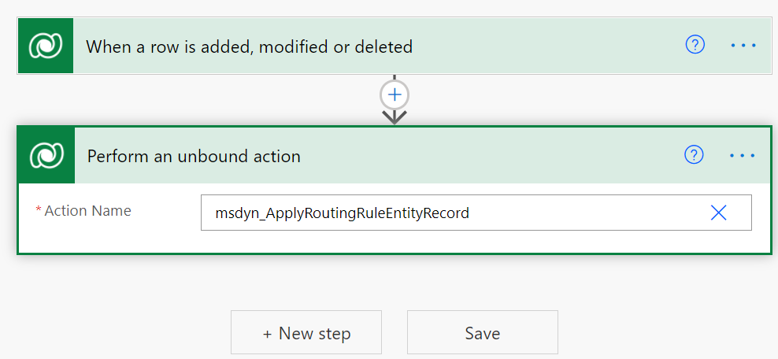

# Route records automatically using custom flow

[!INCLUDE[cc-data-platform-banner](../includes/cc-data-platform-banner.md)]

[!INCLUDE[cc-use-with-omnichannel](../includes/cc-use-with-omnichannel.md)]

## Set up custom flow to automatically route records

As an administrator, you can route records automatically using Power Automate. Set up a custom flow to automatically route records based on certain conditions, such as when a record is created or updated. Let's see how to set up a custom flow for the create condition.

> [!Note]
> - For case records, an out-of-the-box trigger is shipped to route the cases automatically. The routing is based on the **Route Case** field value in the case record. 
> - If **Route Case** is set to **Yes**, the record is routed upon creation.
> - If **Route Case** is set to **No**, the record is not routed upon creation.
> - By default, for all of the cases created from the user interface, the **Route Case** field is set to **No**. So, routing for these cases is not triggered.

To enable the automatic trigger of routing the records:

1. Sign in to Power Automate and select the environment for which you want to update the flow.

2. Select **My flows** on the site map, then select **New flow**. Under the **Build your own from blank** option, select **Automated cloud flow**.
    The **Build an automated cloud flow** dialog box appears.

3. Select **Skip**. A list of all connectors and triggers is displayed.
<!--
    > [!div class=mx-imgBorder]
    > 
-->
4. Select **Microsoft Dataverse**. In the corresponding list of triggers that appears, select **When a row is added, modified or deleted**.
<!--
    > [!div class=mx-imgBorder]
    > 
-->
5. Specify the following values for the Change type, Table name, and Scope fields.
 
    - **Change type**: Create
 
    - **Table name**: Email Messages

    - **Scope**: Organization

<!--
    | Field | Description | Value |
    |-------|-------------|---------------|
    | Change type | Specify the condition to fire the trigger. That is, when you select a trigger condition, based on this state, the record is routed automatically.     The list of possible values are: <ul> <li>Create</li> <li>Create or Delete</li> <li>Create or Update</li> <li>Create or Update or Delete</li> <li>Delete</li> <li>Update</li> <li>Update or Delete</li>| Create |
    | Table name | Specify the entity collection name for which you want to fire the trigger. |  Email Messages |
    | Scope | Specify where this trigger must be applied. | Organization |
-->
<!--
   > [!div class=mx-imgBorder]
   > 
-->
6. Select **+ New step**. The **Choose an operation** dialog box appears.
<!--
    > [!div class=mx-imgBorder] 
    > 
-->
7. Select **Perform an unbound action** from the **Actions** list. The **Perform an unbound action** dialog box appears.

8. Enter **msdyn_ApplyRoutingRuleEntityRecord** in the **Action Name** field as a custom value.
<!--
    > [!div class=mx-imgBorder] 
    > 
-->
9. In the **Target** field, enter the entity collection name and unique identifier of the record as follows:

    **Format:** `<entity collection name>(unique identifier of the entity)`
    
    **Example:** leads(Lead)

    > [!Note]
    > 1. Open your browser and go to `https://<org_name>/api/data/v9.0/EntityDefinitions(LogicalName='<entityname>')`
    > For example: `https://contoso.dynamics.com/api/data/v9.0/EntityDefinitions(LogicalName='lead')`.
    > 2. Search for `LogicalCollectionName` to view the entity collection name for a particular entity.
    > For example: `"LogicalCollectionName":"leads"`.
    > Here, `leads` is the entity collection name.

10. Select **Save**.

Now, based on the flow that is defined, whenever a record (in this example, a lead) is created, the flow applies the **ApplyRoutingRuleRecord** action to the record. Similarly, you can create a custom flow based on your business scenarios. 

You can also perform other actions in the flow, such as filtering out certain records that you don't want to route, performing data transformation, and more.

### See also

[Overview of routing](overview-unified-routing.md)  
[Set up routing for records](set-up-record-routing.md)  
[Manually route records](routing-trigger.md)  
[Sample code to trigger routing for non-case records](trigger-routing-non-case-records.md)  

[!INCLUDE[footer-include](../includes/footer-banner.md)]
