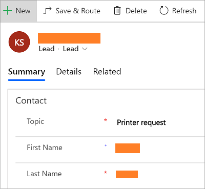
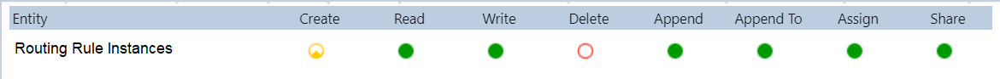

# Route trigger for entity records

[!INCLUDE[cc-data-platform-banner](../includes/cc-data-platform-banner.md)]

[!INCLUDE[cc-use-with-omnichannel](../includes/cc-use-with-omnichannel.md)]

## Overview

After you set up and enable an entity for routing, you can manually trigger the routing for these records using the save and route button on the entity record forms. As an administrator, you can also setup automatic triggers to route these entity records using Power Automate. Let us look at the triggers in detail in the following sections:

- Manual trigger using **Save & Route** and **Apply Routing Rules**
- Automatic trigger using custom Flow

## Manual trigger

After you enable an entity for routing, you see the **Save & Route** in the entity form ribbon command bar and **Apply Routing rules**  in the entity view ribbon command bar. You can use these commands to route the record.

1. Sign in to your model-driven app.

2. Select an entity record for your administrator has enabled routing.   For example, in this procedure, **Leads** entity is enabled for routing, and hence, you can see the button in the Leads form command bar. 

3. Select **Leads** in the sitemap, and you can view the **Apply Routing rules**  in the entity view ribbon command bar. Selecting the **Apply Routing rules** button also routes the record.

4. Select a lead record from the **My Open Leads** view.

5. Select **Save & Route** the command bar. The **Route Case** dialog box appears. 

6. Select **Route**. 

    > [!div class=mx-imgBorder] 
    > 

The entity record will be routed based on the active routing rule set.

### Verify your permissions  

Ensure that your users have the below-mentioned permissions for Routing Rule Instance entity, to trigger routing of entity records using the **Save & Route** or **Apply Routing Rules** buttons.

   > [!div class="mx-imgBorder"]
   > 

## Automatic trigger

You can setup a custom flow, to trigger routing for records based on conditions such as when a record is created, updated, and so on. Let's see how to setup a custom flow for create condition.

To enable automatic trigger to route the entity records, create a custom Flow.

1. Sign in to Power Automate.

2. Select the environment for which you want to update the Flow.

3. Select **My Flows** in the sitemap.

4. Select **+ New** and select the **Automated-from blank** option. Select **Skip** in the **Build an automated flow** dialog.

5. Type **Common Data Service**, and select it from the list. The Common Data Service connector enables you to connect to the Microsoft Dataverse environment.

6. Type **When a record is created, updated or deleted** in the search box, and select it from the list. **When a record is created, updated or deleted** is the trigger condition step. 

    > [!div class=mx-imgBorder] 
    > 

7. Specify the following in the **When a record is created, updated or deleted** trigger.

    | Field | Description | Example Value |
    |-----------------|----------------------------|-----------------------------|
    | Trigger condition| Specify the condition to fire the trigger. That is, when you select a trigger condition, based on this state, the entity record will be routed automatically.     The list of possible values are: <ul> <li>Create</li> <li>Create or Delete</li> <li>Create or Update</li> <li>Create or Update or Delete</li> <li>Delete</li> <li>Update</li> <li>Update or Delete</li>| Create |
    | The entity name | Specify the entity collection name for which you want to fire the trigger. |  Leads |
    | Scope | Specify where this trigger must be applied. | Organization |

    > [!div class=mx-imgBorder] 
    > 

8. Select **+ New step**. The **Choose an action** step appears.

9. Type **Perform an unbound action** in the search box, and select the action from the list. The **Perform an unbound action** step appears.

    > [!div class=mx-imgBorder] 
    > 

10. Type **msdyn_ApplyRoutingRuleEntityRecord** in the **Action Name** field.

11. Type the entity collection name and unique identifier of the entity in the specified format against the **Target** field:

    Format: `<entity collection name>(unique identifier of the entity)`
    Example: leads(Lead)

    > [!Note]
    > 1. Open your browser and go to `https://<org_name>/api/data/v9.0/EntityDefinitions(LogicalName='<entityname>')`
    > For example: `https://contoso.dynamics.com/api/data/v9.0/EntityDefinitions(LogicalName='lead')`.
    > 2. Search for `LogicalCollectionName`, and you can view the entity collection name for a particular entity.
    > For example: `"LogicalCollectionName":"leads"`
    > Here, `leads` is the entity collection name.
    
    > [!div class=mx-imgBorder] 
    > 

12. Select **Save** to save the Flow.

Now, based the Flow that is defined, whenever an entity record, say lead, is created, the Flow applies the **ApplyRoutingRuleRecord** action on the entity record. Similarly, you can create a custom Flow based on your business scenarios.

> [!Note]
> - For case entity record, an out-of-the-box trigger is shipped to route the cases automatically. The routing is based on the **Route Case** field value in the case entity record. 
> - If **Route Case** is set to **Yes**, the record will be routed upon creation. 
> - If **Route Case** is set to No, the record will not be routed upon creation. 
> - By default, for all the cases created from user interface, the **Route Case** field is set to **No**. Hence, the routing for these is not triggered.
> - You can also build a custom flow to automatically trigger routing for cases using any other field per your business scenario, as explained in the above-mentioned section.

### See also

[Entity records routing](entity-channel.md)

[!INCLUDE[footer-include](../includes/footer-banner.md)]