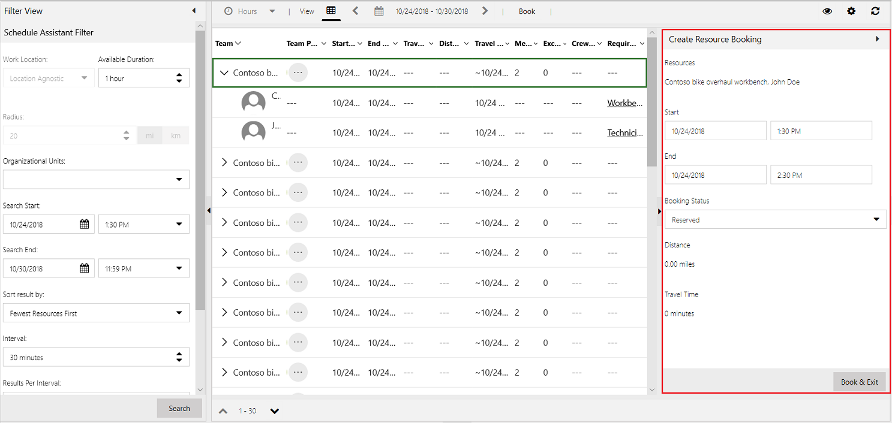
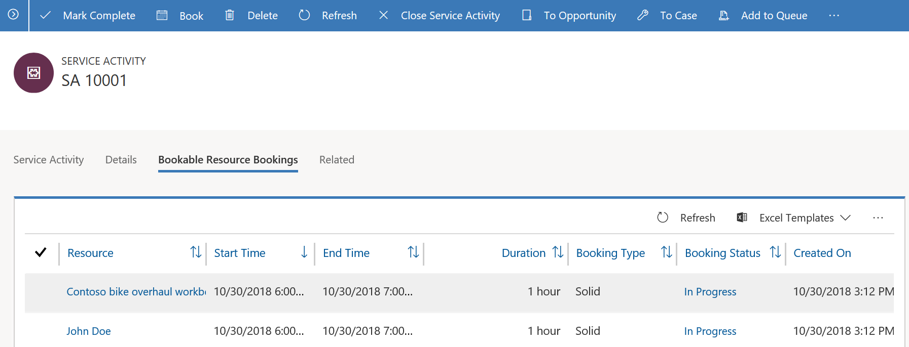

# Schedule a service activity

Use service activity to schedule service appointments by finding the next time resources are available for a service. With the help of service activity, you can coordinate and schedule resources for a service required by your customers.
  
> [!NOTE]
> You can’t create a recurring service activity. Create individual service activities as needed.

## Create a service activity

Make sure that you have the required security role or equivalent permissions. 

[!INCLUDE[proc_more_information](../includes/proc-more-information.md)] [Manage security roles in service scheduling](manage-security-roles.md)

1. In the Customer Service Hub sitemap, go to **Scheduling**.
2. From the list of entity records, select **Scheduling > Service Activity**.
   - The **My Service Activities** view is displayed. You can switch between various system views using the drop-down menu.
   - Select any existing service activity to see additional options in the command bar.

3. On the command bar, select **Service Activity** to create a new service activity.  

4. In the **Service Activity** section:
    - Enter the **Subject** of the service activity.
    - Select the type of service from the **Service** drop-down menu.
    - Select **Customers** to specify the customer who requested the activity.
    - Specify **Location** of the activity.
    - Select **Show Time As** either Requested or Tentative.
    - Provide the **Organizational Business Unit**.

    

5. Select **Save**.

6. In the **Details** section:

     - Provide the **Owner** and **Priority**.
     - Provide **Category** and **Sub-category** for the activity.

7. In the **Bookings** section:

   - View the bookings that you have scheduled in this section.

8. Select **Book** to schedule a service activity in the calendar.

    - The **Schedule Board** is displayed. You can view the list of services and the associated resources.
    - In the **Create Resource Booking** panel, select the service start date and time and end date and time.
    - Select the **Booking Status** from the drop-down menu.
    - Select **Book** to schedule a service activity. Select **Book and Exit** to schedule and exit the tab.

      [!INCLUDE[proc_more_information](../includes/proc-more-information.md)] [Schedule a booking for a service activity](use-schedule-board-configure-service-activity.md#schedule-a-booking-for-a-service-activity)

      

   The bookings that you schedule appear in the **Bookings** tab.

   

   You can select an existing booking and edit, activate, or deactivate it from the **Bookings** tab.

      > [!NOTE]
      > While creating a service activity, manual selection of resources is not supported in the new scheduling experience in the Customer Service Hub.

9. To close or cancel a service activity, select **Close Service Activity** from the command bar.

   Select the status as Closed or Canceled in the **Close Service Activity** dialog box.

10. If the service activity has been completed, select **Mark Complete** from the command bar. 

### See also

[Use the schedule board to configure service activity](use-schedule-board-configure-service-activity.md)

[!INCLUDE[footer-include](../includes/footer-banner.md)]