# Search for knowledge articles in the Customer Service Hub

Knowledge base search in the Customer Service Hub app lets you search for relevant knowledge articles to resolve a case. To search for knowledge articles in a case form, select the **Knowledge Base Search** search box in the **Knowledge Base Search control** of the **Related** section.

The search results are automatically populated based on a field your administrator configured in the **Knowledge Base Search** control properties. Out of the box, for a case this is the title of the case record.

For more information, see [Knowledge Base Search control](#knowledge-base-search-control).

## Knowledge base search control powered by Relevance search 

Knowledge base search in the Customer Service Hub comes with improved search functionality. The knowledge base search is enabled to use Relevance Search in the knowledge base search control area, in addition to the global search area where Relevance Search is already enabled.

[!INCLUDE[proc_more_information](../includes/proc-more-information.md)] [How Relevance Search works](https://docs.microsoft.com/power-platform/admin/configure-relevance-search-organization)

Relevance Search uses Azure search service to index and search records. Relevance Search provides improved search functionality, like better relevance, highlighted search keyword text, and the ability to search within attachments and notes. With Relevance Search, you can also configure searchable fields in the knowledge article entity. 

[!INCLUDE[proc_more_information](../includes/proc-more-information.md)] [Configure searchable fields for Relevance Search](https://docs.microsoft.com/power-platform/admin/configure-relevance-search-organization)

> [!NOTE]
> To enable Relevance Search for the knowledge article entity, see [Enable Relevance Search](https://docs.microsoft.com/power-platform/admin/configure-relevance-search-organization) and [Select entities for Relevance Search](https://docs.microsoft.com/power-platform/admin/configure-relevance-search-organization). 
If Relevance search is not enabled for the entity, standard Full-text search is used. 

For more information, see [Understand knowledge base search mechanisms](knowledge-base-search-methods.md).

### Before you begin using Relevance Search

Relevance Search uses the scoring concepts as defined by Azure search. To be able to search the knowledge base using Relevance Search, certain view columns must be configured in the Quick Find view columns list. If any of these columns are deleted or missing, the search query displays an error.

> [!NOTE]
> An admin can configure the knowledge article quick find view columns list by navigating to **Settings > Customizations > Entities > Knowledge Article > Views > Quick Find View > View Columns**.

The following are required view columns:

- Article Public Number
- Title 
- Created On 
- Keywords
- Knowledge Article Views 
- Language
- Major Version Number 
- Minor Version Number 
- Rating
- Status
- Modified On

## Knowledge Base Search control

Customer Service Hub comes with an enhanced Knowledge Base Search that shows you articles arranged in a single stream. Searching, sorting, and filtering the articles in the search control is faster and more responsive, with improvements to article viewability and usability.

When you select the **Knowledge Base Search** option in the **RELATED** section, the **Knowledge Base Search** control loads, and you can view the following:

  > [!div class=mx-imgBorder]
  > 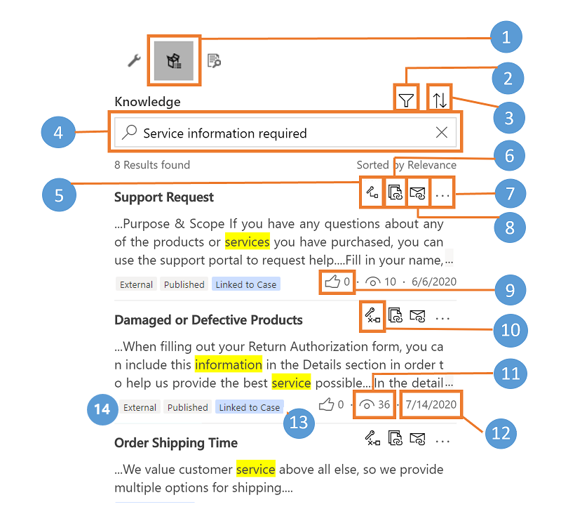

  1. Knowledge Base Search
  2. Open filter pane
  3. Sort search results by
  4. Search knowledge articles
  5. Link this article to the current record (unlink will be displayed when the article is already linked to a record)
  6. Copy
  7. Displays Popout and Email link this article to a record and send via Email 
  8. Link this article to a record and send via Email
  9. Rating
  10. Unlink an article that is currently linked to a case
  11. Number of views the article has received
  12. Confirmation that the record is linked to a case
  13. Article date

In the knowledge base search control, you can do the following:
- Search for knowledge articles
- Filter articles using multiple filter options
- Sort knowledge articles
- Link and unlink a knowledge article to a record
- Email a knowledge article
- View the knowledge article inline in the search control

### Display knowledge article pop outs 

1. In the top right corner, select the ellipsis (...).
2. A pop-out option is displayed.
3. Select **Pop out**.
4. The article opens in an expanded form in a new window.

  > [!div class=mx-imgBorder]
  > 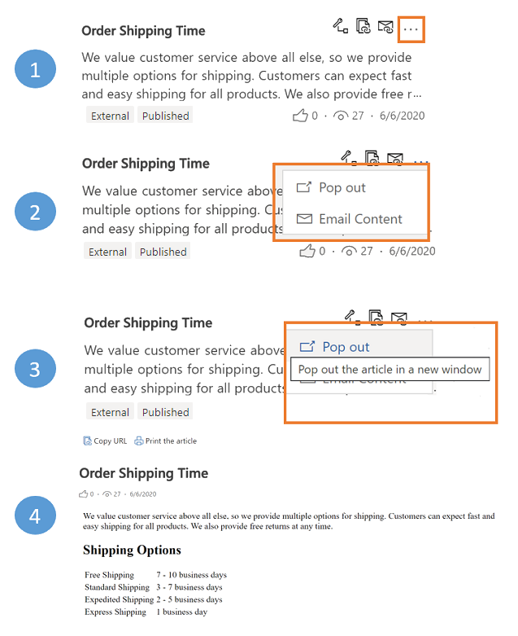

### Search for knowledge articles

Type a keyword in the search box to search for knowledge articles.

  > [!div class=mx-imgBorder]
  > 

- If Relevance Search is not enabled, the keywords that you enter will initiate a search (using the Full-text search mechanism) in the following fields of a knowledge article: **Title**, **Content**, **Keywords**, **Description**, and **Article Public Number**.

- If Relevance Search is enabled, you can configure the fields based that you want to be searched for. [!INCLUDE[proc_more_information](../includes/proc-more-information.md)] [Configure searchable fields for Relevance Search](https://docs.microsoft.com/power-platform/admin/configure-relevance-search-organization) 

[!INCLUDE[proc_more_information](../includes/proc-more-information.md)] [Add the Knowledge Base Search control to Main forms](add-knowledge-base-search-control-forms.md#add-the-knowledge-base-search-control-to-main-forms)

## Linked knowledge articles subgrid

The linked knowledge article subgrid is available for an entity, such as a case or account, only if your system administrator has added the subgrid to the entity form. The knowledge article subgrid displays the knowledge articles that have been linked with the entity. Some of the options available are as follows:

- Add a knowledge article
- Select and edit an article's content
- Sort
- Bulk operations
 
You can also edit a knowledge article by double-clicking it in the linked articles list.

To link the knowledge article to an entity, you need to do the following steps. For the sake of this example, let us consider the entity as Accounts.

1. In the Customer Service Hub site map, go to **Customers** > **Accounts**.

2. Select any active account from the list of accounts.

3. On the **Summary** tab, scroll down to the **Linked Knowledge Articles** subgrid.

  > [!NOTE]
  > The name of the subgrid can vary depending on the customizations your organization has made.

4. Select **More commands** (⁝), and then select **Add Existing Knowledge Article**.

   > [!div class=mx-imgBorder]
   > 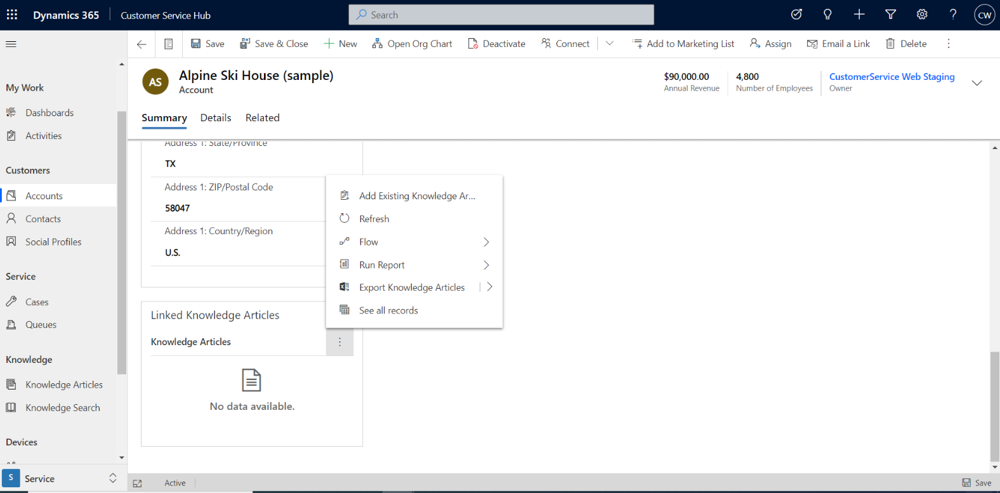

5. Search for the knowledge article that you want to link, and select **Link.**

   > [!div class=mx-imgBorder]
   > 

6. Select **Done**. The article will appear in the **Linked Knowledge Articles** subgrid.

## Independent knowledge base search

Agents can do knowledge base searches outside of cases using the **Knowledge Search** option in the sitemap under **Knowledge**.  This functionality performs like a knowledge search hub. 

Agents can do the following:

- View a article 
- Send an article pop out 
- Copy and send article URLs (when preconfigured)

To configure the ability to copy and send article URLs, see [Configure knowledge base article URLs](#configure-knowledge-base-article-urls).

  > [!div class=mx-imgBorder]
  > 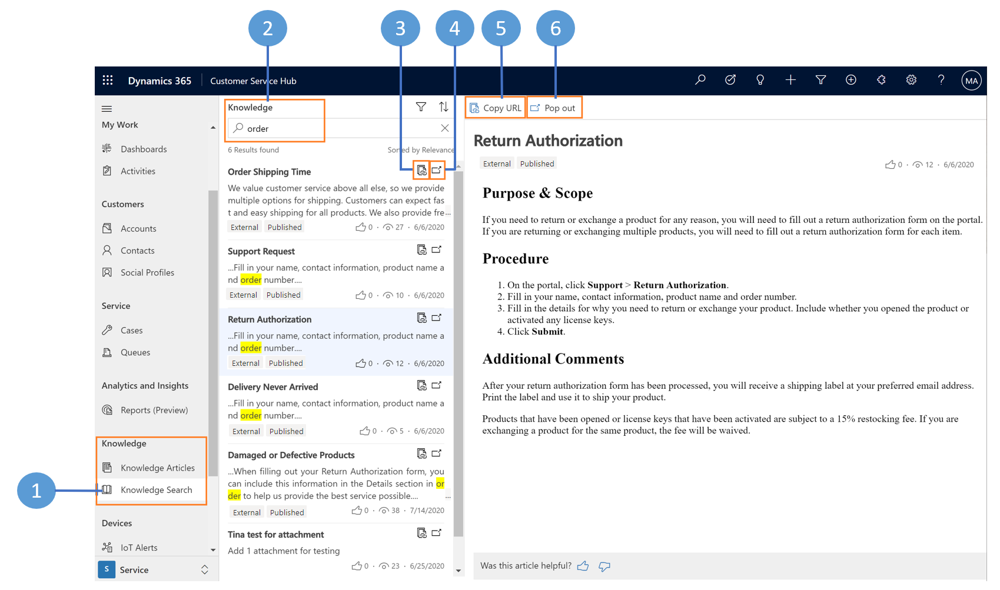

  1. In the sitemap, select **Knowledge Search**.
  2. In search box, type keywords of an article.  
  3. Select copy URL icon to copy the article URL.
  4. To open an article in a new window, select the pop-out icon.
  5. To copy the article URL, select **Copy URL**.
  6. To open the article in a new window, select **Pop out**.  

### Configure knowledge base article URLs

Knowledge articles can be configured with their portal URLs, and then agents can copy and share the URL links. 

> [!NOTE]
> Before you can configure knowledge articles with their own URLs, you must create a portal using your domain name. For information on how create a portal, see [Create a portal in an environment containing customer engagement apps](https://docs.microsoft.com/powerapps/maker/portals/create-dynamics-portal).

To configure a knowledge base article URL, do the following:

1. In the sitemap, under **Knowledge Base Management** select **Settings**.

   > [!div class=mx-imgBorder]
   > 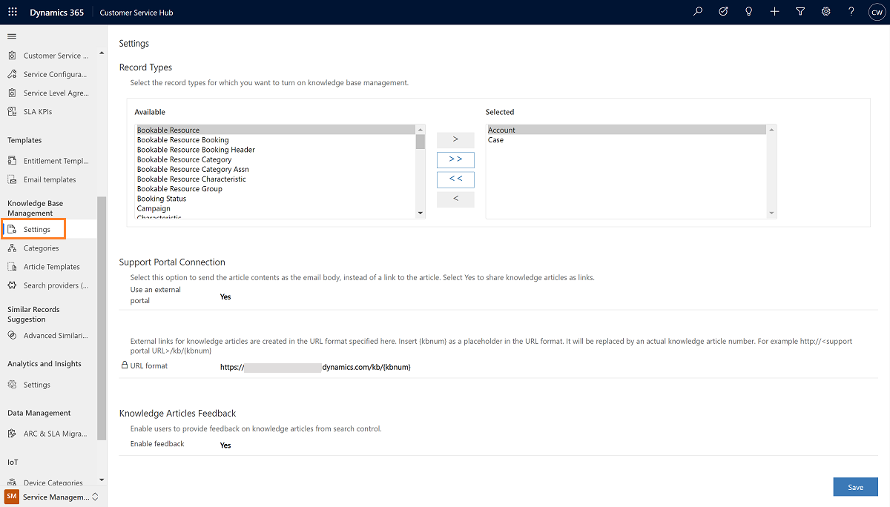

2. Under **Support Portal Connection**, set **Use an external portal** to **Yes**.

3. In the **URL format** field, enter the URL name.

   > [!div class=mx-imgBorder]
   > 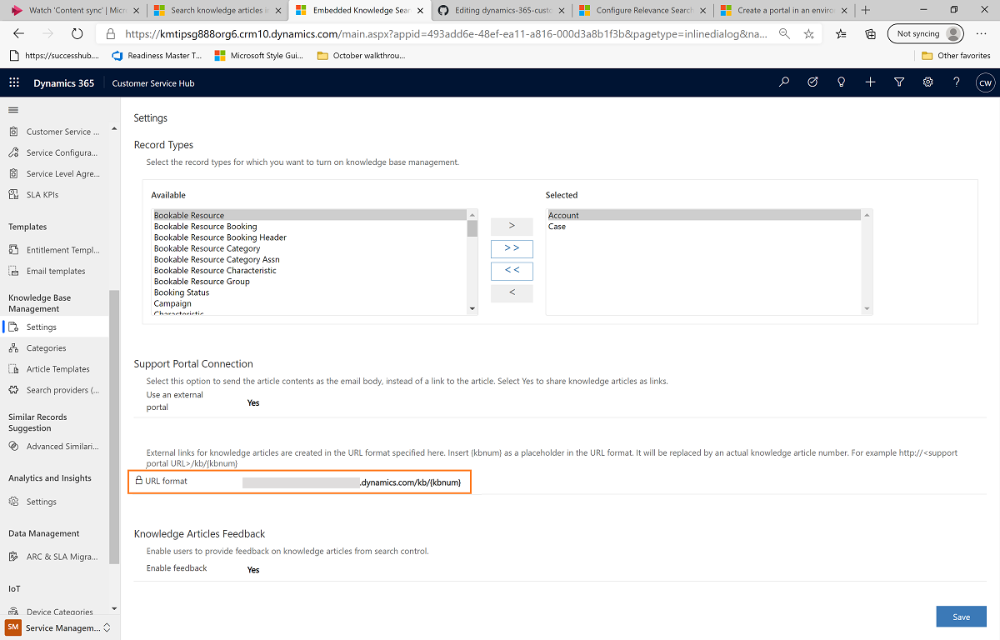

4. Select **Save**.

The knowledge base article link is now active and can be copied and shared.

### Filter knowledge articles

With the help of text and visual filters, you can filter the knowledge articles. To see knowledge articles in specific states, use the **Status** filter. You can filter search results to see all draft, published, or approved articles. See articles that are categorized as internal and external. You can also filter the articles based on date and language.

  > [!div class=mx-imgBorder]
  > 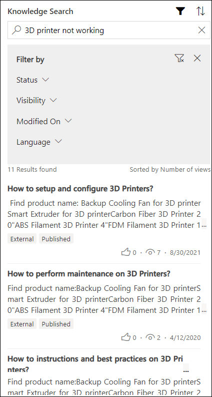  
  
  
When you select the filter icon, you can see the **Filter by** menu where you can filter the items based on the following categories.

  | Category | Sub-category |
  |-----------------------|-----------------------|
  | Status | <ul> <li> Draft </li> <li> Approved </li> <li> Published </li> </ul> |
  | Visibility | <ul> <li> Internal </li> <li> External </li> <li> All </li> </ul> |
  | Date | <ul> <li> Last 7 days </li> <li> Last 30 days </li> <li> Last 6 months </li> <li> Last year </li> <li> All </li> </ul> |
  | Language | <ul> <li> List of languages </li> </ul> **Note:** The language list is based on the articles that are present in the those languages. For example, there are a total of 50 articles in five different languages such as French, English, Japanese, Spanish, and Danish. The language filter will show only these five languages. |

  

### Sort knowledge articles

The knowledge base search control provides sort the knowledge articles interactions. Select the up-arrow icon to view the sorting options and select one of the options from the following: 

- Relevance
- Number of views
- Last modified date (newest first) 
- Last modified date (oldest first)

  > [!div class=mx-imgBorder]
  > 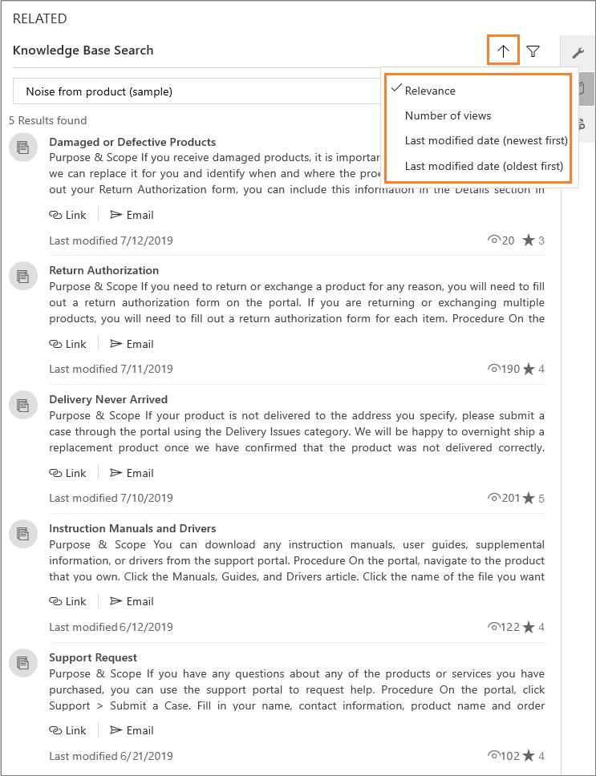
  

### Link and unlink a knowledge article to a record

When configured, you can link an article to a case. You can associate and dissociate the knowledge article with a record.

  > [!div class=mx-imgBorder]
  > 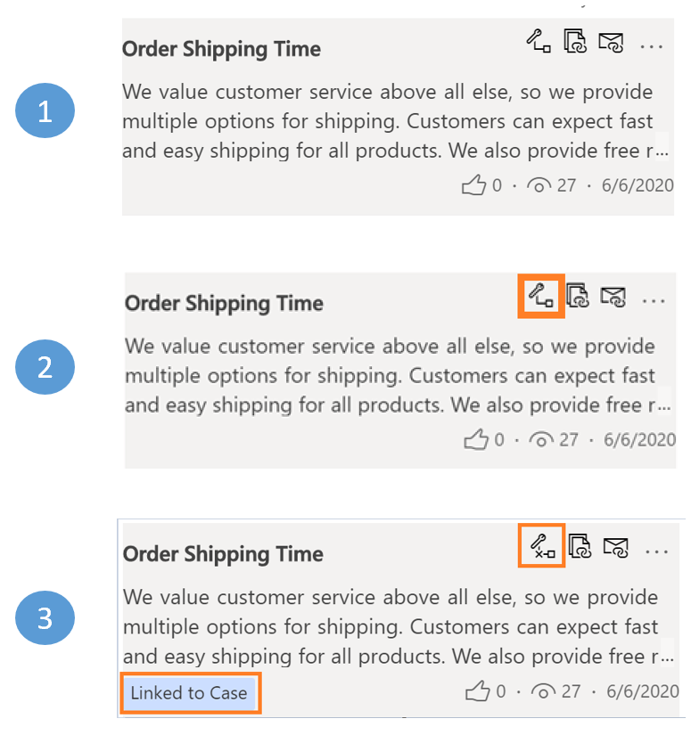

  
1. In the top-right of the article, there's a link icon. 
2. If linking is preconfigured, you can select the link icon and it will link the article to your case.
3. Articles that are linked to a case will display  **Linked to Case** in blue in the bottom left and the link icon will update to show the link.

### Email the knowledge article

Use the **Email** button to send the knowledge article via mail. When you select the **Email** button, first, the knowledge article is linked to the current case record. Simultaneously, an email form opens with the link to the article. The article content is populated in the email body. The fields are automatically populated based on the case and customer details. Add other information as needed, and then on the command bar, select **Send**.

  > [!div class=mx-imgBorder]
  > 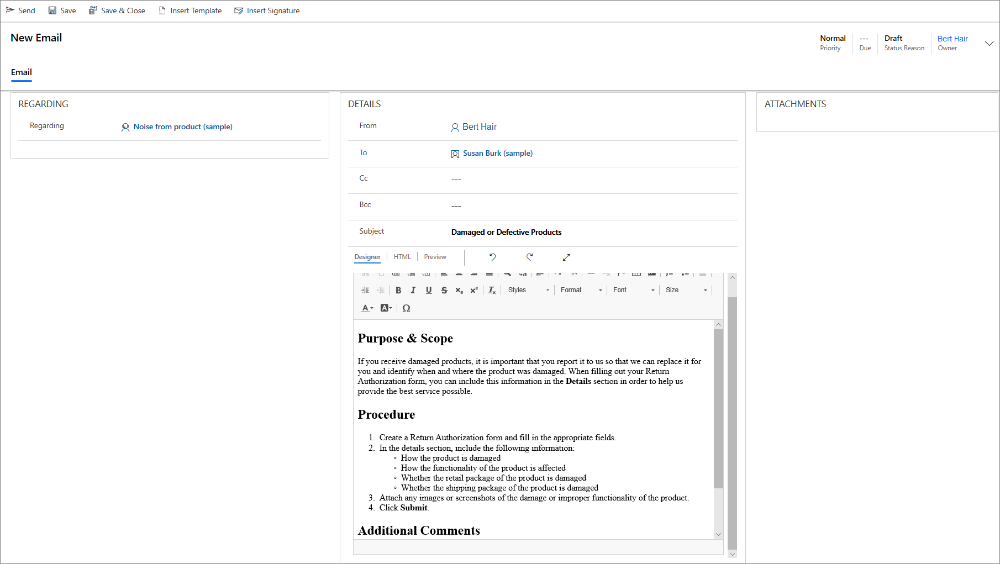

### View the knowledge article inline in the search control

Select a article title to see its full content rendered in the same control. The article opens inline and you can scroll to read the complete article. In this view mode, you can perform the actions such as linking the knowledge article to a record and emailing the knowledge article to a customer. To learn more about send the knowledge articles via email, see [Email the knowledge article](#email-the-knowledge-article).

  > [!div class=mx-imgBorder]
  > 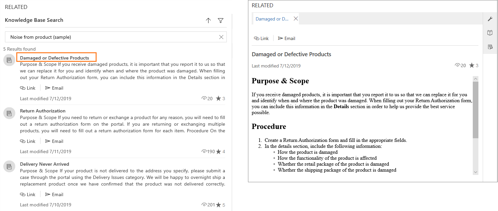

> [!Note]
> - Select the **Copy Link** button  to copy the external URL of the article so you can share it with your customers over channels like chat or email.  If you use a browser other than [!INCLUDE[pn_Internet_Explorer](../includes/pn-internet-explorer.md)], this option isn’t available. 
>
> - Copy Link and Email Link options are available only if your organization is using an external portal to publish the knowledge articles and your administrator has selected the **Use an external portal** check box in the **Embedded Knowledge search** setup.  [!INCLUDE[proc_more_information](../includes/proc-more-information.md)] [Use embedded knowledge search to set up knowledge management](set-up-knowledge-management-embedded-knowledge-search.md).
>
> - Copy Link, Email Link, and Email options can be used only for published and expired articles.

## View auto-filtered results

As a customer service agent, to view the most relevant results, you can have knowledge articles automatically filtered based on the case data. This helps in identifying the most relevant articles so that you can resolve customer queries quickly and accurately. You can further have an option to disable the auto-filter results and search the entire knowledge base.  

Administrator or system customizer must configure this option for you. To learn more, see [Configure automatic filtering](add-knowledge-base-search-control-forms.md#configure-automatic-filtering-for-the-web-client). 

To view the auto filtered results:

1. Search knowledge articles from the case related section. To learn more, see [Search for knowledge articles in the Customer Service Hub](#search-for-knowledge-articles-in-the-customer-service-hub).

2. The articles are automatically filtered and displayed to you based on case data.

3. If you want to disable automatic filtering option and search the entire knowledge base for articles, deselect the **Auto-filter results** option.  

    > [!NOTE]
    > Administrator or system customizer must enable **Users can turn off automatic filtering** option for you to see the **Auto-filter results** option. If the **Users can turn off automatic filtering** option is not enabled, you will always see the auto filtered results. To learn more, see  [Configure automatic filtering](add-knowledge-base-search-control-forms.md#configure-automatic-filtering-for-the-web-client). 

Let’s understand this in detail with the help of an example.

In the below illustration, the case subject is **Xbox**. If automatic filtering is configured on case subject, with the **Auto filter results** check box selected, only those knowledge articles whose subject is **Xbox** are automatically filtered in and displayed. Other articles are automatically filtered out. This is shown in the below image.

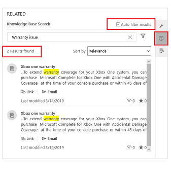   
  
However, if the Auto filter results check box is not selected, you can see more articles that are not related to subject. These are the results from the entire knowledge base.

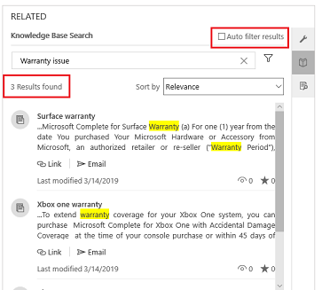

## View search results from external sources

If your administrator has configured the ability for you to search for files, documents, or articles from data sources outside of your current Dynamics 365 organization, you can view those results by selecting the provider from the drop-down list under **Knowledge**.

   > [!div class=mx-imgBorder]
   > 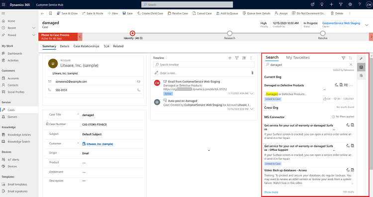

For more information on setting up search providers, see [Set up a search provider in Customer Service Hub](set-up-search-providers.md).
    
## Submit ratings and feedback for knowledge articles

As a customer service agent, you can easily provide feedback on knowledge articles with the help of knowledge article rating in the Customer Service Hub. Knowledge article rating lets you provide feedback on knowledge articles within the context of case resolution. Knowledge managers can capture and review the feedback on the articles to improve and maintain a healthy knowledge base.

When you are working on a case and refer to an article from the **Knowledge Base Search** control, you will be presented with an option to rate whether the article is helpful and provides relevant information to assist customers quickly. If you think it’s not helpful, you can rate the article accordingly and provide comments on how it can be improved

> [!NOTE]
> - Ensure that the knowledge article entity is enabled for feedback. To learn more, see [Enable an entity for feedback/ratings](/dynamics365/customer-engagement/customize/enable-entity-feedback).
> - Customer service agents and customer service managers can create, or view feedbacks based on their role and privileges on feedback entity. Out of the box, customer service agents can create, view, or edit their own feedback only. Customer service managers or knowledge managers can view feedback submitted by all agents.

1. Open an article from search results to read it.

2. You can rate a knowledge article and submit feedback. 

    You can provide your feedback on the article, whether it is helpful or not, by selecting the **Thumbs up** or **Thumbs down** button.    

    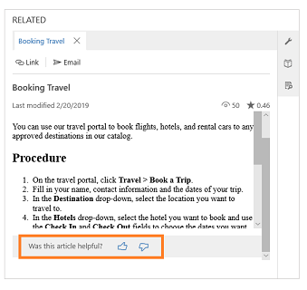

    If the article is not helpful, you can also provide your comments in the comment box on how the article can be improved. The comment box is displayed when you select **Thumbs down**.

    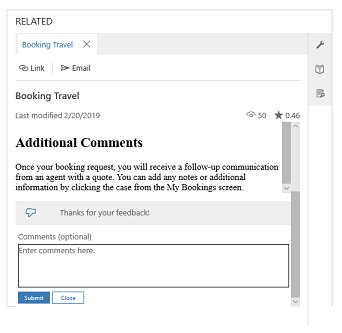

To set up the feedback control, see [Enable feedback control](set-up-knowledge-management-embedded-knowledge-search.md#enable-feedback-control).

### See also

[Add the Knowledge Base Search control to forms](add-knowledge-base-search-control-forms.md)

[Create and manage knowledge articles](customer-service-hub-user-guide-knowledge-article.md)

[Understand knowledge base search mechanisms](knowledge-base-search-methods.md)

[Set up a search provider in Customer Service Hub](set-up-search-providers.md)

[Add a knowledge article subgrid to a form](add-knowledge-base-search-control-forms.md)

[!INCLUDE[footer-include](../includes/footer-banner.md)]
