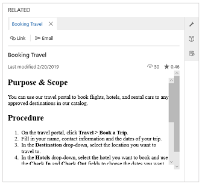

# Search for knowledge articles in the Customer Service Hub
 Knowledge base search in the Customer Service Hub app lets you search for relevant knowledge articles to resolve a case. To search for knowledge articles in a case form, select the **Knowledge Base Search** search box in the **Knowledge Base Search control** of the **Related** section.

The search results are automatically populated based on a field your administrator configured in the **Knowledge Base Search** control properties. Out of the box, for a case this is the title of the case record.  

For more information, see [Knowledge Base Search control](#knowledge-base-search-control).

## Knowledge base search control powered by Relevance search 

Knowledge base search in the Customer Service Hub now comes with an improved search functionality. The knowledge base search is now enabled to use Relevance search mechanism in the knowledge base search control area, in addition to the global search area where the Relevance search mechanism was already enabled.

[!INCLUDE[proc_more_information](../includes/proc-more-information.md)] [How Relevance Search works](../admin/configure-relevance-search-organization.md#how-relevance-search-works)

Relevance search mechanism uses Azure search service to index and search records.  Relevance search provides improved search functionality like better relevance, highlighted search keyword text, and search within attachments and notes. With Relevance search, you can also configure searchable fields in the knowledge article entity. 

[!INCLUDE[proc_more_information](../includes/proc-more-information.md)] [Configure searchable fields for Relevance Search](../admin/configure-relevance-search-organization.md#configure-searchable-fields-for-relevance-search)

> [!NOTE]
> To enable Relevance search for knowledge article entity, see [Enable Relevance Search](../admin/configure-relevance-search-organization.md#enable-relevance-search) and [Select entities for Relevance Search](../admin/configure-relevance-search-organization.md#select-entities-for-relevance-search). 
If Relevance search is not enabled for the entity, standard Full-text search is used. 

For more information, see [Understand knowledge base search mechanisms](knowledge-base-search-methods.md).

### Before you begin using Relevance search

Relevance search uses the scoring concepts as defined by Azure search. To be able to search the knowledge base using Relevance search, certain view columns should be mandatorily configured in the Quick Find view columns list. If any of these columns are deleted or missing, the search query displays an error.

> [!NOTE]
> An admin can configure the knowledge article quick find view columns list by navigating to **Settings > Customizations > Entities > Knowledge Article > Views > Quick Find View > View Columns**.

Here are the required view columns:

- Article Public Number
- Title 
- Created On 
- Keywords
- Knowledge Article Views 
- Language
- Major Version Number 
- Minor Version Number 
- Rating
- Status
- Modified On

## Knowledge Base Search control

   

In the Knowledge Base search box:

- Type a keyword to search for knowledge articles:
   - If Relevance search is not enabled, the keywords that you enter will trigger a search (using Full-text search mechanism) in the following fields of a knowledge article: **Title**, **Content**, **Keywords**, **Description**, and **Article Public Number**.  
   - If Relevance search is enabled, you can configure the fields that you want to be searched upon. [!INCLUDE[proc_more_information](../includes/proc-more-information.md)] [Configure searchable fields for Relevance Search](../admin/configure-relevance-search-organization.md#configure-searchable-fields-for-relevance-search)

- To see knowledge articles in specific states, use the **State** filter. You can filter search results to see all draft, published, or approved articles.  You can also filter the articles based on language.
  
  [!INCLUDE[proc_more_information](../includes/proc-more-information.md)] [Add the Knowledge Base Search control to Main forms](add-knowledge-base-search-control-forms.md#add-the-knowledge-base-search-control-to-main-forms)

- To choose how you want to sort your search results, select **Sort by**. You can sort the knowledge articles on relevance, number of views, newest first, or oldest first.  

- Select the article title to see its full content. The article opens inline and you can scroll to read the complete article. You can perform various quick actions either in full view mode or in list view mode.

   - To associate the knowledge article with the current case, select the  **Link the KB Article** button .  You can also dissociate the article from the case by choosing the **Unlink the knowledge article from the current record** button .  

   - To email the article directly, select the **Email** button. To send an external link of the knowledge article in an email, select **Email Link**. 

      An email form opens with the link to the article. The article content is populated in the email body. The fields are automatically populated based on the case and customer details. Add other information as needed, and then on the command bar, select **Send**.

   - To copy the external URL of the article so you can share it with your customers over channels like chat or email, select the **Copy Link** button .  If you use a browser other than [!INCLUDE[pn_Internet_Explorer](../includes/pn-internet-explorer.md)], this option isn’t available. 

      > [!NOTE]
      > Copy Link and Email Link options are available only if your organization is using an external portal to publish the knowledge articles and your administrator has selected the **Use an external portal** check box in the **Embedded Knowledge search** setup.  [!INCLUDE[proc_more_information](../includes/proc-more-information.md)] [Use embedded knowledge search to set up knowledge management](set-up-knowledge-management-embedded-knowledge-search.md).

  > [!IMPORTANT]
  > Copy Link, Email Link, and Email options can be used only for published and expired articles. 

> [!IMPORTANT]
>  Knowledge base search in the Customer Service Hub shows relevant knowledge articles only when your organization is set up to use the native [!INCLUDE[pn_crm_shortest](../includes/pn-crm-shortest.md)] knowledge management capability. For more information, talk to your administrator. 

## View filtered articles in the Related section

Improve knowledge article suggestions and search results by enabling automatic filtering. Automatic filtering ensures your customer service agents receive only the most relevant knowledge articles. As an administrator, you can configure Knowledge Base Search control to automatically filter knowledge articles based on case data without any manual input from the agents.

For example, if you set up automatic filtering of knowledge articles on the subject of the case, the knowledge articles that have the same subject as the case will be filtered in and will be shown to the agents. Other articles will be filtered out automatically. 

As a customer service agent, you can view automatically filtered knowledge articles in the Related section of a case. With the help of filtered knowledge articles, you can resolve customer queries quickly and accurately. You also have an option to switch between auto-filtered search results or results from the entire knowledge base.

> [!NOTE]
> Administrators can configure this option in the Knowledge Base Search control. To learn more, see [Configure automatic filtering](add-knowledge-base-search-control-forms.md#configure-automatic-filtering)

Follow these steps to view filtered knowledge articles.

1. In the **Customer Service Hub** sitemap, go to **Service** > **Cases**.
2. Select a case from the **Active Cases** view. Navigate to the **Related** section and select **Knowledge Base Search** to search the knowledge articles. To learn more, see [Related section in Customer Service Hub](customer-service-hub-user-guide-basics.md#related-section)

    With the **Auto filter results** check box selected, the results are displayed in the **Knowledge Base Search** control as per configured automatic filtering. So, if automatic filtering is configured on case subject, the results display only those knowledge articles which have the same subject as case. 

    Let’s understand this in detail with the help of an example.

    In the below illustration, the case subject is **Xbox**. If automatic filtering is configured on case subject, with the **Auto filter results** check box selected, only those knowledge articles whose subject is **Xbox** are automatically filtered in and displayed. Other articles are automatically filtered out. This is shown in the below image.

       
  
    However, if the Auto filter results check box is not selected, you can see more articles that are not related to subject. These are the results from the entire knowledge base.

    
    
## Submit ratings and feedback for knowledge articles

As a customer service agent, you can easily provide feedback on knowledge articles with the help of knowledge article rating in the Customer Service Hub. Knowledge article rating lets you provide feedback on knowledge articles within the context of case resolution. Knowledge managers can capture and review the feedback on the articles to improve and maintain a healthy knowledge base.

So, when you are working on a case and refer to an article from the Knowledge Base Search control, you will be presented with an option to rate whether the article is helpful and provides relevant information to assist customers quickly. If you think it’s not helpful, you can rate the article accordingly and provide comments on how it can be improved

> [!IMPORTANT]
>  Ensure that the knowledge article entity is enabled for feedback. To learn more, see [Enable an entity for feedback/ratings](/dynamics365/customer-engagement/customize/enable-entity-feedback)

Customer service agents and customer service managers can create, or view feedbacks based on their role and privileges on feedback entity. Out of the box, customer service agents can create, view, or edit their own feedback only. Customer service managers or knowledge managers can view feedback submitted by all agents.

### Rate the articles and submit feedback

You can rate a knowledge article and submit feedback when you open the article in full view in the Knowledge Base Search control of the Related section. To learn more, see [Related section in Customer Service Hub](customer-service-hub-user-guide-basics.md#related-section).

1. In the **Customer Service Hub** sitemap, go to **Cases** > **My Active Cases**.
2. Select a case and navigate to the **Related** section.
3. Select **Knowledge Base Search** and select the article title to read it in full view.

    

    You can provide your feedback on the article, whether it is helpful or not, by selecting the **Thumbs up** or **Thumbs down** button.    

    

    If the article is not helpful, you can also provide your comments in the comment box on how the article can be improved. The comment box is displayed when you select **Thumbs down** button.

    

### See also

[Add the Knowledge Base Search control to forms](add-knowledge-base-search-control-forms.md)

[Create and manage knowledge articles](customer-service-hub-user-guide-knowledge-article.md)

[Understand knowledge base search mechanisms](knowledge-base-search-methods.md)