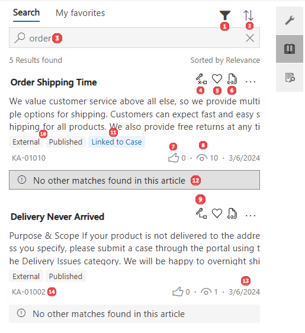

# Search knowledge articles

You can search knowledge articles through Customer Service workspace or Customer Service Hub.

## Prerequisites

### Customer Service workspace

- The productivity pane and knowledge search must be enabled in the app profile manager.
- Dataverse search must be enabled. If dataverse search isn't enabled, then the full-text search mechanism works.

### Customer Service Hub

Dataverse search must be enabled. The knowledge base search uses the Dataverse search mechanism in the knowledge base search control area. More information: [Knowledge base search control powered by Dataverse search](search-knowledge-articles-csh.md#knowledge-base-search-control-powered-by-dataverse-search). Before you begin using Dataverse search, your administrator must configure certain view columns in the Quick Find view columns list. More information: [Before you begin using Dataverse Search](search-knowledge-articles-csh.md#before-you-begin-using-dataverse-search).

## Use the independent knowledge base search

In the Customer Service Hub site map, you can perform independent knowledge base searches outside of cases using the **Knowledge Search** option in the **Knowledge** area. This functionality performs like a knowledge search hub, where you can do the following:

- View an article 
- Send an article pop out 
- Copy and send article URLs (when preconfigured). To configure the ability to copy and send article URLs, see [Configure knowledge base article URLs](#configure-knowledge-base-article-urls).

Type a keyword in the search field to search for knowledge articles.

 :::image type="content" source="media/search-kb-article.png" alt-text="Search for knowledge article":::

  |Label|Description|
  |-----|-----------|
  |1.| The Knowledge search field.|
  |2.| Status and visibility tags for the article.|
  |3.| The number of times the article has been viewed. |
  |4.| Article number.|
  |5.| Info card that displays search term matches from keywords, description, attachments, and any other custom fields.|
  |6.| Search results across attachments. The attachment title is displayed only when the search term matches the content in the attachment.|

- If Dataverse search is not enabled, the keywords that you enter will initiate a search (using the Full-text search mechanism) in the following fields of a knowledge article: **Title**, **Content**, **Keywords**, **Description**, and **Article Public Number**.

  > [!NOTE]
  > If there's a style tag with CSS styles at the top of the article, the summary of the content in the knowledge search results list will contain style tags. Use inline CSS styling instead of putting styles in style tags.

- If Dataverse search is enabled, you can configure the fields  that you want to be searched for. [!INCLUDE[proc_more_information](../includes/proc-more-information.md)] [Configure searchable fields for Dataverse Search](/power-platform/admin/configure-relevance-search-organization) 

[!INCLUDE[proc_more_information](../includes/proc-more-information.md)] [Add the Knowledge Base Search control to Main forms](add-knowledge-base-search-control-forms.md#add-the-knowledge-base-search-control-to-main-forms) 

## Use the productivity pane to search knowledge articles

### How to search in Customer Service workspace

In Customer Service workspace, for example for a case, when you select the **Knowledge search** tab in the productivity pane, knowledge articles that match the case title are displayed on the **Knowledge search** pane. These articles are displayed based on dataverse and full-text search mechanisms.

The knowledge articles are applicable for all the knowledge-enabled entities. By default, the full-text search and Dataverse search display 10 results. You can also use the search box to enter keywords and search for articles if those displayed by default aren't relevant.

:::image type="content" source="media/csw-knowledge-tab.png" alt-text="View features in knowledge base search":::

  |Label|Description|
  |-----|-----------|
  |1.| The Knowledge tab.|
  |2.| Tag when the article is linked to the entity.|
  |3.| Article number.|
  |4.| The number of times the article has been viewed. |
  |5.| Info card that displays search term matches from keywords, description, attachments, and any other custom fields.|
  |6.| Lets you link or unlink the article to the entity, such as the case.|
  |7.| Status and visibility tags for the article.|
  |8.| Search results across attachments. The attachment title is displayed only when the search term matches the content in the attachment.|

### How to search in Customer Service Hub

In Customer Service Hub, for example for a case, when you select the **Knowledge** option in the productivity pane, the **Knowledge** tab shows you articles arranged in a single stream. Searching, sorting, and filtering articles in the search control is faster and more responsive, with improvements to article viewability and usability. The Knowledge Base Search capability is also available in Dynamics 365 Customer Engagement (on-premises) 9.1. More information: [New features in Dynamics 365 Customer Engagement (on-premises)](../customerengagement/on-premises/whats-new.md#agent-productivity-enhancements-to-knowledge-capabilities)

On the **Knowledge** tab, you can view the following:

  > [!div class=mx-imgBorder]
  > 

  1. Open filter pane
  2. Sort search results by
  3. Search box
  4. Link this article to the current record (unlink will be displayed when the article is already linked to a record)
  5. Copy
  6. Link this article to a record and send via email
  7. Displays Pop out and Email Content
  8. Rating
  9. Number of views the article has received
  10. Unlink an article that is currently linked to a case
  11. Article date
  12. Status and visibility tags for the article
  13. Confirmation that the record is linked to a case
  14. Info card that displays search term matches from keywords, description, attachments, and any other custom fields.

> [!NOTE]
> If the keyword you used matches, the matches are highlighted in yellow, but won't necessarily show up in the first three lines, so you might not see the highlighted text in search results.

In the knowledge base search control, you can do the following:
- Search for knowledge articles
- Filter articles using multiple filter options
- Sort knowledge articles
- Link and unlink a knowledge article to a record
- Email a knowledge article
- View the knowledge article inline in the search control

## Use smart assist to search for knowledge articles
Smart assist provides real-time knowledge article suggestions depending on the ongoing conversations with your customer. The smart assist option appears on the productivity pane.

In Customer Service workspace, select the **Smart assist** option on the productivity pane to see knowledge article suggestions related to your case.

## View knowledge articles

### View the knowledge article on the application tab

In Customer Service workspace, select an article title to view the complete article on an application tab. You can view up to 10 articles on the application tab. 

:::image type="content" source="media/csw-article-app-tab.png" alt-text="Knowledge article search pane":::

You can perform the following actions for the knowledge article:

- Copy URL to copy the external URL of the article so you can share it with your customers over channels like chat or email.
- Provide feedback by selecting the thumbs up or thumbs down icon.
  - Make sure that the knowledge article entity is enabled for feedback. To learn more, see [Enable an entity for feedback/ratings](/dynamics365/customer-engagement/customize/enable-entity-feedback).
  - Customer service agents (you) and customer service managers can create or view feedback based on your role and privileges on feedback entity. Out of the box, you can create, view, or edit your own feedback only. Customer service managers or knowledge managers can view feedback submitted by you.
- When you select thumbs down, the **Comments** box to provide feedback appears. Optionally, provide additional information and reasons for the feedback.

### View the knowledge article inline in the search control

In Customer Service Hub, select an article title to see its full content rendered in the same control. The article opens inline, and you can scroll to read the complete article.

However, if you see an error while trying to open an article, it might be because the link types used in the article aren't a part of the origins allow list. The error message "Update your origins allow list if any iframe in the article doesn't work or displays error" will also appear. You must contact your administrator to update your origins allow list. More information: [Configure the origins allow list for knowledge articles](configure-knowledge-article-origin-allow-list.md)

In this view mode, you can perform actions such as linking the knowledge article to a record or emailing the knowledge article to a customer. To learn more about sending the knowledge articles via email, go to [Email a knowledge article](email-articles.md#email-a-knowledge-article).

  > [!div class=mx-imgBorder]
  > 

> [!NOTE]
> - Select the **Copy Link** button  to copy the external URL of the article so you can share it with your customers over channels like chat or email. If you use a browser other than [!INCLUDE[pn_Internet_Explorer](../includes/pn-internet-explorer.md)], this option isn't available. 
>
> - The **Copy Link** and **Email Link** options are available only if your organization is using an external portal to publish the knowledge articles and your administrator selected the **Use an external portal** checkbox during embedded knowledge search setup. [!INCLUDE[proc_more_information](../includes/proc-more-information.md)] [Use embedded knowledge search to set up knowledge management](set-up-knowledge-management-embedded-knowledge-search.md)
>
> - The **Copy Link**, **Email Link**, and **Email** options can be used only for published or expired articles.

### View search results from external sources

In Customer Service Hub, if your administrator has configured the ability for you to search for files, documents, or articles from data sources outside of your current Dynamics 365 organization, you can view those results by selecting the provider from the drop-down list under **Knowledge**.

   > [!div class=mx-imgBorder]
   > 

For more information on setting up search providers, see [Set up a search provider in Customer Service Hub](set-up-search-providers.md).

### Configure knowledge base article URLs

Knowledge articles can be configured with their portal URLs, and then agents can copy and share the URL links.

> [!NOTE]
> Before you can configure knowledge articles with their own URLs, you must create a portal using your domain name. For information on how to create a portal, see [Create a portal in an environment containing customer engagement apps](/powerapps/maker/portals/create-dynamics-portal).

You can configure a knowledge base article URL in the Customer Service admin center or Customer Service Hub app by performing the following steps:

1. Go to the **Support portal connection** section.

### [Customer Service admin center](#tab/customerserviceadmincenter)

  1. In the site map, select **Knowledge** in **Agent experience**. The **Knowledge** page appears.
  1. On the **Knowledge** page, go to the **Portal** section and select **Manage**. The **Portal** page appears.
  1. On the **Portal** page, go to the **Support portal connection** section.

### [Customer Service Hub](#tab/customerservicehub)

  1. In the site map, go to **Service Management** and select **Settings** in **Knowledge Base Management**.
  1. On the **Settings** page, go to the **Support portal connection** section.

---

2. Set the **Use an external portal** toggle to **Yes**.

3. In the **URL format** field, enter the URL name.

 4. Select **Save**.

The knowledge base article link is now active and can be copied and shared.

### See also

[Create and manage knowledge articles](customer-service-hub-user-guide-knowledge-article.md)  
[Understand knowledge base search mechanisms](knowledge-base-search-methods.md)  

[!INCLUDE[footer-include](../includes/footer-banner.md)]
