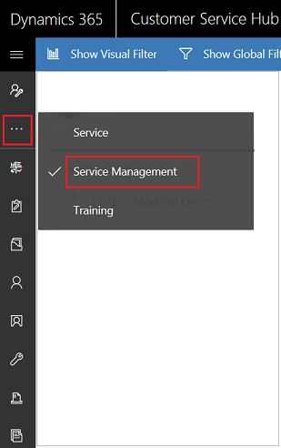
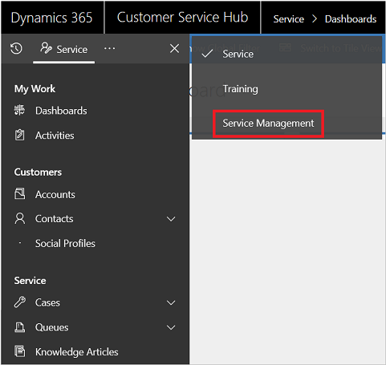

# Service Manager Guide (Customer Service and Customer Service Hub)

[!INCLUDE[cc-applies-to-update-9-0-0](../includes/cc_applies_to_update_9_0_0.md)]

Easily set up and manage your customer service tasks from one place by using Service Management. Set up everything related to customer service, like defining parent-child case hierarchy, creating queues, routing rule sets, rules for automatic case creation, service level agreements (SLAs), entitlements, and customer service schedule. 
  
> [!NOTE]
> If you have previously installed any portal solution, to create a case in the Customer Service Hub or to use the Merge cases command, you must turn off the **Read-only in mobile** option for the Case entity. More information: [Turn off Read-only in mobile option](../customize/edit-entities.md#enable-or-disable-entity-options).

## Access Service Management

Use the Service manager to set up various service management tasks for customer service. You can access service management using either of the following ways:

- In the Customer Service Hub sitemap, select **...** to go to Service Management. To know more about the Customer Service Hub sitemap, see [Understand the sitemap navigation](customer-service-hub-user-guide-basics.md#understand-the-sitemap-navigation).

  

- You can also select **...** from the service sitemap to access Service Management.  

  
 

Use the following links to learn about Service Management tasks:  
  
## Case Settings  

[Create and manage queues](create-manage-queues.md)

[Parent and child case settings](define-settings-parent-child-cases.md)

[Routing Rule Sets](create-rules-automatically-route-cases.md)

[Automatic Record Creation](set-up-rules-to-automatically-create-or-update-records.md)

[Subjects](create-manage-subject-tree.md)
  
## Service terms  

[Service Level Agreements](define-service-level-agreements.md)

[Entitlements](create-entitlement-define-support-terms-customer.md)

[Holiday Schedule](set-up-holiday-schedule.md)

[Customer Service Schedule](create-customer-service-schedule-define-work-hours.md)

[Service Configuration Settings](../admin/system-settings-dialog-box-service-tab.md)

## Knowledge Base Management 

[Set up knowledge management using embedded knowledge search](set-up-knowledge-management-embedded-knowledge-search.md)

[Categories](create-manage-categories.md)

## Templates

[Entitlement Templates](set-up-entitlements-templates.md)

 

> [!NOTE]
> Service Scheduling settings on the **Service Management** and **Business Management** pages have been deprecated. For more information, see [Important changes coming](https://docs.microsoft.com/dynamics365/get-started/whats-new/customer-engagement/important-changes-coming).

### See also

[User Guide (Customer Service Hub)](user-guide-customer-service-hub.md)