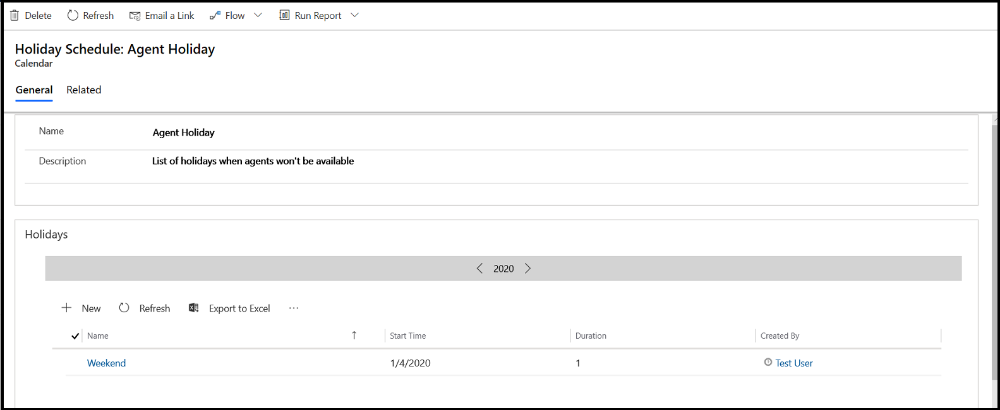

# Create and manage holiday schedules

Avoid having your service level agreements (SLAs) affected when your service organization is closed by creating a holiday schedule and adding it to your service calendar.  
  
For example, if your service organization has an SLA to reply to email cases within two business days, you can create a holiday schedule and add it to your service calendar. Then, if a customer submits an email case on that holiday, your SLA is clear and is not affected by the holiday closure.  

> [!NOTE]
> With the latest release of Dynamics 365 Customer Service app, holiday schedule in service management is available in the Customer Service Hub. We recommend that you create and manage holiday schedules using the new experience.
 
## Create a holiday schedule  (Customer Service Hub)
Follow these steps to create a holiday schedule:
  
1. [!INCLUDE[proc_permissions_custsvcmgr_sysadmin_and_customizer](../includes/proc-permissions-custsvcmgr-sysadmin-and-customizer.md)]  
  
   - [!INCLUDE[proc_follow_steps_in_link](../includes/proc-follow-steps-in-link.md)] [!INCLUDE[proc_dont_have_correct_permissions](../includes/proc-dont-have-correct-permissions.md)]  
  
2. In the Customer Service Hub sitemap, go to **Service Management** and select **Service Terms** > **Holiday Schedule**.
  
4. Select **New** and in the **Create Holiday Schedule** dialog box, enter a name and description for the holiday, and then select **Create**.  
  
6. When the holiday opens, select **New** in the **Holidays** grid to add the holiday to your customer service calendar.  
  
7. In the **Add a Holiday** dialog box, specify the **Name**, **Start Date**, **End Date**, and **Duration** of the holiday, and then select **OK**.  
  
   The holiday is created and associated with your customer service calendar. After the customer service schedule is associated with an SLA, then your SLA during business hours is not affected. [!INCLUDE[proc_more_information](../includes/proc-more-information.md)] [Define service level agreements](../customer-service/define-service-level-agreements.md)  

   
 
To resolve any issues with the SLA during holidays, see [SLA timer does not pause when its state is changed from InProgress to OnHold on a holiday](troubleshoot-sla-issues.md).

## Create a holiday schedule  (Customer Service app)

1. [!INCLUDE[proc_permissions_custsvcmgr_sysadmin_and_customizer](../includes/proc-permissions-custsvcmgr-sysadmin-and-customizer.md)]  
  
   - [!INCLUDE[proc_follow_steps_in_link](../includes/proc-follow-steps-in-link.md)] [!INCLUDE[proc_dont_have_correct_permissions](../includes/proc-dont-have-correct-permissions.md)]  
  
2. [!INCLUDE[proc_settings_service_management](../includes/proc-settings-service-management.md)]  
  
3. Select **Holiday Schedule**.  
  
4. Select **New** and in the **Create Holiday Schedule** dialog box, enter a name and description for the holiday, and then select **Create**.  
  
5. In the list of holidays, select the holiday you created.  
  
6. When the holiday is open, select **New** to add the holiday to your customer service calendar.  
  
7. In the **Add a Holiday** dialog box, specify the name and select the time of the holiday, and then select **OK**.  
  
   The holiday is created and associated with your customer service calendar. After the customer service schedule is associated to an SLA,  then your SLA during business hours is not affected. [!INCLUDE[proc_more_information](../includes/proc-more-information.md)] [Define service level agreements](../customer-service/define-service-level-agreements.md)  

## Additional actions

- To edit an existing holiday schedule, go to **Service Management** > **Holiday Schedule**. The **All Holiday Schedules** view is displayed. Select the holiday schedule you want to edit from the list of holiday schedules and select **Edit** in the command bar.
    - You can edit the **Name** or **Description**, or add new holidays for the holiday schedule. 
    - By default, all the holidays of the current year are displayed. To switch to a different year, select and type the year in the **Holidays** grid:
    
- To print a holiday schedule, select **Print Preview** in the **Holidays** section of the holiday schedule.

### See also

 [Create a customer service schedule and define the work hours](../customer-service/create-customer-service-schedule-define-work-hours.md)  

[!INCLUDE[footer-include](../includes/footer-banner.md)]