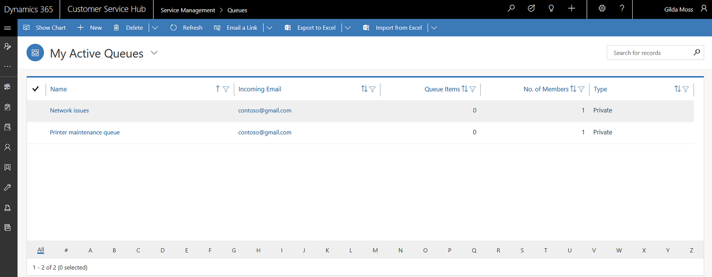

# Create and manage queues

Queues help you to organize, prioritize, and monitor the progress of your work. In Dynamics 365 Customer Service, queues are containers used to store anything that needs to be completed or requires an action, for example completing a task or closing a case. 

 Queues can be useful in:  
  
-   Having a centralized list of pending work that needs attention  
  
-   Sorting tasks by type or by the people assigned to complete them  
  
Use queues to categorize and prioritize your activities and cases. You can categorize based on:  
  
-   Different products or services  
  
-   Different subscription levels (regular, premium customers)  
  
-   Various activity categories  
  
-   Different geography  

 By default, a queue is created for each user and team in Dynamics 365 Customer Service. You can use this default queue to track all your work items, or you can set up queues to reflect your organization's structure, business processes, or both. How you set up queues depends on how your business works. 

For example, you could create separate queues for first tier and second tier product support teams that reflect their differing levels of expertise, or Gold and Silver queues to reflect differing priorities based on service contracts that customers have with your organization.  
  
 Dynamics 365 Customer Service lets you create two types of queues:

- **Private queues:** Create private queues with limited set of members to help those members easily view the queue items in that queue. Private queues streamline queue items for the members of that queue only and help to remove clutter from other user’s views.
- **Public queues:** Create public queues to let everyone in the organization view the queue and all the items it contains.

> [!IMPORTANT]
> Private queues are a great way to organize cases, but do not restrict access to the records they contain. If your organization handles sensitive data and needs to restrict access to queue items or fields, explore the different options given in [Dynamics 365 security model](../developer/security-dev/security-model.md).

> [!NOTE]
> With the latest release of Dynamics 365 Customer Service app, queues in service management are available in the Customer Service Hub. We recommend that you create and manage queues using the new experience.
  
## Create a queue (Customer Service Hub) 
  
Follow the steps given below to create or edit a queue: 
  
1. Make sure that you have the Sales or Marketing Manager, Customer Service Manager, System Administrator, or System Customizer security role or equivalent permissions.  
  
   #### Check your security role  
  
   - [!INCLUDE[proc_follow_steps_in_link](../includes/proc-follow-steps-in-link.md)]  
  
   - [!INCLUDE[proc_dont_have_correct_permissions](../includes/proc-dont-have-correct-permissions.md)]  
  
2. In the Customer Service Hub sitemap, go to **Service Management** and select **Case Settings** > **Queues**.
  
3. To create a new queue, select **New**.  
  
    -OR-  
  
    To edit a queue, select the queue in the list of queues, and then on the command bar, select **Edit**.  
  
5. Type or change information in the text boxes.  
  
    Hovertips provide hints about what to enter.  
  
   - In the **Summary** section, complete the required fields.  
  
      - In the **Name** field, type the name of the queue.  
  
      - In the **Type** field, choose if the queue is a private or public queue. You can use a private queue to allow only a specific set of people to work on activities in this queue.  
  
        If you’re creating a private queue, you’ll need to add members to this queue manually. In the **Members** section, select the **Add** button **+** to add members to the queue. Only these members will be able to work on the items in this queue.  
  
        > [!NOTE]
        >  The email address that you enter in the **Incoming Email** field receives all messages sent to the queue.  
      - Write a description in the **Description** field.
  
   - In the **Email Settings** section, in the **Convert to email activities** drop-down list, choose which messages to track as activities.  
  
      - In the **Mailbox** field, a mailbox record for the queue is automatically created and selected as soon as you save the queue record. [!INCLUDE[proc_more_information](../includes/proc-more-information.md)] [Create forward mailboxes or edit mailboxes](../admin/create-forward-mailboxes-edit-mailboxes.md)  

6. Select **Save**.

   

## Create a queue (Customer Service app) 

Follow the steps given below to create or edit a queue: 
  
1. Make sure that you have the Sales or Marketing Manager, Customer Service Manager, System Administrator, or System Customizer security role or equivalent permissions.  
  
   #### Check your security role  
  
   - [!INCLUDE[proc_follow_steps_in_link](../includes/proc-follow-steps-in-link.md)]  
  
   - [!INCLUDE[proc_dont_have_correct_permissions](../includes/proc-dont-have-correct-permissions.md)]  
  
2. Go to **Settings** > **Service Management**.  
  
3. [!INCLUDE[proc_click_or_tap_queues](../includes/proc-click-or-tap-queues.md)]  
  
4. To create a new queue, select **New**.  
  
    -OR-  
  
    To edit a queue, in the list of queues, select the queue, and then on the command bar, select **Edit**.  
  
5. Type or change information in the text boxes.  
  
    Hovertips provide hints about what to enter.  
  
   - In the **Summary** section, complete the required fields.  
  
   - In the **Name** field, type the name of the queue.  
  
   - In the **Type** field, choose if the queue is a private or public queue. You can use a private queue to allow only a specific set of people to work on activities in this queue.  
  
      If you’re creating a private queue, you’ll need to add members to this queue manually. In the **Members** section, select the **Add** button **+** to add members to the queue. Only these members will be able to work on the items in this queue.  
  
     > [!NOTE]
     >  The email address you enter in the **Incoming Email** field receives all messages sent to the queue.  
  
   - In the **Email Settings** section, in the **Convert to email activities** drop-down list, choose which messages to track as activities.  
  
   - In the **Mailbox** field, a mailbox record for the queue is automatically created and selected as soon as you save the queue record. To update the mailbox details, select the mailbox name. [!INCLUDE[proc_more_information](../includes/proc-more-information.md)] [Create forward mailboxes or edit mailboxes](../admin/create-forward-mailboxes-edit-mailboxes.md)  
  
   - In the **Record creation and update rules** section, add a **Record Creation and Update Rule** record. By using these rules, you can automatically create or update system or custom records from incoming activities, such as emails, social activities, or custom activities. [!INCLUDE[proc_more_information](../includes/proc-more-information.md)] [Set up rules to automatically create or update records](../customer-service/set-up-rules-to-automatically-create-or-update-records.md)  
  
   > [!IMPORTANT]
   >  This is a central place to manage rules across all supported activities including out-of-the-box and custom activities associated with the queue.  
   >  The **Record creation and update rules** section displays rules using the **Email Activity Conversation Setting**  or **Social Activity Conversation Setting** and that have the same queue ID as the queue.   
   >  Multiple rules with the same source type and same queue can exist. Therefore, when you select **Email Activity Conversion Settings** or **Social Activity Conversion Settings**, the rule with the latest **Last Modified On** date is applied.  
  
6. [!INCLUDE[proc_click_or_tap_save](../includes/proc-click-or-tap-save.md)]  

## View queue items for a queue 
 In the **Queue Items** section, all activities that are either routed to this queue automatically by the routing rules or the activities that are manually assigned to this queue are listed.  
  
## Route items to queues  
 For all cases that are automatically created from incoming email and social posts, create routing rules to route the cases to queues. Then, assign the items in the queue to appropriate agents. 

[!INCLUDE[proc_more_information](../includes/proc-more-information.md)] [Create rules to automatically route cases](create-rules-automatically-route-cases.md)

Alternatively, you can manually add cases and activities to queues.  

[!INCLUDE[proc_more_information](../includes/proc-more-information.md)] [Add a case to a queue](customer-service-hub-user-guide-case-queues-and-routing.md#add-a-case-to-a-queue)
  
## Assign items to agents
 Queues share cases or activities as a group until these are taken out of the queue, or accepted, by a customer service agent who assumes responsibility for handling them. Agents can pick the items for themselves, or a customer service manager can manually route these cases to the agents or to other queues, users, or teams.  

To assign items in the queue to agents, select **Assign** after selecting one or multiple items in the queues grid. In the **Assign Queue** box, you can choose to assign to other users or teams.

> [!Note]
> - When two agents simultaneously add cases to the queue, then the system creates two queue items instead of a single queue item.
> - If you've created workflows or used custom API to assign cases to agents and if a same case is assigned to two agents at the same time, then the system creates two queue items instead of a single queue item.
> - When an agent picks a case from a queue created by another agent and releases it, then the case gets assigned to the [queue owner](#create-a-queue-(customer-service-app)) instead of the agent who created it.

### See also  

[Work with Queues in the Customer Service Hub](customer-service-hub-user-guide-basics.md#work-with-queues)
