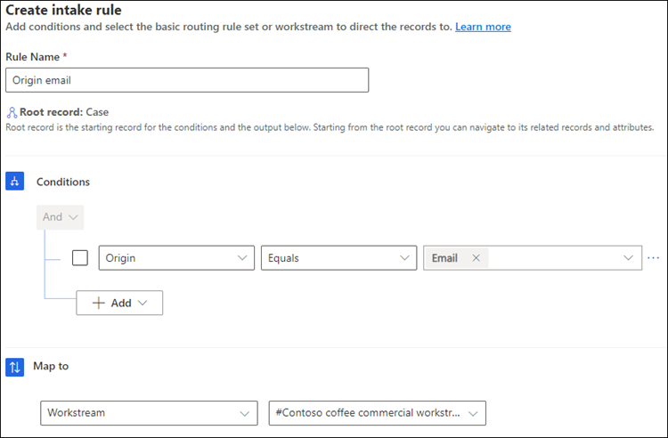
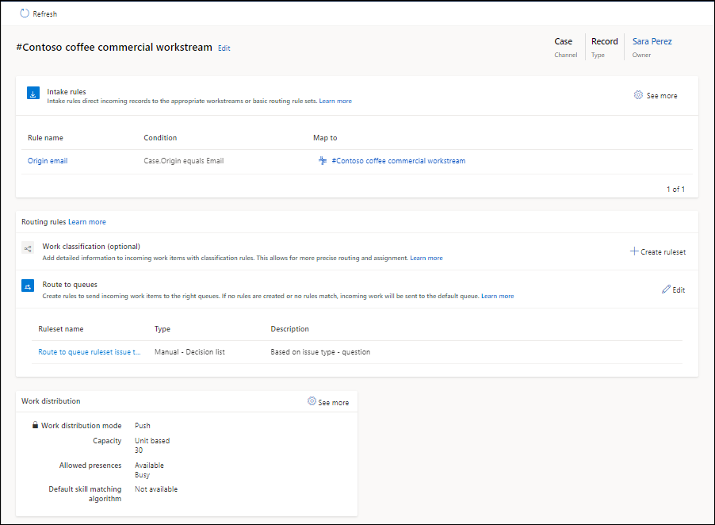

# Set up record routing

[!INCLUDE[cc-use-with-omnichannel](../includes/cc-use-with-omnichannel.md)]

You can configure settings for record routing in Customer Service Hub, Omnichannel admin center, or Omnichannel Administration.

## Prerequisites

- To route entity records, you must enable the entity for routing using entity records channel configuration. More information: [Entity records routing](entity-channel.md#enable-entities)
- The entities that you want to configure routing for should also be enabled in your environment. More information: [Enable entity for routing](entity-channel.md#step-3-enable-entity-for-routing)
- You must have the CSR Manager role to configure record routing.

## Configure unified routing for records

You can configure record routing for entities through Customer Service Hub or Omnichannel admin center.

Perform the following steps to configure record routing:

1. If you're using Customer Service Hub, then in the **Service Management** change area, on the site map, select **Record routing** under **Unified Routing**. If you're using Omnichannel admin center, on the site map, select **Record routing** under **General settings**.

2. On the **Record routing** page, select **Add**.

3. In the **Add a record type** dialog box, select an entity from the **Record type** list, and select **Add**. The entity is added and listed on the **Record routing** page.

4. Do the following tasks:
   1. Configure workstreams.
   2. Configure intake rules.

### Create workstreams for record routing

To configure a workstream for the entity record, do the following:

1. In the Customer Service Hub app, in the **Service Management** change area, on the site map, select **Workstream** under **Unified Routing**, and then select **New**. If you're using Omnichannel admin center, on the site map, select **Workstreams** under **General settings**.

2. In the **Create a workstream** dialog box, enter the following details:
    - **Name**: Enter an intuitive name, such as **Contoso chat workstream**.
    - **Work distribution mode**: Select **Push** or **Pick**.
    - **Type**: Select **Record**.
    - **Record type**: Select an entity record from the list.

3. Select **Create**. The workstream is created.

### Configure intake rules

Intake rules for an entity record help determine the workstream to be picked up to assign an incoming work item.

Perform the following steps to configure the intake rules:

1. Select the workstream that you configured for routing records, such as the case.
2. In the **Intake rules** area, select **Create rule**.
3. In the **Create intake rule** dialog box, enter a name and define the conditions for the rule.
   
   
   
4. Select **Create**.

The following screenshot shows a workstream with the required intake rule and route to queues.

### Configure work distribution and advanced settings

1. In the **Work distribution** area, you can either accept the default settings or select **See more**, and update the following options:
   - **Capacity**: Select one of the following options:
     - **Unit based**: Enter value if your organization has configured unit-based capacity.
     - **Profile based**: Specify a profile in the list if your organization has configured profile-based capacity.
   - **Allowed presences**: Select the presences in which agents will be assigned.
   - **Default skill matching algorithm**: Select **Exact Match** or **Closest Match**.
2. Expand **Advanced settings** to configure the following options:
   - [Sessions](../app-profile-manager/session-templates.md)
   - [Agent notifications](../app-profile-manager/notification-templates.md#out-of-the-box-notification-templates)
   > [!NOTE]
   > The agent notifications that you configure for entity record routing will be displayed only in the Customer Service workspace and Omnichannel for Customer Service apps.

## Create entity record workstream in Omnichannel Administration

This section describes how to create a workstream for an entity that has been enabled for routing.

1. Sign in to the Omnichannel Administration app.

2. Select **Work Streams** under **Channels** in the sitemap.

3. Select **New** on the **Active Work Streams** page.

4. Specify the following on the **New Work Stream** page:

   | Tab | Field | Value | Description | 
   |---------------------|-----------------------------|-------------------------------------------|-------------------------------------------------|
   | Work Distribution | Name | Case Workstream | Provide a name to the workstream.   **Note:** The value provided is an example.  |
   | Work Distribution | Channel | Entity Records | Select the **Entity Records** channel from the list.|
   | Work Distribution | Entity | Case | Select an entity from the drop-down menu.   If you want to create an entity, select **+ New**. To learn more, see [Enable entity for routing](entity-channel.md#step-3-enable-entity-for-routing). |
   | Work Distribution | Capacity | 50 |Specify the units of capacity that are required to process a conversation for the workstream in the text box.   **Note:** The value provided is an example. |
   | Work Distribution | Work distribution mode | Push | Select **Push** when you want to automatically route the cases to the agents.    Select **Pick** when you want the agents to explicitly pick a conversation from the **Open work items** in agent dashboard. |
   | Work Distribution | Allowed Presences | Allowed, Busy | Set the allowed presence status    Select the option and type a presence status in the search box. Select a status from the list.   **Note:** The value provided is an example. |
   ||||

   > [!div class=mx-imgBorder] 
   > 

5. Select **Save** to save the workstream.

### Upgrade path for preview users

If you're upgrading from preview release to the latest version, then earlier configured workstreams will be obsolete. You'll need to create a new entity records channel and then redefine the workstreams. To learn more, see [Entity records routing](entity-channel.md).

### See also

[Entity records routing](entity-channel.md)  
[Create workstreams](create-workstreams.md)  
[Create multiple work streams for entity records routing](multiple-ws-entity-record-routing.md)  

[!INCLUDE[footer-include](../includes/footer-banner.md)]
