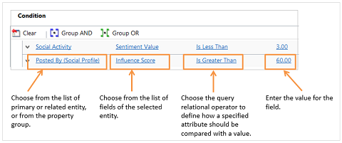
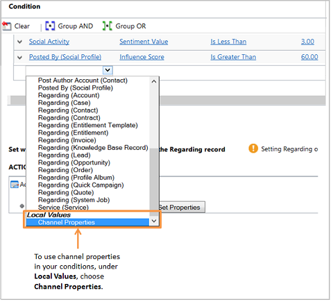
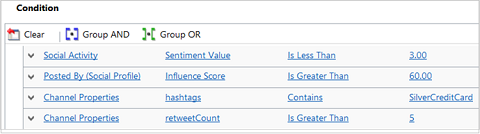
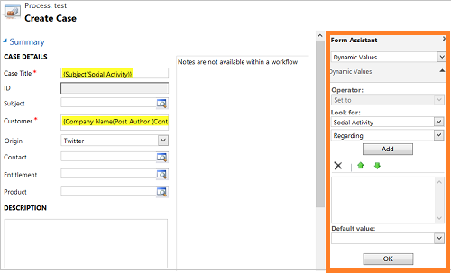
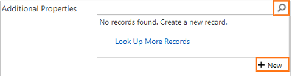
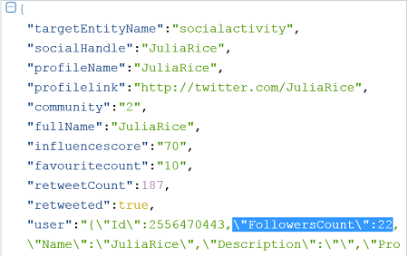
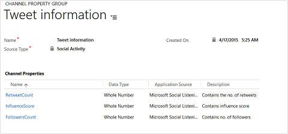

# Set up rules to automatically create or update records

[!INCLUDE[cc-data-platform-banner](../includes/cc-data-platform-banner.md)]

Every organization has multiple applications to capture customer interactions. The ability to channel external data into Microsoft Dataverse records can significantly improve the efficiency of your sales, marketing, and service teams, and increase the quality of your data. You can now direct this data from various applications and external sources into Dataverse with the help of *record creation and update rules*.  

By using record creation and update rules in Dynamics 365 Customer Service, you can automatically create or update system or custom records from incoming activities, such as emails, social activities, or custom activities, without writing any code. Not just that, you can set up the rule to convert the incoming activity into multiple records. For example, you can create a case and a lead from a single social activity.  

 A record creation and update rule consists of rule items that define the conditions for creating or updating records, and also defines what actions or steps to take on the newly-created records. The rule also contains channel properties that are used to define conditions for rules, and also for setting properties of the record you’re creating or updating.  

 To enable the rule to update records, you must add an **Update** step to the rule. Only the entity that you select in the **Update** step is updated based on the properties you set.   

> [!NOTE]
> With the latest release of Dynamics 365 Customer Service app, you can access and manage all service management tasks from the Customer Service Hub sitemap except **Routing Rule Sets**, **Automatic Record Creation**, and **Service Level Agreements**. To access and manage these three admin settings, use **Service Management** under **Settings** in the web application.  

## Activities and entities supported by record creation and update rules

 By default, Dynamics 365 Customer Service supports creating records from the following activities, also called source types in the context of record creation and update rules:  

-   Email  
-   Social activity  
-   Task  
-   Phone call  
-   Appointment  
-   Service activity  
-   Custom activity  

These activities can be converted to any default (system) entity records or custom entity records. For example, you could create a lead, opportunity (system record), or incident (custom record) from an incoming email.  

## Capture data from external sources

 You can also capture additional valuable customer information provided by an external application in the form of JSON (a collection of name-value pairs), and use it to enhance the quality of the target records and set various conditions in the record creation and update rules.  

 Every default (out-of-the-box) activity or custom activity has an Additional Parameters attribute. This attribute stores the JSON payload received from an external application.  

 To capture this information in Dataverse, you can define channel properties and associate them with a particular rule or share them across multiple rules of the same source type. For example, along with a social post, you can capture important information about the post, such as sentiment value. Sentiment value is the property of social activity, so you can use this property in any other record creation and update rule of type Social Activity.  

 Here’s the correct format in which Dataverse should receive the JSON payload (data received as a name-value pair in JSON format) from the external application:  

{“PropertyName1”:”Propertyvalue1”; “PropertyName2”:”Propertyvalue2”}  

> [!NOTE]
>  Any configuration done in the channel properties is only valid if those name-value pairs exist in the JSON payload. Also, you must only use parameters received from the external application in the rule item conditions and as record properties.

## Activate or deactivate a rule

 For any record creation and update rule to apply to a matching incoming activity, after you add the rule items, you must activate the rule.

 When a record creation and update rule is activated, a corresponding workflow is created automatically. You can use channel properties to define a workflow’s conditions and operators in mapping the target entity attribute values. For complex scenarios, you may configure child workflows.  

 [!INCLUDE[proc_more_information](../includes/proc-more-information.md)] [Configure workflow steps](../customerengagement/on-premises/customize/configure-workflow-steps.md)  

## How do record creation and update rules work with queues?

 In a record creation and update rule, when you specify a queue for a source type, any incoming activity from that source is added as a queue item for that specified queue. That is, if a rule for a particular source activity and queue combination is active, the rule processes the incoming activity on that queue to create or update records.  

 For an email source type, specifying a queue is mandatory. For all other source types including custom activities, it is optional. 

> [!NOTE]
> When an automatic record creation (ARC) rule is applied to an Email queue item, it gets deactivated.
  
## Rules in solutions

 The record creation and update rules can be packaged as a part of Dataverse solution. Customizers and developers distribute solutions so organizations can use Dataverse to install and uninstall the business functionality defined by the solution.

 Keep the following things in mind about using rules in solutions:  

- Any rule that you created in [!INCLUDE[pn_crm_online_2015_update_1](../includes/pn-crm-online-2015-update-1.md)] or later can’t be exported to a previous release.  

- Any rules upgraded to and edited in [!INCLUDE[pn_crm_online_2015_update_1](../includes/pn-crm-online-2015-update-1.md)] or later can’t be exported back to an earlier release.  

## Prerequisites 

Before you can use automatic record creation rules, be sure your external application/social engagement system is already integrated with your Dataverse instance.  

If your instance meets the prerequisites, all you need to do is set up rules in Dataverse that will automatically create or update a support case, lead, opportunity, appointment, task, and more from incoming activities.

## Set up a rule to create and update records automatically  
  
1.  Make sure that you have the customer service, sales manager, or marketing manager role or equivalent permissions.  
  
    #### Check your security role  
  
    - [!INCLUDE[proc_follow_steps_in_link](../includes/proc-follow-steps-in-link.md)]  
  
    - [!INCLUDE[proc_dont_have_correct_permissions](../includes/proc-dont-have-correct-permissions.md)] 

2. [!INCLUDE[proc_settings_service_management](../includes/proc-settings-service-management.md)]  
  
3. Select **Automatic Record Creation and Update Rules**.

  
4.  To create a record creation and update rule, select **New**.  
  
     -OR-  
  
     To edit an existing rule, in the list of rules, select and open the rule you want to edit.  
  
5.  Type or modify information in the fields.  
  
     Hover over the field labels to see what to enter:  
  
    - **Name**. Type the name of the rule.  
  
    - **Source Type**. From the drop-down list, select the activity that’s the source of the record.  
  
    - **Queue**. Select the queue the rule applies to. Incoming activity arrives in the queue, and then the valid rule and rule item applies for creation or update of records.  
  
         Here are a few things to consider:  
  
        -   For all activities and custom activities, except email, specifying a queue is optional. For all such activities you can have only one rule with an associated queue and one rule without an associated queue active at any given time. For example, for a Social Activity source type, you can have two active rules, one with a queue specified, and one without a queue.  
  
        -   If you selected Email as the source type for this rule, you can’t activate the rule unless you select a queue.  
  
        > [!NOTE]
        >  You can associate only one rule per source type to a specific queue. For example: If you’re creating a rule to convert an email to a case, make sure you specify an email address for this queue. Otherwise, automatic record creation for email won’t work. 
        [!INCLUDE[proc_more_information](../includes/proc-more-information.md)] [Create or change a queue](set-up-queues-manage-activities-cases.md)
  
6.  Select **Save**.  

## Set Channel Properties

1.  Under **Channel Properties**, in the **Additional Properties** box, select a channel property group.  

    > [!NOTE]
    >  When you select a property group for a record creation and update rule, you can use the channel property group’s property items in the rule item conditions or while setting properties for the target record. After you activate a rule, you can’t remove or change the selected property group. You can select another property group only after you remove the referenced property items of the previous property group from the rule items. When you try to select a new property group without removing the property references of the previous property group, you’ll see an error.  

To learn more about creating channel property groups and adding properties to them, see [Set up channel properties](#set-up-channel-properties) later in this topic.  

## Set Email conditions
If the source type for the rule is set to **Email**, specify the conditions for converting the email to the target record.  

1. **Create records for email from unknown senders**. If you select this check box, all email messages from unknown senders (a sender whose email address isn’t present in any records) are converted to new records (based on the conditions you define). A contact record is also created for this unknown sender.  

   > [!NOTE]
   > Dataverse determines what record to create based on the entity you select in the **Create Record** step under **Actions**.  

    If you don’t select this check box, records are created only for email messages that have a contact or account as the senders.  

    This option, in conjunction with the **Automatically create records in [!INCLUDE[pn_dynamics_crm](../includes/pn-dynamics-crm.md)]** option in the rule owner's Personal Options, determines whether a case and contact record is created (see [Set personal options](../basics/set-personal-options.md)).  

2. **Create case if a valid entitlement exists for the customer**. If you select this check box, a case is created only if an active entitlement exists for the customer.  

    If the sender of the email is a contact with a parent account, a record is created if the contact’s parent account has a valid entitlement, and the contact is listed in the **Contacts** section of the entitlement or if the **Contacts** section is empty (which means the entitlement is applicable to all contacts for the customer).  

3. **Create cases for activities associated with a resolved case**. If you select this check box, a case is created if the email is related to a resolved case. If the email is related to an active case, a new case won’t be created. However, if the email is related to a canceled case, a new case will be created.

4. **Create case when the case associated with the activity is resolved since**. If you select the **Create cases for activities associated with a resolved case** check box, select the duration here. A case is created only if the case is resolved earlier than the duration you specify. If the incoming email is related to a case resolved later than the specified duration, the incoming email is associated with the existing resolved case; a new case won’t be created.  

5. **Send automatic email response to customer on record creation**. Select this check box if you want to automatically send email responses to the sender of the email after a target record for the email is created.  

6. **Select email template to respond to customer.**  If you select the **Send automatic email response to customer on record creation** check box, select an email template (global email template or email template of any entity type). If you don’t select a template, an automatic response won’t be sent.  

    > [!NOTE]
    > When mapping incoming email to a field that does not support HTML, you should remove HTML content from the email, so that the text is compatible with Dynamics and the content can be viewed without HTML tags. You can do this in the following ways.     1. Use a regular expression such as \&lt;[^\&gt;]*\&gt; to filter the HTML tags out of the email before mapping it to the field. Note that taking this approach will permanently remove the tags from the content.   2.  If you want to maintain the HTML from the email, but don’t want it to be displayed, customize the field CSS to use the textContent DOM node to have the browser only display the text from the email in the form.     Please note that these customizations are not supported by Microsoft. Try them on your sandbox environment to avoid any loss of production data.

## Set Social Activity conditions
If the source type for the rule is set to Social Activity, specify the conditions for converting the social activity to the target record.  

1. **Create records for blocked social profile**. If you select this check box, a target record is created or updated for the social posts (social activities) from social profiles that are blocked by you.  

   > [!NOTE]
   >  Social posts appear in the application as social activities.  

2. **Create records for direct messages only**. If you select this check box, the target record is created only when the social posts are sent as direct or private messages. If you clear the check box, records are created for all social posts including public messages (timeline).  

   > [!NOTE]
   > Dataverse determines what record to create based on the entity you select in the **Create Record** step under **Actions**.  

## Set record creation details
In the **Specify Record Creation and Update Details** section, select  to define the conditions for creating or updating a record and specify the properties of the record.  

1.  In the **Name** box, enter a meaningful name for the rule item.  

2.  In the **Conditions** section, select the record, channel properties, fields, and relational query operators to specify when a target record should be created or updated.  

    For example, to create a record from a social post (social activity) with a sentiment value of less than 3, an influence score greater than 60, and hashtags containing SilverCreditCard, you can add the following conditions:  

      

    > [!NOTE]
    > You can also use channel properties in your conditions.  

      

    Here’s the rule item after you add all the conditions:  

      

3.  Add steps to create or update records for the incoming activity that matches the conditions you defined earlier.  

    a.  Under **Actions**, select **Add Step** > **Create record**.  

    b.  In the **Create** box, select the record type for the record you want to create from the incoming activity. For example, if you want to create a case from the social activity, select **Case**.  

      > [!NOTE]
      >  If the incoming activity has a regarding object set, and if the regarding object entity and the entity selected in the **Create Record** step aren’t the same, no workflow is applied and the actions defined in the rule are not executed.  

    c.  Select **Set Properties**.  

       The entity form is displayed. You can map the target entity fields to the social activity record data, including channel properties. Some of the mappings are available out of the box: Case title, Customer, and Origin (highlighted in yellow). The out-of-the-box mappings can be changed and new mappings can be added using the **Form Assistant** control.  

         

       The new record that is created will be automatically set as the regarding record of the incoming activity record. There is only one regarding object to the social activity, so, only one **Create** record action is possible in the **Actions** section.  

    d.  To add more actions, under **Specify Other Actions**, select **Add Step** > \<Action>. The available actions are: Create Record, Update Record, Send Email, or Start Child Workflow.  

       Learn more about each of these actions in [Configure workflow steps](../customerengagement/on-premises/customize/configure-workflow-steps.md).  

4.  Select **Save and Close**.  

    > [!NOTE]
    > - Data types "Option Set" and "Two Option" are not supported in string type conditions.  
    > - The property items for each of the supported data types need to have a default value. This requirement is important in scenarios where the configured property line items have a blank incoming web request. In such cases, the property line item will take the default value when referred to in a workflow.  

## Turn on the rule

Turn on the rule so that records can be created or updated for incoming activities based on the defined conditions. [!INCLUDE[proc_more_information](../includes/proc-more-information.md)] [Activate or deactivate a rule](#activate-or-deactivate-a-rule).  

> [!TIP]
>  Developers can also apply rules retroactively to the incoming records that might have been skipped while a rule was edited. 

## Set up channel properties  

Every default or custom activity has an **Additional Parameters** attribute. This attribute stores the JSON payload received from an external application.  

 You can find these parameters in the **Additional Parameters** field of any incoming activity.  

 To capture this information in Dataverse and associate it with the record creation or update rule, you can define channel properties in a channel property group and associate them with a rule or share them across multiple rules. For example, along with a social post, you can capture important information about the post, such as rating or influencer score. Rating and influencer score are the properties of social channel.  

### Create channel property groups and add channel properties  

1. After you save the record creation and update rule form, under **Channel Properties** section, in the **Additional Properties** box, select the lookup button, and then select **New**.  

     

   A channel property group form opens.  

   > [!IMPORTANT]
   >  A property group record contains multiple property items.  
   >   
   >  To fix this issue, first delete the properties from the conditions and steps that use the record, and then save or activate the rule.  

2. Enter a meaningful name for the property group, so you can easily identify it while adding it to any record creation or update rule.  

3. The **Source Type** field will be automatically set to the source type of the record creation and update rule.  

4. Select **Save**.  

5. In the **Channel Properties** section, select **+** to add in the group-specific channel properties.  

6. In the **Channel Property** form, enter the following:  

   a. **Name**. Type the property name as it appears in the activity’s payload.  

   > [!NOTE]
   >  The name can contain only alphanumeric and underscore characters and shouldn’t be longer than 300 characters.  

      To see properties received for an activity, go to **Sales** or **Service** or **Marketing** > **Activities**, and open the activity, and see the **Additional Parameters** field.  

   > [!NOTE]
   >  This field isn’t available on the activity form by default. A system customizer can add the field to the activity forms. The field will have the JSON payload only when the external application sends it for the activity.  

        

   > [!IMPORTANT]
   > - Create a channel property for each name from the name-value pair that you want to use in your record creation and update rule. For example, you could use `influenceScore` as a property name.  
   > - The information in the JSON payload isn’t very easy to read. To make it more readable, you can use [online JSON parser](https://json.parser.online.fr/) that will provide a better output.  
   > - The property group doesn’t support adding nested values in a JSON payload as channel properties. The following sample shows the "FollowersCount" under the user node as a nested JSON key-value pair.  
   > 
   >   

   b. **Data Type**. Select a data type for the channel property. For example, if the property is influence score, use the data type as Whole Number because its value can’t be in decimals.  

      The selected data type will determine the relational query operators when you use the property to define conditions in the record creation and update rule items. Dataverse supports creating properties only of the following data types: Floating Point Number, Single Line of Text, and Whole Number.  

   > [!NOTE]
   > - Option Set and Two option data types are supported in conditions of type string. You’ll have to type out the option set value in the conditions.  
   > - Dataverse sets a default value for property items for each of the supported data types. This is for scenarios when a channel property is used in a workflow but the incoming payload has no value provided from the external channel; the workflow conditions in which the property is referred use a least the following default value: String: “”, Whole Number: -2,147,483,648, Float: -1e+011.  

   c. **Application Source**. Type the name of the application that this property is related to.  

   d. **Description**. Type details to further explain what the property is for.  

7. When you’re done, select **Save & Close**.  

    You can see all the properties in the channel property group form.  

     

## Activate a record creation and update rule

 For any record creation and update rule to apply to a matching incoming activity, after you add the rule items, you must activate the rule.  

### To activate a record creation and update rule  

1.  Go to **Settings** > **Service Management**. 

2.  Select **Automatic Record Creation and Update Rules**.  

3.  Open the rule you want to activate, and on the command bar, select **Activate**.  

    > [!NOTE]
    >  You can have two record creation and update rules active at a time for any source type, except email—one with queue and one without a queue. You can have only one record creation and update rule active for the source type Email, and this rule should have a queue specified.  

     After the rule is active, the only way to change the rule is to first deactivate it. Open the rule, and on the command bar, select **Deactivate**.  

## Manage automatic record creation and update from a queue form  
 
 You can create or manage an automatic record creation and update rule from a queue form, too. To do this, open the queue record, and on the command bar, select **Email Activity Conversion Settings** or **Social Activity Conversion Settings**.  

 [!INCLUDE[proc_more_information](../includes/proc-more-information.md)] [Create or change a queue](set-up-queues-manage-activities-cases.md)

## Upgrade considerations  
 Here are a few things you should know if you’re upgrading to the latest release, and have existing case creation rules for email and social activity.  

|                             Existing rules prior to upgrade                              |                                                                                                                                                                       What happens to the rules after upgrade?                                                                                                                                                                       |
|------------------------------------------------------------------------------------------|--------------------------------------------------------------------------------------------------------------------------------------------------------------------------------------------------------------------------------------------------------------------------------------------------------------------------------------------------------------------------------------|
|            A rule that has rule items with conditions and properties defined             | -   The rule and rule items are upgraded and the properties and conditions in the existing rule items are preserved. -   A new rule item is created with blank conditions. A new Create Record step (with Case selected) is added with out-of-the-box property mapping. The rule items are applied in an order and the newly-created rule item is considered last in the order. |
|         A rule that has a rule items with conditions , but no properties defined         |               -   The rule and rule items are upgraded and the conditions in rule items are preserved. -   A new rule item is created with blank conditions. A new Create Record step (with Case selected) is added with out-of-the-box property mapping. The rule items are applied in an order and the newly-created rule item is considered last in the order.               |
|          A rule that has a rule items with no conditions or properties defined           |                                      -   The rule and rule items are upgraded. -   A new rule item is created with blank conditions. A new Create Record step (with Case selected) is added with out-of-the-box property mapping. The rule items are applied in an order and the newly-created rule item is considered last in the order.                                       |
|         A rule that has a rule items with properties, but no conditions defined          |             -   The rule and rule items are upgraded and the properties in the rule items are preserved. -   A new rule item is created with blank conditions. A new Create Record step (with Case selected) is added with out-of-the-box property mapping. The rule items are applied in an order and the newly-created rule item is considered last in the order.             |
|                                A rule with no rule items                                 |                                              -   The rule is upgraded. -   A new rule item is created with blank conditions. A new Create Record step (with Case selected) is added with out-of-the-box property mapping. The rule items are applied in an order and the newly-created rule item is considered last in the order.                                               |
|  An active case creation rule for social or email source types, with a queue specified   |                                                                                                                                                                 All such rules will be upgraded in an active state.                                                                                                                                                                  |
| An active case creation rule for social or email source types, without a queue specified |                                                                                  All such rules will be upgraded and deactivated. This is because even in [!INCLUDE[pn_v6_online_ur1](../includes/pn-v6-online-ur1.md)], a case creation rule without a queue did not apply and create any record.                                                                                   |

## Recommendation to upgrade solution

Perform the following steps before you upgrade a solution:

1.	Deactivate the Record Creation and Update Rules which are brought through the previous version of the solution. The state of Record Creation and Update Rules changes to draft.

2.	Upgrade your solution as required. 

3.	After the successful upgrade of the solution, activate the Record Creation and Update Rules as required.

### See also

 [Create rules to automatically route cases](../customer-service/create-rules-automatically-route-cases.md)    

[Create or change a queue](set-up-queues-manage-activities-cases.md)

[!INCLUDE[footer-include](../includes/footer-banner.md)]