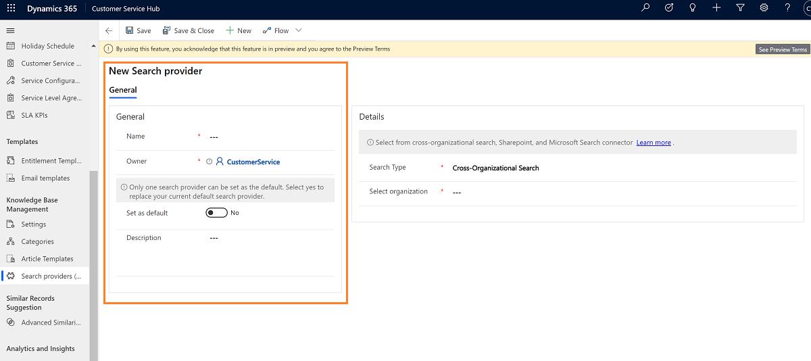

# Set up a search provider in Customer Service Hub (Preview)

[!INCLUDE[cc-beta-prerelease-disclaimer](../includes/cc-beta-prerelease-disclaimer.md)]

As a knowledge manager, you can use search providers to federate the search of files, documents, or articles from data sources outside of your current Dynamics 365 organization.

There are three types of search providers you can set up: 
  -	**Cross-organizational search**: This option allows you to specify a different organization under the same tenant of the current organization and search the articles from that organization. The list from the current tenant is automatically identified. 
  -	**Sharepoint**: This option requires you to enter the SharePoint URL. 
  -	**Microsoft search connector**: This option is for organizations that already use Microsoft search to index all Microsoft Dynamics 365 or external data. You only need to specify the unique connection ID when you create the connector. To learn more about Microsoft search connectors, see [Overview of Microsoft Graph connectors](https://docs.microsoft.com/microsoftsearch/connectors-overview).
  
From an authentication perspective, your agents must have access to external content or they won't be able to view search results. 

To set up a search provider, do the following:

1.	Open the **Customer Service Hub** app and select **Change area > Service Management**.

    > [!div class=mx-imgBorder]
    > 

2.	Under the **Knowledge Base Management** section, select **Search providers**, and then select **New**.

    > [!div class=mx-imgBorder]
    > 
    
    The **New Search provider** page is displayed.

3.	Under **General**, enter the name and owner information for the search provider. You can optionally also enter a description.

    > [!div class=mx-imgBorder]
    > 
    
4. If you want this search provider to be your default provider, toggle **Set as default** to **Yes**.
    
5. Under **Details**, from the drop-down menu, select the type of search provider you want to use and the organization.

    > [!div class=mx-imgBorder]
    > 

6. When you are finished, select **Save** in the lower right-hand corner.
