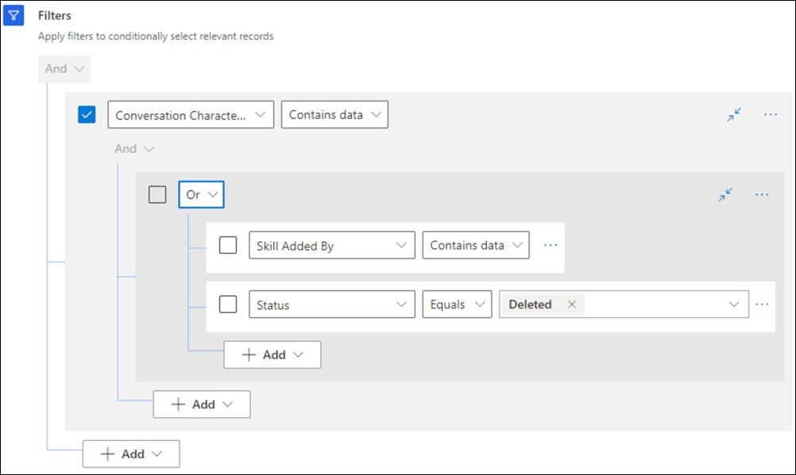

# Set up skill-based routing for unified routing

## Introduction

The steps to configure skill-based routing are as follows:

1. [Create a rating model](setup-skills-assign-agents.md#create-a-rating-model).
2. [Create skill types and skills](setup-skills-assign-agents.md#create-skill-types).
3. [Assign agents to skills](setup-skills-assign-agents.md#assign-agents-to-skill).
4. [Set exact or closest match as the default skill-matching algorithm for a workstream](create-workstreams.md#configure-work-distribution).
5. Choose one of the following skill-classification methods:
   - [Author logical classification rules to attach skills for a workstream](configure-work-classification.md#create-logical-skill-classification-rulesets).
   - [Set up intelligent skill finder model](#set-up-intelligent-skill-finder-model) and [author machine learning-based classification rules to attach skills](configure-work-classification.md#create-machine-learning-based-skill-classification-rulesets).
6. [Choose out-of-the-box assignment method or author a custom assignment method for a queue](assignment-methods.md).
7. [Enable skill control for the agent](allow-agents-update-skills.md).

## How skills are matched

How the default skill match algorithm works when you set the value as exact match or closest match for a workstream is explained in this section. When the work classification skill rules attach skills and proficiency level, the assignment method matches the required skill with the skills of the agent. The system assigns the conversation to an agent based on the skill criteria chosen.

The default skill-matching algorithm will work only with the out-of-the-box assignment method. If you choose to use the custom assignment method, then you'll need to write the conditions to achieve skill-based routing. The rules written for custom assignment override the algorithm in the work distribution settings of the workstream.

You can achieve the following skill matching based on the business requirements:

- Exact skill match
- Closest or nearest skill match

When you select one of these skill-matching types, you must configure the skill attachment rules for the conversation to be routed to the correct agent.

### Exact match

In exact skill matching, the assignment logic searches for an agent with the required skills and proficiency.

Exact match filters all matched agents whose rating value is greater than or equal to the required value, and then orders them based on the higher available capacity, capacity profile, or round robin as per the selected order by attribute.

If an agent isn't available with all the required skills and corresponding proficiency, then the conversation remains unassigned in the queue.

You can configure exact skill match in one of the following ways:

- In the work distribution settings of the workstream, set the value for **Default skill matching algorithm** as **Exact Match**. In the assignment method of the queue, choose highest capacity or round robin assignment method. The exact match algorithm is not applicable to work items if custom assignment method is applied to a queue. You'll need to write rules to achieve exact match for the custom assignment method.
- Create a custom assignment method and create rules on attribute user skills:

  In exact skill match, as part of custom assignment method, you can write rule conditions to enable assignment logic to search for agents who match all the required skills or match all skills within a skill type. The matched agents can be ordered using the following order by options:
  - Nearest proficiency
  - Nearest proficiency within skill type
  - Most proficient
  - Most proficient within skill type
  - Skill count
  - Skill count within skill type
  - Round robin
  - Capacity

  For example, order by nearest proficiency or most proficiency will have the agent with skill proficiency nearest to required proficiency or highest proficiency at the top accordingly. It can be configured within a skill type as well.

  The following table lists a few examples of how skills are matched and results are ordered when the algorithm is "exact match".

  |Skills required|Agent characteristics|Scenario description|Rule condition|Order by/Result   |
  |----|----|---|----|----|
  |<ul><li> Cafe A-100 (Type: Product); Proficiency required: 2</li><li> Spanish (Type: Language); Proficiency required: 3 </li></ul> |<ul><li> Name: Carlos; Capacity: 100; Cafe A-100 (2); Spanish (3) </li><li> Name: Eric; Capacity: 200; Cafe A-100 (3); Spanish (4) </li></ul>| Exact match all skills | Agent.User skills. Exact match.All skills AND (optional) Agent.PresenceStatus Equals Conversation.Work Stream.Allowed Presences AND Agent.Available capacity >= Conversation.Work Stream.Capacity| Choose from one of the Order by options: <ul><li> **Available capacity**: Eric</li><li> **Nearest Proficient**: Carlos</li><li> **Most Proficient**: Eric </li><ul>|
  |<ul><li> Cafe A-100 (Type: Product); Proficiency required: 2</li><li> Spanish (Type: Language); Proficiency required: 3 </li></ul> |<ul><li> Name: Carlos; Capacity: 100; Cafe A-100 (2); Spanish (3) </li><li> Name: Eric; Capacity: 200; Cafe A-100 (3); Spanish (4) </li></ul>|Exact match language skill only | Agent.User skills.Exact match.Skill type: Language AND (optional) Agent.PresenceStatus Equals Conversation.Work Stream.Allowed Presences AND Agent.Available capacity >= Conversation.Work Stream.Capacity|Choose from one of the order by options: <ul><li> **Available capacity**: Eric</li><li> **Nearest Proficient**: Carlos</li><li> **Most Proficient**: Eric </li><ul>|
  ||||||

### Closest Match

When finding an agent at the earliest is more important than waiting for an agent with exact required skills, unified routing provides with an option to order agents using proficiency or skill count and thereby achieving closest skill match.

Closest match orders all agents based on their closeness to the required skill and proficiency. For example, if the required skills are four, then agents with four skills will be put on top (exact qualified), then agent with five skills (overqualified), followed by agent with three skills (under qualified).

If no agent is available with any of the required skills, then the conversation might be assigned to an agent without any required skills.

You can achieve closest skill match in one of the following ways:

- In the work distribution settings of the workstream, set the value for **Default skill matching algorithm** as **Closest Match**. In the assignment method of the queue, choose highest capacity or round robin assignment method.

  In this scenario where closest match is chosen as the skill matching algorithm at workstream level, and round robin or highest capacity assignment method is chosen; if more than one agent with same skill score is there; the system won't order them by round robin or highest capacity. The system will continue to assign all the incoming work items to the same agent until other constraints like capacity and presence are satisfied.

- Create a custom assignment method and create order by using proficiency or skill count to achieve closest match.
  
  You need to select order by > Proficiency > All skills or skill type > Nearest Proficient.

  In closest skill matching as part of custom assignment method, you can choose from the following order by options:
  
  - Nearest proficiency
  - Nearest proficiency within skill type
  - Most proficiency
  - Most proficiency within skill type
  - Skill count
  - Skill count within skill type
  
   The following table lists a few examples of how the skills are matched and results are ordered when the default skill-matching algorithm is "closest match".

  |Skills required|Agent characteristics|Scenario description|Rule condition|Order by/Result|
  |----|----|---|----|----|
  |<ul><li>Cafe A-100 (Type: Product); Proficiency required :2</li><li>Coffee machine (Type: Product); Proficiency required: 3</li> <li>Spanish (Type: Language); Proficiency required: 3</li></ul> | <ul><li>Name: Carlos; Cafe A-100 (2); Coffee machine (3); Spanish (3)</li><li>Name: Eric; Cafe A-100 (5); Coffee machine (4); Spanish (1)</li><li>Name: Jamie; Cafe A-100 (1); Coffee machine (2); Spanish (1)</li> |Closest match all skills|Agent.PresenceStatus Equals Conversation.Work Stream.Allowed Presences AND Agent.Available capacity >= Conversation.Work Stream.Capacity|Choose from one of the order by options:<ul><li>Nearest Proficient: Carlos > Eric > Jamie </li><li>Most Proficient: Eric > Carlos > Jamie</li></ul> |
  |<ul><li>Café A-100 (Type: Product); Proficiency required: 2</li><li>Coffee machine (Type: Product); Proficiency required: 3 </li><li>Spanish (Type: Language); Proficiency required: 3</li> |<ul><li>Name: Carlos; Cafe A-100 (2); Coffee machine (3); Spanish (3)</li><li>Name: Eric; Cafe A-100 (5); Coffee machine (4); Spanish (1)</li><li>Name: Jamie; Cafe A-100 (1); Coffee machine (2); Spanish (1)</li>|Closest match product skill only |Agent.PresenceStatus Equals Conversation.Work Stream.Allowed Presences AND Agent.Available capacity >= Conversation.Work Stream.Capacity|Choose from one of the order by options:<ul><li>Nearest Proficient: Carlos > Eric > Jamie </li><li>Most Proficient: Eric > Carlos > Jamie</li></ul>|
  |<ul><li>Café A-100 (Type: Product); Proficiency required: 2</li><li>Coffee machine (Type: Product); Proficiency required: 3 </li><li>Spanish (Type: Language); Proficiency required: 3</li> |<ul><li>Carlos Cafe A-100 (2); Coffee machine (3); Spanish (3)</li><li>Name: Eric; Cafe A-100 (5); Coffee machine (4)</li><li>Name: Jamie; Cafe A-100 (1)</li>|Closest match with all skills using skill count |Agent.PresenceStatus Equals Conversation.Work Stream.Allowed Presences AND Agent.Available capacity >= Conversation.Work Stream.Capacity|Order by option:  Skill count: Carlos > Eric > Jamie|
  |<ul><li>Cafe A-100 (Type: Product); Proficiency required: 2</li><li>Coffee machine (Type: Product); Proficiency required: 3</li><li>Spanish (Type: Language); Proficiency required: 3</li></ul> |<ul><li>Name: Carlos; Cafe A-100 (2); Coffee machine (3); Spanish (3)</li><li>Name: Eric; Cafe A-100 (5); Coffee machine (4);</li><li>Name: Jamie; Cafe A-100 (1);</li></ul> |Closest match product skill only using skill count |Agent.PresenceStatus Equals Conversation.Work Stream.Allowed Presences AND Agent.Available capacity >= Conversation.Work Stream.Capacity|Order by:  Skill count: System will randomly pick from Carlos or Eric|
  |||||

> [!NOTE]
> We recommend that you use the same rating model across skills. However, if skills that belong to different rating models are there, then the system will normalize and calculate the skill scores.

## Set up intelligent skill finder model

To configure machine learning-based skill classification rulesets, you can configure intelligent skill finder models that will be used for predicting skills.

You can create and train machine-learning models that use AI to determine the necessary skills for new work items. You can create and train the model by using the data in Microsoft Dataverse. However, if you're trying to set up the model in a new organization or if skill-based routing wasn't in use, you might not have the needed skill data. In such conditions, you can use data from another application by using the **Import from Excel** option in the skill finder model.

Intelligent skill finder depends upon the custom AI Builder category classification model. Therefore, AI Builder should be available in the geographical region where you want to use intelligent skill finder. More information: [Availability of AI Builder](/ai-builder/availability-region).

 > [!IMPORTANT]
 > If you want to import skill finder models from one environment to another, make sure that you import and export between environments of the same type. A model trained in test environment will work only in another test environment and not in a production environment.

 ## Create skill finder models
   
You can set up the intelligent skill finder model rating models in the Customer Service admin center or Omnichannel admin center app. You can create as many models as your business requires.

**To create the skill finder model**

1. In Dynamices 365, go to one of the apps, and perform the following steps.
   
   ### [Customer Service admin center](#tab/customerserviceadmincenter)
     
     - In the site map, select **Insights** in **Operations**. The **Insights** page appears.
     
   ### [Omnichannel admin center](#tab/omnichanneladmincenter)
    
     - In the site map, select **User attributes** in **Advanced settings**. The **User attributes** page appears.
     

1. In the **Intelligent skill finder** section, select **Manage**.

1. On the **Intelligent skill finder models** page, select **New**, and on the **Configuration** tab of **New skill finder model** page, enter a name.

1. In **Data criteria**, enter the following to form the dataset records:
    - **Attributes (Required)**: Select attributes in the Attributes and related list to form the training dataset. The corresponding attribute values will be merged in the sequence they are added and will be used to form the input string for the model training data.
    - **Filters**: Optionally, apply filters to conditionally select the relevant records.
    - **Date range**: Select a value to set the time period for which the records need to be loaded.
    
    

1. Select **Save**, and then select **Load training data**. The **Training data** tab appears and displays the data load status.

1. After the load is complete, review the data, and edit the records if you want to modify the tags.

1. In the **Training data** section, select the checkbox for **Input data** to select all the records, and select **Approve**. You must approve a minimum of 50 records for the model to be trained.

1. Select **Train model**, and select **Train model** again on the confirmation dialog.

1. After the status changes to training completed, select the rows that you want to publish, and select **Publish model**. The skills model is ready for use.

### Retrain the model iteratively

You should retrain your published model iteratively to improve the model with new data in Microsoft Dataverse. For example, model retraining can be done by using the records in which agents have updated the skills for records or conversations. When you retrain the model to include the skills added by agents, review the training data records after loading it to make sure it meets the required skill criteria.

For information about how your agents can update skills, see [Manage skills](manage-skills.md). To enable your agents to update skills at runtime, see [Enable agents to update skills](allow-agents-update-skills.md).

You can define the conditions as seen in the following screenshot.

  

### Use training data imported from Excel file

If you don't have data to train your model, you can populate skills and attributes data in Excel files and upload them to the application by using the import feature of Microsoft Dataverse.

To use the data from the Excel files, you must make sure of the following:

- The model name in the application should match the name in the Training record column of the Excel file.

- Name the files as msdyn_ocsitrainingdata.csv and msdyn_ocsitdskill.csv.

- Ensure that the input data string is less than or equal to 5000 characters to avoid truncation.
  
A sample of each file is as follows.

**msdyn_ocsitrainingdata.csv**

|Skill finder model|Training record name|Input data|
|------------------|--------------------|----------|
|CCSFM01-Contoso Coffee skill finder model|CCSFM01-Contoso Coffee training data A10001|Hi, I work at Trey Research. One of the automatic espresso machines is becoming overheated and starts giving a burning smell after 30 minutes of usage. Please help! Yes. No.|
|CCSFM01-Contoso Coffee skill finder model|CCSFM01-Contoso Coffee training data A10002|Hi, I recently bought Café A-100  coffee machine and its top plate is getting heated after 15 minutes of usage. Please resolve this at the earliest.|
|CCSFM01-Contoso Coffee skill finder model|CCSFM01-Contoso Coffee training data A10003|Hi, I am unable to start my recently bought espresso machine, looks like the electrical plug provided with it is not functioning.|
|CCSFM01-Contoso Coffee skill finder model|CCSFM01-Contoso Coffee training data A10004|Hi, I work at Trey Research. I am looking for replacement of coffee machine purchased 3 months ago. Even after raising complaints earlier about overheating the issue still persists. Please help! |
|CCSFM01-Contoso Coffee skill finder model|CCSFM01-Contoso Coffee training data A10005|Hi, my recently bought Café A-100 machine is not in the color I ordered. Please replace the same. |
||||

**msdyn_ocsitdskill.csv**

|Training record|Characteristic mapping|Characteristic|
|---------|--------|-----------|
|CCSFM01-Contoso Coffee training data A10001|Café A-100|Café A-100|
|CCSFM01-Contoso Coffee training data A10001|Heating|Heating|
|CCSFM01-Contoso Coffee training data A10001|Electrical|Electrical|
|CCSFM01-Contoso Coffee training data A10002|Café A-100|Café A-100|
|CCSFM01-Contoso Coffee training data A10002|Heating|Heating|
||||

Perform the following steps to upload the data for training your model:

1. On the **Skill finder model** page, enter a name for the model, and then save the form.
2. Select the **Training data** tab, and select **Import Excel**.
3. Select the .csv files to upload in the import tool.
   
   

4. Review the upload settings, and select **Finish** after you go through the stages. The data upload starts. The time taken for the data upload depends on the number of records.
5. Optionally, you can select **Refresh** to see the updated status of the data upload.
6. Perform steps 5 through 8 in [Create skill finder models](#create-skill-finder-models) to approve, train, and publish your model.

### See also

[Overview of skill-based routing](overview-skill-work-distribution.md)  
[Overview of unified routing](overview-unified-routing.md)  
[FAQ on unified routing](unified-routing-faqs.md)  

[!INCLUDE[footer-include](../includes/footer-banner.md)]  
