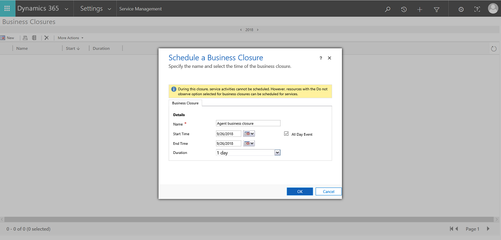

# Set when your business is closed (Customer Service app)

Prevent scheduling resources on holidays and other nonworking days by defining business closures in Dynamics 365 Customer Service. You can set both the days and times that your organization will be closed. 

> [!IMPORTANT]
> With the latest release of Dynamics 365 Customer Service app, the new Service Scheduling is now available in the Customer Service Hub sitemap. We recommend that you set business closures using the new experience. [!INCLUDE[proc_more_information](../includes/proc-more-information.md)] [Set when your business is closed](set-when-business-closed-csh.md)
  
1.  Make sure you have the Schedule Manager Security role or equivalent permissions to update the business closures.  
  
    #### Check your security role  
  
    - [!INCLUDE[proc_follow_steps_in_link](../includes/proc-follow-steps-in-link.md)]  
  
    - [!INCLUDE[proc_dont_have_correct_permissions](../includes/proc-dont-have-correct-permissions.md)]  
  
2. [!INCLUDE[proc_settings_service_management](../includes/proc-settings-service-management.md)]  
  
3.  Select **Business Closure**.  
  
4.  To create a new business closure, on the command bar, select **New**.  
  
     -OR-  
  
     To edit an existing business closure record, open it from the list.  
  
5.  In the **Schedule a Business Closure** dialog box, type or modify information in the text boxes:  
  
    1.  In the **Name** box, type a name that describes the purpose of the closure.  
  
         The first 12 characters of the name appear on each day of the closure on the calendar view of the affected resource's **Work Hours**.  
  
    2.  In the **Start Time** and **End Time** boxes, enter the start and end date for the closure.  
  
    3.  If you want to enter duration instead of an end time, select the length of the closure in the **Duration** box. The application automatically calculates the end time for you.  
  
    4.  If the closure is an all-day event, select the **All Day Event** check box. The application automatically enters the duration of *1 day*.  
  
         If you want to enter a specific time period, clear the **All Day Event** check box. You can then specify the hours during which your organization will be closed.  
  
6.  To save this business closure, select **OK**.  

    
  
### See also  
 [Set work hours for a resource](../customer-service/set-work-hours-resource.md)   
 [Set up a holiday schedule](../customer-service/set-up-holiday-schedule.md)   
 [Create a customer service schedule and define the work hours](../customer-service/create-customer-service-schedule-define-work-hours.md)

[!INCLUDE[footer-include](../includes/footer-banner.md)]