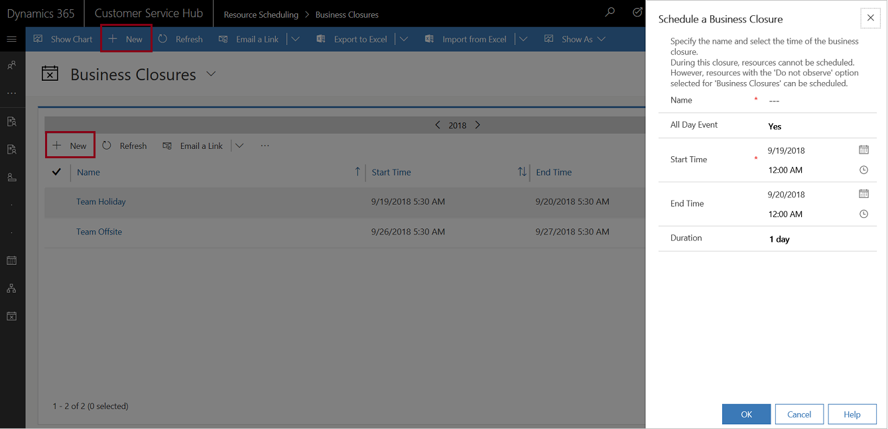

# Set when your business is closed

Prevent scheduling resources on holidays and other nonworking days by defining business closures in Dynamics 365 Customer Service. You can set both the days and times that your organization will be closed. 

## Schedule a new business closure
Make sure that you have the required security role or equivalent permissions. 

[!INCLUDE[proc_more_information](../includes/proc-more-information.md)] [Manage security roles in service scheduling](manage-security-roles.md)

1. In the Customer Service Hub sitemap, go to **Scheduling**.
2. From the list of entity records, select **Settings > Business Closures**.
   - The **Business Closures** view is displayed. You can switch between various system views using the drop-down menu.
   - Select any existing record to see additional options in the command bar
3. On the command bar, select **New** to schedule a new business closure.  
 
   You can also select **New** from the business closure grid to create a new business closure record.

   

   A quick create dialog box is displayed.
  
5.  In the **Schedule a Business Closure** dialog box, type or modify information in the text boxes:  
  
    - In the **Name** box, type a name that describes the purpose of the closure.
  
         The first 12 characters of the name appear on each day of the closure on the calendar view of the affected resource's **Work Hours**.  
  
    -  If the closure is an all-day event, select the **All Day Event** check box. The application automatically enters the duration of *1 day*.
    - In the **Start Time** and **End Time** boxes, enter the start and end date and time for the closure.
  
    - If you want to enter duration instead of an end time, select the length of the closure in the **Duration** box. The application automatically calculates the end time for you.
  
      If you want to enter a specific time period, clear the **All Day Event** check box. You can then specify the hours during which your organization will be closed.  
  
6.  To save this business closure, select **OK**.  
  
### See also  
 [Set work hours for the resources](resources-service-scheduling.md#set-work-hours-for-the-resources)  
 [Set up a holiday schedule](../customer-service/set-up-holiday-schedule.md)    
 [Create a customer service schedule and define the work hours](../customer-service/create-customer-service-schedule-define-work-hours.md)

[!INCLUDE[footer-include](../includes/footer-banner.md)]